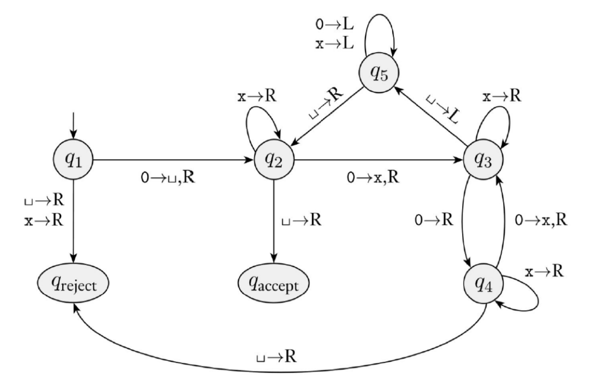
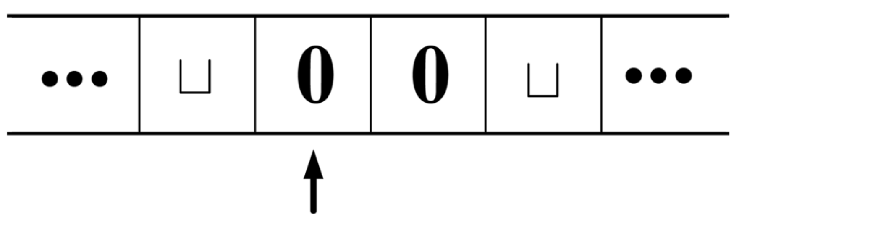
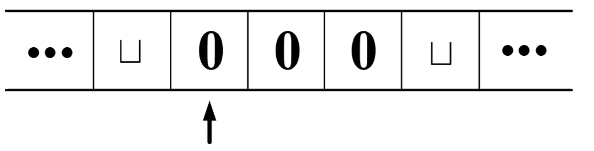

# 第一章 习题

## 习题

1. Amdahl 定律是计算机理论中的一条重要定律, 它阐释了改进系统中某一部分的性能能够给系统整体带来多大的性能提升. 其通用形式为:

   $$\text{加速比} = \frac{\text{原执行时间}}{\text{新执行时间}} = \frac{1}{1 - F + \frac{F}{N}} \, .$$

   其中, $F$ 为系统中受到改进的比例, $N$ 则为被改进部分获得的提升倍率.

   (1) 当 $F$ 趋于 1 时, 系统加速比的极限是多少? 该值有什么实际含义?

       当 $F$ 趋于 1 时, 系统加速比的极限是 $N$. 这表示当改进的部分占系统总执行时间的比例趋近于 1 时, 系统的加速比将趋近于被改进部分的性能提升倍率. 这意味着如果能够将系统中几乎所有的部分都进行改进, 那么系统的整体性能提升将接近于被改进部分的性能提升倍率. 但是, 实际上很难将系统中所有的部分都进行改进, 因此在优化系统性能时需要关注那些占据较大执行时间比例的部分.

   (2) 当 $N$ 趋于无穷时, 系统加速比的极限是多少? 该值有什么实际含义?

       当 $N$ 趋于无穷时, 系统加速比的极限是 $\frac{1}{1 - F}$. 这表示当被改进部分的性能提升倍率趋近于无穷大时, 系统的加速比将趋近于 $\frac{1}{1 - F}$. 这意味着即使被改进部分的性能提升非常大, 系统的整体性能提升仍然受到未改进部分的限制. 因此, 在优化系统性能时, 不仅需要关注被改进部分的性能提升, 还需要考虑未改进部分对系统整体性能的影响.

2. 对于一个给定的程序, 如果其中 90% 的代码可以被并行执行, 则至少需要多少个处理器核心才能使得该程序相比单核运行获得超过 5 的加速比? 该程序是否有可能获得 15 的加速比?

   设需要 $N$ 个处理器核心以获得超过 5 的加速比. 根据 Amdahl 定律,

   $$\frac{1}{(1 - 0.9) + \frac{0.9}{N}} > 5 \implies N > 9 \, ,$$

   即至少需要 9 个处理器核心才能使得该程序相比单核运行获得超过 5 的加速比.

   令 $N \to \infty$, 则

   $$S = \frac{1}{(1 - F) + \frac{F}{N}} \to \frac{1}{1 - F} = 10 < 15 \, .$$

   因此该程序不可能获得 15 的加速比, 加速比理论上限为 10.

3. 假设处理器执行某程序所需要的时间比例和优化特定功能能够为该部分功能带来的性能提升幅度如下表所示:

   | 类型 | 原执行时间占比 | 优化幅度 |
   | :---: | :---: | :---: |
   | 整型运算 | 10% | 3x |
   | 浮点运算 | 60% | 5x |
   | 内存访问 | 5% | 20x |
   | 其他 | 25% | --- |

   (1) 如果因时间限制, 仅能完成一个功能的优化, 则选择哪个部分进行优化可以获得最大的整体加速比?

       优化各方面能带来的整体加速比分别为:

       * 整型运算: $S = \frac{1}{(1 - 0.1) + \frac{0.1}{3}} = \frac{15}{14} \approx 1.07$.
       * 浮点运算: $S = \frac{1}{(1 - 0.6) + \frac{0.6}{5}} = \frac{25}{13} \approx 1.92$.
       * 内存访问: $S = \frac{1}{(1 - 0.05) + \frac{0.05}{20}} = \frac{400}{381} \approx 1.05$.

       综上, 应该选择对浮点运算进行优化, 可以获得约 1.92 的加速比.

   (2) 上述结论对于实际的性能优化过程有什么启发性?

       在进行系统性能优化时, 应该综合考虑各个部分的执行时间占比和优化潜力. 优先优化那些占据较大执行时间比例且具有较高优化幅度的部分, 可以获得更显著的整体性能提升. 某些部分虽然优化幅度较大, 但如果其执行时间占比较小, 则对整体性能提升的贡献可能非常有限.

4. Amdahl 定律指出了并行可以为系统性能带来提升. 但在实际系统中, 最终的实际性能变化还可能受到通信开销升高等因素带来的负面影响.

   (1) 如果核的数量每提升 1 倍, 就会产生相当于单核执行时间 1% 的通信开销, 程序可以并行化的比例为 $M \%$, 则 $N$ 个核并行时总的加速比是多少?

       $$S' = \frac{1}{(1 - M \%) + \frac{M \%}{N} + 1 \% \cdot \log_2 N} \, .$$

   (2) 当 $M = 80$ 时, 能取得最佳加速比的 $N$ 是多少?

       $$\begin{align*} S' &= \frac{1}{(1 - M \%) + \frac{M \%}{N} + 1 \% \cdot \log_2 N} \\ &= \frac{1}{(1 - 0.8) + \frac{0.8}{N} + 0.01 \times \log_2 N} \\ &= \frac{1}{0.2 + \frac{0.8}{N} + 0.01 \times \log_2 N} \, . \end{align*}$$

       令 $f(N) = 0.2 + \frac{0.8}{N} + 0.01 \times \log_2 N$, 则 $S' = \frac{1}{f(N)}$. 为了最大化 $S'$, 需要最小化 $f(N)$. 对 $f(N)$ 求导数:

       $$f'(N) = -\frac{0.8}{N^2} + \frac{0.01}{N \ln 2} \, .$$

       令 $f'(N) = 0$, 得到:

       $$-\frac{0.8}{N^2} + \frac{0.01}{N \ln 2} = 0 \implies N = 80 \ln 2 \in [55, 56] \, .$$

       $N = 55$ 时,

       $$S' = \frac{1}{0.2 + \frac{0.8}{55} + 0.01 \times \log_2 55} = 3.671624 \, .$$

       $N = 56$ 时,

       $$S' = \frac{1}{0.2 + \frac{0.8}{56} + 0.01 \times \log_2 56} = 3.671621 \, .$$

       综上, 取 $N = 55$ 能获得最佳加速比.

5. 调查资料并说明丘奇-图灵论题的主要内容和意义.

   丘奇-图灵论题的主要内容是: 任何在算法上可计算的问题, 都可以由图灵机计算出来.

   该论题的意义在于它为计算理论提供了一个统一的框架, 使得我们能够理解和分析计算的本质. 丘奇-图灵论题表明了可计算性的边界, 以及计算模型之间的等价性, 为计算机科学的发展奠定了理论基础.

6. 哈佛架构和冯·诺依曼架构的主要特点和区别有哪些? 对于冯·诺依曼架构, 处理器如何区分从内存中取得的内容是指令还是数据?

   | 特性 | 冯·诺依曼架构 | 哈佛架构 |
   | :---: | :---: | :---: |
   | 总线结构 | 统一的数据和指令总线 | 独立的指令总线和数据总线 |
   | 存储器 | 指令和数据存储在同一物理空间 | 指令和数据存储在不同的物理空间 |
   | 执行效率 | 指令获取和数据访问需分时进行, 存在瓶颈 | 允许同时获取指令和存取数据, 效率较高 |

   在冯·诺依曼架构中, 处理器依靠指令周期的不同阶段和程序计数器来区分指令和数据. 处理器在指令获取阶段从内存中读取指令, 并将其存储在指令寄存器中. 在执行阶段, 处理器根据指令寄存器中的指令来执行相应的操作, 包括访问内存中的数据. 程序计数器指向当前正在执行的指令的地址, 处理器根据程序计数器的值来获取指令并执行.

7. 微处理器的功耗受到哪些因素影响? 有哪些提升微处理器能量效率的方法?

   微处理器的动态功耗主要受到时钟频率, 工作电压和晶体管电容影响. 另外还有静态功耗, 但相比于动态功耗通常较小. 此外, 处理器功耗也与所采用的工艺相关.
   
   提升微处理器能量效率的方法包括多核设计, 动态调整时钟频率和电压, 采用更先进的工艺, 优化微架构设计, 设计领域专用处理器等.

8. 什么是量子计算机? 量子计算机相比传统计算机的优劣是什么?

   量子计算机是一种基于量子力学原理进行计算的计算机, 其基本单位是量子比特.

   量子计算机利用量子叠加和量子纠缠等现象, 可以在某些特定问题上实现指数级的加速, 也能节省存储空间. 但量子计算机稳定性差, 且需要特殊的环境条件, 通用性也不如传统计算机.

9. 调查资料, 说明对不同微处理器架构进行性能分析和对比的方法有什么? Dhrystone 和 CoreMark 等评分是如何测得的?

   对不同微处理器架构进行性能分析和对比时, 通常可以对比处理器工作频率, 每周期指令数等指标. 还可以通过运行标准化的基准测试程序来评估处理器在实际应用中的性能表现, 如整数运算和浮点运算等.

   Dhrystone 和 CoreMark 等评分是通过运行特定的基准测试程序来测得的. 这些程序包含了一系列的计算任务, 通过测量处理器完成这些任务所需的时间, 可以计算出每秒钟能够执行多少次 Dhrystone 或 CoreMark 任务, 从而得到相应的性能评分. Dhrystone 主要用于评估整数性能, 而 CoreMark 则同时评估包括整数在内对多项性能.

10. 层次化是计算机体系结构中的重要概念, 简述现代计算机系统中有哪些地方体现出了层次化的设计特点? 它们有怎样的实际意义?

    现代计算机系统中体现层次化设计的地方有存储器层次结构和软硬件系统层次结构等.

    存储器层次结构是计算机体系结构中最典型的层次化设计, 包括寄存器, 各级缓存, 主存和外部存储等不同层次的存储设备. 每一层存储设备在容量, 访问速度和成本等方面都有所不同, 通过层次化设计可以优化性能和成本之间的平衡.
    
    硬件系统层次结构包括指令集体系结构, 微架构和物理实现等不同层级. 每一层级都抽象了不同的功能, 只需要向上提供接口, 就可以隐藏底层的具体实现.

    软件系统层次结构包括操作系统, 中间件和应用程序等不同层级. 每一层级都提供了不同的功能和服务, 通过层次化设计可以提高软件的可维护性和可扩展性, 同时也能够更好地利用硬件资源和提高整体性能.

## 附加题

1. 已知图灵机的 $K = \{q_1, q_2, q_3, q_4, q_5, q_{accept}, q_{reject}\}$; $\Sigma=\{0\}$; $\Gamma=\{0, x, \sqcup\}$ 
(其中 $\sqcup$ 表示空白符). $L$ 代表左移, $R$ 代表右移.

   例如: $\sqcup \rightarrow R$ 代表当前纸带为空白符时右移; $\sqcup \rightarrow 0, R$ 代表当前纸带为空白符时, 在纸带上写 $0$ 再右移. $\delta$ 如下图所示.

   {width=80%}

   请根据上述的图灵机, 推演以下两种纸带输入情况下图灵机的最终输出结果, 并描述此图灵机所实现的功能.

   (1) 纸带输入情况:

       {width=80%}

       | $q_1$ | $\cdots$ | $\sqcup$ | > 0 < | 0 | $\sqcup$ | $\cdots$ |
       | :---: | :---: | :---: | :---: | :---: | :---: | :---: |
       | $q_2$ | $\cdots$ | $\sqcup$ | $\sqcup$ | > 0 < | $\sqcup$ | $\cdots$ |
       | $q_3$ | $\cdots$ | $\sqcup$ | $\sqcup$ | x | > $\sqcup$ < | $\cdots$ |
       | $q_5$ | $\cdots$ | $\sqcup$ | $\sqcup$ | > x < | $\sqcup$ | $\cdots$ |
       | $q_5$ | $\cdots$ | $\sqcup$ | > $\sqcup$ < | x | $\sqcup$ | $\cdots$ |
       | $q_2$ | $\cdots$ | $\sqcup$ | $\sqcup$ | > x < | $\sqcup$ | $\cdots$ |
       | $q_2$ | $\cdots$ | $\sqcup$ | $\sqcup$ | x | > $\sqcup$ < | $\cdots$ |
       | $q_{accept}$ | $\cdots$ | $\sqcup$ | $\sqcup$ | x | $\sqcup$ | $\cdots$ |

   (2) 纸带输入情况:

       {width=80%}

       | $q_1$ | $\cdots$ | $\sqcup$ | > 0 < | 0 | 0 | $\sqcup$ | $\cdots$ |
       | :---: | :---: | :---: | :---: | :---: | :---: | :---: | :---: |
       | $q_2$ | $\cdots$ | $\sqcup$ | $\sqcup$ | > 0 < | 0 | $\sqcup$ | $\cdots$ |
       | $q_3$ | $\cdots$ | $\sqcup$ | $\sqcup$ | x | > 0 < | $\sqcup$ | $\cdots$ |
       | $q_4$ | $\cdots$ | $\sqcup$ | $\sqcup$ | x | 0 | > $\sqcup$ < | $\cdots$ |
       | $q_{reject}$ | $\cdots$ | $\sqcup$ | $\sqcup$ | x | 0 | $\sqcup$ | $\cdots$ |

   (3) 该图灵机的功能:

       检验从起始位置开始, 纸带上连续 $0$ 的数量是否为 $2^n$ 个 ($n \geq 0$). 如果是, 则接受 (进入 $q_{accept}$); 如果不是, 则拒绝 (进入 $q_{reject}$).

2. 阅读上面两篇论文, 然后思考 Dark Silicon 效应和 DSA 的黄金时代之间的关系; 本题不需要写读后感, 只需要在作业上写 “我读过了” 四个字.

   我读过了.

