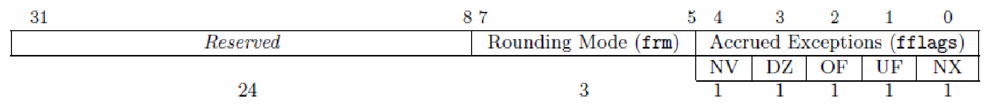

# 第二章 习题

## 习题

1. 简要分析 CISC 和 RISC 架构各自的优势和劣势.

   CISC 对编译器和程序存储空间的要求较低, 代码密度高. 但硬件设计复杂, 设计与测试验证难度极高.

   RISC 硬件设计较为简单, 设计周期短. 但编译器设计复杂, 程序的代码密度较低.

2. RISC-V 中的基本指令集是什么? 列举五个常见的 RISC-V 标准扩展指令集并简要说明它们的作用和应用范围.

   RISC-V 中的基本指令集是 RV32I , RV64I 或 RV128I 等, 包含了整数寄存器操作, 内存访问, 控制流等基本指令.

   常见的扩展指令集还有:

   **F 扩展**: 提供单精度浮点数运算指令, 适用于科学计算和图形处理等需要浮点运算的应用.

   **D 扩展**: 提供双精度浮点数运算指令, 适用于需要更高精度的科学计算等.

   **M 扩展**: 提供整数乘法和除法指令, 适用于需要高级整数运算的应用.

   **E 扩展**: 提供嵌入式系统的指令, 适用于资源受限的嵌入式设备.

   **A 扩展**: 提供原子操作指令, 适用于多线程和并发编程场景.

3. RISC-V 汇编中存在许多伪指令, 它们一般是具有特殊操作数的基本指令或指令组合. 请写出与以下伪指令等价的基本指令或指令组合.

   (1) **`nop`**:

       ```riscvasm
       addi x0, x0, 0
       ```

   (2) **`ret`**:

       ```riscvasm
       jalr x0, ra, 0
       ```

   (3) **`call offset`**:

       ```riscvasm
       auipc ra, offset[31:12]
       jalr ra, ra, offset[11:0]
       ```

   (4) **`mv rd,rs`**:

       ```riscvasm
       addi rd, rs, 0
       ```

   (5) **`rdcycle rd`**:

       ```riscvasm
       csrrs rd, cycle, x0
       ```

   (6) **`sext.w rd, rs`**:

       ```riscvasm
       addiw rd, rs, 0
       ```

4. 阅读 RISC-V 规范以回答以下问题:

   (1) RV32I 中的 `add` 指令和 RV64I 中的 `addw` 指令均为 32 位整型加法指令, 它们是否具有相同的指令操作数 (opcode)? 此外, RV32I 中的 `add` 指令和 RV64I 中的 `add` 指令是否具有相同的指令操作数 (opcode)? 试分析为什么采取这样的设计.

       RV32I 中的 `add` 指令和 RV64I 中的 `addw` 指令的 opcode 不同, 而 RV32I 中的 `add` 指令和 RV64I 中的 `add` 指令的 opcode 相同.

       两指令集中的 `add` 均表示针对寄存器最长宽度的加法操作, 因此它们具有相同的 opcode. 而 `addw` 指令只在 64 位指令集中存在, 仅用于支持 32 位整数的加法操作, 而不是为了兼容 32 位指令集, 因此它具有不同的 opcode.

   (2) 在 RV64I 中, `addw` 和 `addiw` 指令的目标寄存器中存放的 32 位计算结果是否需要进行额外的符号扩展才能用于后续 64 位计算? 请说明理由.

       不需要. `addw` 和 `addiw` 指令会自动进行符号扩展.

5. 什么是 RISC-V 的 I 标准指令集中存在的 HINT 指令空间? 它有什么作用?

   HINT 指令是不会改变系统状态的指令, 其目标寄存器一般为 `x0`. 

   HINT 指令的作用是向微架构提供优化提示. 在不支持 HINT 的处理器上, 其作用与 `nop` 指令相同.

6. 考虑如下指令序列:

   `div a2, a0, a1`
   `rem a3, a0, a1`

   假设寄存器 `a0` 和 `a1` 的初始值分别为 16 和 -5, 则上述指令序列执行完成后 `a2` 和 `a3` 寄存器中的值分别是多少? 简要说明 RISC-V 的 M 标准指令集中对除法和余数指令的符号规定.

   `a2` 的值为 -3, `a3` 的值为 1.

   RISC-V 的 M 扩展中, `div` 指令的结果向 0 取整, `rem` 指令的结果符号与被除数相同.

7. RISC-V 标准指令集并未为加法指令的溢出引入专用的标志位, 因此通常需要额外的指令以检查加法溢出.

   (1) 考虑如下的指令序列:

       ```riscasm
       add t0, t1, t2
       ______
       ______
       bne t3, t4, overflow
       ```

       若 `t1` 和 `t2` 都是有符号数, 请在横线处填入正确的指令, 使得当 `t1` 和 `t2` 的加法发生溢出时, 控制流可以正确跳转到 overflow 位置. (请勿使用除 `t0`~`t4` 以外的任何寄存器)

       ```riscvasm
       slt t3, t0, t1
       slt t4, t2, zero
       ```

   (2) 当 `t1` 和 `t2` 都是无符号数时, 请给出尽量简单的检测 `add t0, t1, t2` 指令加法是否溢出的指令序列.

       ```riscvasm
       bltu t0, t1, overflow
       ```

   (3) 调研其他指令集架构 (如 x86, ARM 等) 是如何检测加法溢出的.

       x86 和 ARM 等指令集架构通常会在加法指令执行后设置一个专门的溢出标志位, 以供后续的条件跳转指令检查.

8. 阅读 RISC-V 规范以了解 RISC-V 对除数为 0 的除法指令的处理方法, 回答以下问题.

   (1) 对整型除法, 填写下表. 整型除法中除数为 0 是否会引起 RISC-V 抛出异常? 试分析为什么采取这样的设计.

       | 指令 | `rs1` | `rs2` | `Op=DIVU` 时 `rd` 值 | `Op=REMU` 时 `rd` 值 | `Op=DIV` 时 `rd` 值 | `Op=REM` 时 `rd` 值 |
       | :---: | :---: | :---: | :---: | :---: | :---: | :---: |
       | `Op rd,rs1,rs2` | X | 0 | 全 1 | X | 全 1 | X |

       整型除法中除数为 0 不会引起 RISC-V 抛出异常. 这种设计可以避免频繁的异常处理开销, 简化处理器设计.

   (2) 对浮点除法, 除数为 0 将会引起 fcsr 控制寄存器中的相关标志位被置位. 下图给出了 fcsr 的构成, 请说明 fflags 的各位分别代表什么含义. fflags 被置位是否会使得处理器陷入系统调用?

       {width=80%}

       fflags 的各位分别代表:

       **NV**: 无效操作.

       **DZ**: 除零.

       **OF**: 上溢出.

       **UF**: 下溢出.

       **NX**: 不精确.

       fflags 被置位不会触发 exception 或陷入系统调用.

   (3) 调研其他指令集架构 (如 x86, ARM 等) 是如何处理除数为 0 的.

       x86 和 ARM 都会在除数为 0 时抛出异常.

9. 回答以下问题:

   (1) `jal` 指令包含 20 位的有符号立即数编码 (J-type), 该指令相较当前 PC 可以跳转的地址空间范围为多少?

       由于立即数最后一位 0 并不包括在编码中, 即采用 2 字节对齐, 因此 `jal` 指令相较当前 PC 可以跳转的地址总长度为 $2^{20} \times 2 = 2^{21}$ 字节, 即跳转的地址空间范围为 $\pm 2^{20}$ 字节.

   (2) 条件分支指令 (如 `bne`) 包含 12 位的有符号立即数编码 (B-type), 这类指令相较当前 PC 可以跳转的地址空间范围为多少?

       同样采用 2 字节对齐, 条件分支指令相较当前 PC 可以跳转的地址总长度为 $2^{12} \times 2 = 2^{13}$ 字节, 即跳转的地址空间范围为 $\pm 2^{12}$ 字节.

   (3) 是否可以使用一条 `lui` 指令和一条 `jalr` 指令的组合完成任意 32 位绝对地址的跳转操作?

       可以. `lui` 指令将高 20 位加载到寄存器中, `jalr` 指令包含低 12 位的立即数编码, 因此两者的组合可以实现任意 32 位绝对地址的跳转操作.

10. 调查 RVC 压缩指令集的编码, 说明一条常用的 32 位指令能够被压缩为 16 位 RVC 指令的条件是什么? RVC 中各类型的指令是否都可以使用完整的 32 个通用整型寄存器?

    只有最常用的指令 (如 `addi`, `lw`, `sw`, `beqz` 等) 才能被压缩为 16 位 RVC 指令, 且对其寄存器和立即数有特定的限制.

    RVC 中的指令并不全都可以使用完整的 32 个通用整型寄存器.

11. 写出以下指令使用的寻址模式.

    (1) **`jal ra, 0x88`**: 立即数寻址.

    (2) **`jalr x0, ra, 0`**: 寄存器间接寻址.

    (3) **`addi a0, a1, 4`**: 立即数寻址.

    (4) **`mul a0, a1, a2`**: 寄存器直接寻址.

    (5) **`ld a4, 16(sp)`**: 基址偏移寻址.

12. 写出以下程序在 RISC-V 中应当处于的特权等级.

    (1) **Linux Kernel**: Supervisor.

    (2) **BootROM**: Machine.

    (3) **BootLoader**: Supervisor.

    (4) **USB Driver**: Supervisor.

    (5) **vim**: User.

13. 写出实现以下 C 程序的 32 位 RISC-V 汇编代码. 假设 A 和 B 的起始地址存放于寄存器 `t0` 和 `t1`, C 的地址存放于寄存器 `t2`.

    ```C
    int vecMul(int *A, int *B, int *C) {
        for (int i = 0; i < 100; ++i) {
            A[i] = B[i] * (*C);
        }
        return A[0];
    }
    ```

    ```riscvasm
    vecMul:
        lw t3, 0(t2)          # Value of *C
        mv t4, zero           # i = 0
        li t5, 100            # i < 100
    loop:
        bge t4, t5, end
        slli t6, t4, 2        # Offset
        add t7, t0, t6        # Address of A[i]
        add t8, t1, t6        # Address of B[i]
        lw t9, 0(t8)          # Value of B[i]
        mul t9, t9, t3        # B[i] * (*C)
        sw t9, 0(t7)          # Store A[i]
        addi t4, t4, 1        # ++i
        j loop
    end:
        lw a0, 0(t0)
        ret
    ```

14. 写出实现以下 C 程序的 32 位 RISC-V 汇编代码. 假设 a, b 和 c 分别对应寄存器 `a0`, `a1` 和 `a2`.

    ```C
    int a, b, c;
    if (a > b) {
        c = a + b;
    }
    else {
        c = a - b;
    }
    ```

    ```riscvasm
        bge a1, a0, else_case
        add a2, a0, a1
        j end
    else_case:
        sub a2, a0, a1
    end:
    ```

15. 写出实现以下 C 程序的 32 位 RISC-V 汇编代码. 假设指针 p 已经通过程序 `int *p = (int *)malloc(4 * sizeof(int))` 得到, 且 p 存放于 `t0` 中, a 存放于 `t1` 中.

    ```C
    p[0] = (int)p;
    int a = 3;
    p[1] = a;
    p[a] = a;
    ```

    ```riscvasm
    sw t0, 0(t0)
    li t1, 3
    sw t1, 4(t0)
    slli t2, t1, 2
    add t2, t0, t2
    sw t1, 0(t2)
    ```

16. 写出实现以下 C 程序的 32 位 RISC-V 汇编代码. 假设指针 a 和 b 分别存放于 `t0` 和 `t1` 中.

    ```C
    void swap(int *a, int *b) {
        int tmp = *a;
        *a = *b;
        *b = tmp;
        return;
    }
    ```

    ```riscvasm
    swap:
        lw t2, 0(t0)
        lw t3, 0(t1)
        sw t3, 0(t0)
        sw t2, 0(t1)
        ret
    ```

17. 解释以下 RISC-V 汇编代码实现的功能.

    ```riscvasm
        addi a0, x0, 0
        addi a1, x0, 1
        addi a2, x0, 30
    loop:
        beq a0, a2, done
        slli a1, a1, 1
        addi a0, a0, 1
        j loop
    done:
        # exit code
    ```

    实现求 $2^{30}$ 的功能.

18. 有一组操作码, 它们的出现几率如下表所示.

    | **$a_i$** | **$p_i$** |
    | :---: | :---: |
    | **a** | 0.25 |
    | **b** | 0.20 |
    | **c** | 0.20 |
    | **d** | 0.15 |
    | **e** | 0.15 |
    | **f** | 0.05 |

    请按照霍夫曼编码对这组操作码进行编码, 计算操作码的平均长度和信息冗余度.

    | **$a_i$** | **$p_i$** | **Encoding** |
    | :---: | :---: | :---: |
    | **a** | 0.25 | 00 |
    | **b** | 0.20 | 10 |
    | **c** | 0.20 | 010 |
    | **d** | 0.15 | 011 |
    | **e** | 0.15 | 110 |
    | **f** | 0.05 | 111 |

    操作码平均长度:
    $$L = 0.25 \times 2 + 0.20 \times 2 + 0.20 \times 3 + 0.15 \times 3 + 0.15 \times 3 + 0.05 \times 3 = 2.55 \,.$$

    信息熵:
    $$H = -\sum_{i=0}^{5} p_i \log_2 p_i \approx 2.466 \,.$$

    信息冗余度:
    $$D = 1 - \frac{H}{L} = 1 - \frac{2.466}{2.55} \approx 0.033 \,.$$

19. 回答以下问题:

    (1) 当函数嵌套调用层数过多 (例如递归陷入死循环时), 可能会造成栈溢出, 请简述其原理.

    每次函数调用时, 都会在栈上分配一个新的栈帧来保存函数的返回地址, 参数和局部变量等信息. 当函数嵌套调用层数过多时, 栈帧的总大小可能会超过栈的最大容量, 导致栈溢出.

    (2) 有什么办法可以缓解或避免特定情况下的栈溢出问题?

    增加栈的大小, 减小函数调用深度, 使用堆内存等.

20. 假设有三个函数: F1, F2 和 F3. 其中 F1 包含 1 个输入参数, 计算过程使用寄存器 `t0` 和 `s0`; F2 包含 2 个输入参数, 计算过程使用寄存器 `t0`~`t1` 及 `s0`~`s1`, 返回一个 int 值. F1 执行过程中会调用 F2, F2 执行过程中会调用 F3. 下表模拟了 F1 执行过程中栈的内容, 其中第一行为 F1 函数被首次调用时 `sp` 寄存器指向的位置. 请在表中填入当 F2 函数首次调用 F3 前栈内保存的可能内容, 并在每行的括号内标注该值是被哪个函数所保存的. 第一行的内容已经给出. (可根据需要增删行数)

| **栈内内容** | **Saver** |
| :---: | :---: |
| **`ra`** | F1 (Caller) |
| **`s0`** | F1 (Callee) |
| **`t0`** | F1 (Caller) |
| **`a0`** | F1 (Caller) |
| **`ra`** | F2 (Caller) |
| **`s0`** | F2 (Callee) |
| **`s1`** | F2 (Callee) |
| **`a0`** | F2 (Caller) |
| **`a1`** | F2 (Caller) |
| **`t0`** | F2 (Caller) |
| **`t1`** | F2 (Caller) |

21. 如朱老师课上所说.

    我做过了.

