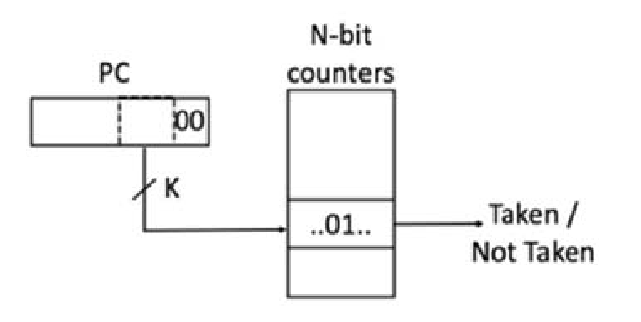
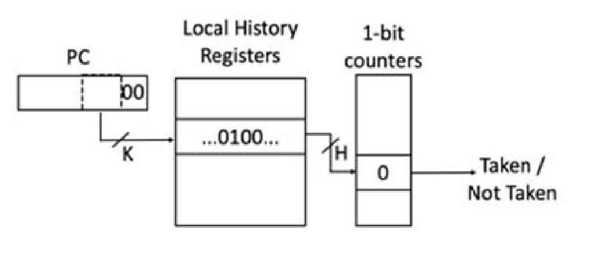
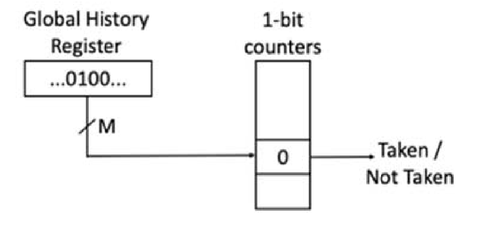

# 第三章 习题

## 习题

1. 假设一个未流水化的处理器使用单个长周期来执行每条指令, 时钟周期为 7ns. 将其进行 5 级分割后, 每个阶段需要的时间为: IF 1ns, ID 1.5ns, EX 1ns, MEM 2ns, WB 1.5ns, 插入的每个流水线寄存器的延迟为 0.1ns, 则:
    (1) 5 级流水化后的处理器时钟周期应为多少?

    $$T = \max(1, 1.5, 1, 2, 1.5) + 0.1 = 2.1 \, \text{ns} \,.$$

    (2) 流水化后的机器相比原来单周期处理器的加速比是多少?

    $$S = \frac{T_{single}}{T_{pipeline}} = \frac{7}{2.1} \approx 3.33 \,.$$

    (3) 如果流水化的机器拥有无限多个流水级, 流水线寄存器延迟不变. 则相比原来单周期处理器的加速比极限是多少?

    $$S_{max} = \frac{T_{single}}{T_{pipeline}} = \frac{7}{0.1} = 70 \,.$$

2. 考虑以下指令序列:

    ```riscvasm
    I1: ld  a1, 0(s1)
    I2: mul a2, a0, a2
    I3: add a1, a2, a2
    I4: ld  a2, 0(s2)
    I5: add a3, a1, a2
    I6: sd  a3, 0(s3)
    ```

    不必考虑内存地址的相关性, 在下表中列出所有的数据依赖.

    |        | **I1** | **I2** | **I3** | **I4** | **I5** | **I6** |
    | :----: | :----: | :----: | :----: | :----: | :----: | :----: |
    | **I1** |  ---   |  ---   |  ---   |  ---   |  ---   |  ---   |
    | **I2** |        |  ---   |  ---   |  ---   |  ---   |  ---   |
    | **I3** |  WAW   |  RAW   |  ---   |  ---   |  ---   |  ---   |
    | **I4** |        |  WAW   |  WAR   |  ---   |  ---   |  ---   |
    | **I5** |        |        |  RAW   |  RAW   |  ---   |  ---   |
    | **I6** |        |        |        |        |  RAW   |  ---   |

3. 如果不同的虚拟地址页都映射到不同物理地址页, 则下列存储-加载指令对是否可能发生数据依赖? 如果可能, 说明发生数据依赖的条件; 如果不可能, 说明理由. 当不同的虚拟地址页可以被映射到相同的物理地址页, 页大小为 4KB, 则结论有什么不同?
    (1) ```riscvasm
        sd a2, 0(a0)
        ld a3, 0(a1)
        ```

        如果不同的虚拟地址页都映射到不同物理地址页, 当 `a0`, `a1` 指向同一个内存地址时可能发生数据依赖 (或非对齐时相差小于 8 字节).

        如果不同的虚拟地址页可以被映射到相同的物理地址页, 且页大小为 4KB, 当 `a0`, `a1` 指向的内存地址相差 4096 字节的整数倍时, 若他们被映射到同一个物理地址页, 就可能发生数据依赖 (非对齐的情况类似).

    (2) ```riscvasm
        sd a2, 0(a0)
        ld a3, 4(a1)
        ```

        如果不同的虚拟地址页都映射到不同物理地址页, 当 `a0`, `a1 + 4` 指向同一个内存地址时可能发生数据依赖 (或非对齐时相差小于 8 字节).

        如果不同的虚拟地址页可以被映射到相同的物理地址页, 且页大小为 4KB, 当 `a0`, `a1 + 4` 指向的内存地址相差 4096 字节的整数倍时, 若他们被映射到同一个物理地址页, 就可能发生数据依赖 (非对齐的情况类似).

    (3) ```riscvasm
        sd a2, 0(a0)
        ld a3, 4096(a1)
        ```

        如果不同的虚拟地址页都映射到不同物理地址页, 当 `a0`, `a1 + 4096` 指向同一个内存地址时可能发生数据依赖 (或非对齐时相差小于 8 字节).

        如果不同的虚拟地址页可以被映射到相同的物理地址页, 且页大小为 4KB, 当 `a0`, `a1` 指向的内存地址相差 4096 字节的整数倍时, 若他们被映射到同一个物理地址页, 就可能发生数据依赖 (非对齐的情况类似).

4. 流水线级数的适度加深一方面能够提高频率, 但同时也会使流水线冲突的停顿代价变大, 最终的性能变化是两者综合作用的结果. 考虑两个处理器: 处理器 A 有 1ns 时钟周期的 5 级流水线, 平均每 5 条指令经历一周期停顿. 处理器 B 有 0.6ns 时钟周期的 12 级流水线, 平均每 8 条指令经历三周期停顿.

    (1) 处理器 B 相比处理器 A 的加速比是多少?

        $$CPI_A = 1 + \frac{1}{5} = \frac{6}{5} \,.$$
        $$CPI_B = 1 + \frac{3}{8} = \frac{11}{8} \,.$$
        $$S = \frac{T_A}{T_B} = \frac{\frac{6}{5} \times 1ns}{\frac{11}{8} \times 0.6ns} = 1.45 \,.$$

    (2) 若分支指令占所有指令类型的 20%, 处理器 A 的错误预测代价为 2 周期, 处理器 B 的错误预测代价为 5 周期. 两处理器的错误预测率均为 5%. 计算两处理器的 CPI.

        $$CPI_A = \frac{6}{5} + 2 \times 0.2 \times 0.05 = 1.22 \,.$$
        $$CPI_B = \frac{11}{8} + 5 \times 0.2 \times 0.05 = 1.425 \,.$$

5. 考虑一个深度流水线处理器, 无分支指令时其基本 CPI 为 1. 对于分支指令采用两种方案, 方案 A 使用一个分支目标缓存 (BTB), 缓存缺失代价为额外 3 个周期, 缓存命中但预测错误的代价为额外 4 个周期, 缓存命中且预测正确则无分支代价. 假设这个 BTB 的命中率为 90%, 预测正确率为 90%. 方案 B 不使用分支预测, 分支代价固定为额外 2 个周期. 假设分支频率为所有指令的 15%, 则处理器采用方案 A 比采用方案 B 快多少?

    $$CPI_A = 0.85 \times 1 + 0.15 \times [0.1 \times 4 + 0.9 \times (0.1 \times 5 + 0.9 \times 1)] = 1.099 \,.$$
    $$CPI_B = 0.85 \times 1 + 0.15 \times 3 = 1.3 \,.$$
    $$S = \frac{CPI_B}{CPI_A} = 1.18 \,.$$

6. 考虑如下所示的代码片段, 假设 a2 寄存器的初值为 0, a3 寄存器的初值为 100. 回答以下问题:

    ```riscvasm
    Loop: ld    a1, 0(a2)
          addi  a1, a1, 1
          sd    a1, 0(a2)
          addi  a2, a2, 4
          sub   a4, a3, a2
          bnez  a4, Loop
    ```

    (1) 列举代码中的数据相关, 说明它们有可能导致什么类型的数据冲突 (不考虑流水线级数).

        I2: RAW, WAW.

        I3: RAW.

        I4: WAR.

        I5: RAW.

        I6: RAW.

    (2) 考虑一个 5 级 RISC 流水线, 该流水线不使用任何前馈硬件. 假设 MEM 阶段均可在单个周期内完成, 分支指令在 WB 阶段完成后取新指令. 按照下表的格式补充表格, 写出该代码段在一次循环中的完整执行时序, 并计算执行完成所有循环共需要多少个时钟周期.

        | | **1** | **2** | **3** | **4** | **5** | **6** | **7** | **8** | **9** | **10** | **11** | **12** | **13** | **14** | **15** | **16** | **17** | **18** |
        | :---: | :---: | :---: | :---: | :---: | :---: | :---: | :---: | :---: | :---: | :---: | :---: | :---: | :---: | :---: | :---: | :---: | :---: | :---: |
        | **I1** | IF | ID | EX | MEM | WB |
        | **I2** | | IF | ID | S | S | EX | MEM | WB |
        | **I3** | | | IF | S | S | ID | S | S | EX | MEM | WB |
        | **I4** | | | | | | IF | S | S | ID | EX | MEM | WB |
        | **I5** | | | | | | | | | IF | ID | S | S | EX | MEM | WB |
        | **I6** | | | | | | | | | | IF | S | S | ID | S | S | EX | MEM | WB |

        单次循环需要 18 个时钟周期, 循环共执行 $100 \div 4 = 25$ 次.

        执行完成所有循环共需要 $18 \times 25 = 450$ 个时钟周期.

7. 仍考虑题 6 中的代码片段, 假设 a2 寄存器的初值为 0, a3 寄存器的初值为 100. 回答以下问题:

    (1) 考虑一个 5 级 RISC 流水线, 该流水线拥有完整的前馈硬件. 假设 MEM 阶段均可在单个周期内完成, 分支指令在 WB 阶段完成后取新指令. 重新写出该代码段在一次循环中的完整执行时序, 并计算执行完成所有循环共需要多少个时钟周期.

        | | **1** | **2** | **3** | **4** | **5** | **6** | **7** | **8** | **9** | **10** | **11** |
        | :---: | :---: | :---: | :---: | :---: | :---: | :---: | :---: | :---: | :---: | :---: | :---: |
        | **I1** | IF | ID | EX | MEM | WB |
        | **I2** | | IF | ID | S | EX | MEM | WB |
        | **I3** | | | IF | S | ID | EX | MEM | WB |
        | **I4** | | | | | IF | ID | EX | MEM | WB |
        | **I5** | | | | | | IF | ID | EX | MEM | WB |
        | **I6** | | | | | | | IF | ID | EX | MEM | WB |

        单次循环需要 11 个时钟周期, 循环共执行 $100 \div 4 = 25$ 次.

        执行完成所有循环共需要 $11 \times 25 = 275$ 个时钟周期.

    (2) 若在前馈硬件的基础上, 该流水线存在一个工作于 IF 级的固定预测发生跳转且能记录跳转目标位置的分支预测器, 此时执行完所有的循环需要的时钟周期变为多少?

        分支预测器可以使得下一循环的 IF 从上一循环的第 8 周期开始, 但最后一个周期预测错误.

        执行完成所有循环共需要 $7 \times 24 + 11 = 179$ 个时钟周期.


8. 仍考虑题 6 中的代码片段, 假设 a2 寄存器的初值为 0, a3 寄存器的初值为 100. 现有一个 10 级的深流水线, 它将原来的 5 级 RISC 流水线的每一级拆分为两个阶段: IF1/IF2, ID1/ID2, EX1/EX2, MEM1/MEM2, WB1/WB2. 前馈仅能将数据从两个阶段的第二阶段转发给需要它的第一阶段, 例如从 MEM2 前馈到 EX1. 静态分支预测器固定预测发生跳转. 回答以下问题:

    (1) 按照下表的格式补充表格, 写出该代码段在一次循环中的完整执行时序, 并计算执行完成所有循环共需要多少个时钟周期.

        | | **1** | **2** | **3** | **4** | **5** | **6** | **7** | **8** | **9** | **10** | **11** | **12** | **13** | **14** | **15** | **16** | **17** | **18** | **19** | **20** | **21** |
        | :---: | :---: | :---: | :---: | :---: | :---: | :---: | :---: | :---: | :---: | :---: | :---: | :---: | :---: | :---: | :---: | :---: | :---: | :---: | :---: | :---: | :---: |
        | **I1** | IF1 | IF2 | ID1 | ID2 | EX1 | EX2 | M1 | M2 | WB1 | WB2 |
        | **I2** | | IF1 | IF2 | ID1 | ID2 | S | S | S | EX1 | EX2 | M1 | M2 | WB1 | WB2 |
        | **I3** | | | IF1 | IF2 | ID1 | S | S | S | ID2 | S | EX1 | EX2 | M1 | M2 | WB1 | WB2 |
        | **I4** | | | | IF1 | IF2 | S | S | S | ID1 | S | ID2 | EX1 | EX2 | M1 | M2 | WB1 | WB2 |
        | **I5** | | | | | IF1 | S | S | S | IF2 | S | ID1 | ID2 | S | EX1 | EX2 | M1 | M2 | WB1 | WB2 |
        | **I6** | | | | | | | | | IF1 | S | IF2 | ID1 | S | ID2 | S | EX1 | EX2 | M1 | M2 | WB1 | WB2 |
        | **I1'** | | | | | | | | | | | IF1 | IF2 | S | ID1 | S | ID2 | S | EX1 | ... | ... | ... |

        单次循环需要 21 个时钟周期, 循环共执行 $100 \div 4 = 25$ 次.

        分支预测器可以使得下一循环的 IF 从上一循环的第 11 周期开始, 但最后一个周期预测错误. 此外, 新循环的第 1 条指令会由于结构冲突停顿 2 周期, 由于数据依赖停顿 1 周期.

        执行完成所有循环共需要 $10 + 13 \times 23 + 24 = 333$ 个时钟周期.


    (2) 计算题 6-8 中各情况下处理器的CPI.

        指令总数为 $25 \times 6 = 150$ 条.

        第 6 题: $CPI = \frac{450}{150} = 3$.

        第 7 题 (1): $CPI = \frac{275}{150} = 1.83$.

        第 7 题 (2): $CPI = \frac{179}{150} = 1.19$.

        第 8 题: $CPI = \frac{333}{150} = 2.22$.

9. 考虑一个顺序流水线, 忽略前端的取指和译码, 处理器从发射到执行完成不同指令所需要的总周期数如下表所示.

    | **指令类型** | **总周期数** |
    | :---: | :---: |
    | **内存加载** | 4 |
    | **内存存储** | 2 |
    | **整型运算** | 1 |
    | **分支** | 2 |
    | **浮点加法** | 3 |
    | **浮点乘法** | 5 |
    | **浮点除法** | 11 |

    考虑如下的指令序列:

    ```riscvasm
    Loop: fld     f2,   0(a0)
          fdiv.d  f8,   f0, f2
          fmul.d  f2,   f6, f2
          fld     f4,   0(a1)
          fadd.d  f4,   f0, f4
          fadd.d  f10,  f8, f2
          fsd     f10,  0(a0)
          fsd     f4,   0(a1)
          addi    a0,   a0, 8
          addi    a1,   a1, 8
          sub     x20,  x4, a0
          bnz     x20,  Loop
    ```

    (1) 假设一条单发射顺序流水线, 在没有数据冲突或分支指令时, 每个周期均会新发射一条指令(假设运算单元是充足的). 检测到数据冲突或分支指令时则会暂停发射, 直到冲突指令执行完毕才会发射新的指令. 则上述代码段的一次迭代需要多少个周期执行完成?

        ```riscvasm
        Loop: fld     f2,   0(a0)     #  0 +  4 =  4
              fdiv.d  f8,   f0, f2    #  4 + 11 = 15
              fmul.d  f2,   f6, f2    #  5 +  5 = 10
              fld     f4,   0(a1)     #  6 +  4 = 10
              fadd.d  f4,   f0, f4    # 10 +  3 = 13
              fadd.d  f10,  f8, f2    # 15 +  3 = 18
              fsd     f10,  0(a0)     # 18 +  2 = 20
              fsd     f4,   0(a1)     # 19 +  2 = 21
              addi    a0,   a0, 8     # 20 +  1 = 21
              addi    a1,   a1, 8     # 21 +  1 = 22
              sub     x20,  x4, a0    # 22 +  1 = 23
              bnz     x20,  Loop      # 23 +  2 = 25
        ```

        上述代码段的一次迭代需要 25 个周期执行完成.

    (2) 假设一条双发射顺序流水线, 取指和译码的带宽足够, 运算单元充足, 且数据在两条流水线之间的传递是无延迟的, 因此只有真数据冲突才会导致流水线停顿. 则上述代码段的一次迭代需要多少个周期执行完成?

        ```riscvasm
        Loop: fld     f2,   0(a0)     #  0 +  4 =  4
              fdiv.d  f8,   f0, f2    #  4 + 11 = 15
              fmul.d  f2,   f6, f2    #  4 +  5 =  9
              fld     f4,   0(a1)     #  5 +  4 =  9
              fadd.d  f4,   f0, f4    #  9 +  3 = 12
              fadd.d  f10,  f8, f2    # 15 +  3 = 18
              fsd     f10,  0(a0)     # 18 +  2 = 20
              fsd     f4,   0(a1)     # 18 +  2 = 20
              addi    a0,   a0, 8     # 19 +  1 = 20
              addi    a1,   a1, 8     # 19 +  1 = 20
              sub     x20,  x4, a0    # 20 +  1 = 21
              bnz     x20,  Loop      # 21 +  2 = 23
        ```

        上述代码段的一次迭代需要 23 个周期执行完成.

    (3) 调整指令的排列顺序, 使得其在上述双发射流水线中完成一次迭代需要的周期数量减少. 给出调整后的指令序列及一次迭代所需要的周期数.

        ```riscvasm
        Loop: fld     f2,   0(a0)     #  0 +  4 =  4
              fdiv.d  f8,   f0, f2    #  4 + 11 = 15
              fmul.d  f2,   f6, f2    #  4 +  5 =  9
              fld     f4,   0(a1)     #  5 +  4 =  9
              fadd.d  f4,   f0, f4    #  9 +  3 = 12
              fadd.d  f10,  f8, f2    # 15 +  3 = 18
              fsd     f4,   0(a1)     # 15 +  2 = 17 *
              addi    a1,   a1, 8     # 16 +  1 = 17 *
              fsd     f10,  0(a0)     # 18 +  2 = 20
              addi    a0,   a0, 8     # 18 +  1 = 19
              sub     x20,  x4, a0    # 19 +  1 = 20
              bnz     x20,  Loop      # 20 +  2 = 22
        ```

        上述代码段的一次迭代需要 22 个周期执行完成.

10. 考虑如下的代码片段:

    ```riscvasm
    Loop: fld f4, 0(a0)
    fmul.d f2, f0, f2
    fdiv.d f8, f4, f2
    fld f4, 0(a1)
    fadd.d f6, f0, f4
    fsub.d f8, f8, f6
    fsd f8, 0(a1)
    ```

    现将其进行简单的寄存器重命名, 假定有 `T0`~`T63` 的临时寄存器池, 且 `T9` 开始的寄存器可用于重命名. 写出重命名后的指令序列.

    ```riscvasm
    Loop: fld T9, 0(a0)
    fmul.d T10, f0, f2
    fdiv.d T11, T9, T10
    fld T12, 0(a1)
    fadd.d T13, f0, T12
    fsub.d T14, T11, T13
    fsd T14, 0(a1)
    ```

11. 查阅资料, 简述显式重命名和隐式重命名的区别, 优缺点以及可能的实现方式.

    显式重命名通过在物理寄存器文件中为每个指令分配一个新的物理寄存器来消除冲突, 需要维护映射表来记录逻辑寄存器和物理寄存器之间的关系. 优点是数据不需要在 ROB/AFR 中传递, 缺点是需要更多的物理寄存器, 维护映射表的复杂度较高.

    隐式重命名中未提交的数据存在 ROB 中, 而 AFR 保存即将写入的值. 优点是各组件分工明确, 需要的物理寄存器较少, 缺点是数据读取的复杂度较高.

12. 考虑如下的代码片段:

    ```riscvasm
            li      a0, 0
            li      a4, 10000
            addi    a1, a0, 0
    Loop:   addi    a3, a0, 2
            rem     a2, a1, a3
    0xe44:  bne     a2, a0, Rem2    // B1
            #...CodeA
    Rem2:   addi    a3, a0, 5
            rem     a2, a1, a3
    0xe84:  bne     a2, a0, End     // B2
            #...CodeB
    End:    addi    a1, a1, 1
    0xec0:  bne     a1, a4, Loop    // B3
    ```

    (1) 写出与该汇编代码功能一致的 C 语言代码.

        ```C
        for (int i = 0; i < 10000; i++) {
            if (i % 2 == 0) {
                CodeA();
            }
            if (i % 5 == 0) {
                CodeB();
            }
        }
        ```

    (2) 无分支预测时, 上述代码中的三条 `bne` 指令发生跳转的比例分别是多少?

        $$B_1 = \frac{5000}{10000} = 0.5 \,.$$
        $$B_2 = \frac{8000}{10000} = 0.8 \,.$$
        $$B_3 = \frac{9999}{10000} = 0.9999 \,.$$

    (3) 引入一个静态分支预测器, 该预测器对向前跳转总是给出 "跳转" 预测, 对向后跳转总是给出 "不跳转" 预测, 则上述代码中的三条 `bne` 指令的预测准确率分别是多少?

        $$B_1 = \frac{5000}{10000} = 0.5 \,.$$
        $$B_2 = \frac{2000}{10000} = 0.2 \,.$$
        $$B_3 = \frac{9999}{10000} = 0.9999 \,.$$

13. 仍考虑题 12 中的代码片段, 现引入局部预测器, 如下图所示. 该预测器使用 PC 的第 `[(K+2):3]` 共 K 位索引一张预测器表, 该表的每个表项是一个 N-bit 的计数器, 计数器的最高位用于预测是否跳转 (1 为跳转, 0 为不跳转), 并根据实际跳转结果更新计数器的值 (跳转自增 1, 增至 $2^N-1$ 后不再变化; 不跳转自减 1, 减至 0 后不再变化). 假设所有计数器的初始值均为 0.

    {width=40%}

    (1) 要保证上述代码片段被映射到不同的局部预测器, K 的最小值是多少?

        十六进制数 `e44` 的二进制为 `1110 0100 0100`.

        十六进制数 `ec0` 的二进制为 `1110 1100 0000`.

        两者差值 `0111 1000`, 右移 2 位后得到 `11110`, 需要 5 位. 因此 K 的最小值为 5.

    (2) 要使该预测器对三条 `bne` 指令的预测准确率均不低于题 12 中的静态预测器, N 的最小值是多少?

        $B_1$ 实际跳转情况交替改变, 因此 $N = 1$ 时几乎无法对其正确预测.

        $B_3$ 由于只在最后一次循环时不跳转, 因此无法超过静态预测器的准确率.

        $N = 2$ 时, 预测器对前 2 条指令的预测准确率都高于上题中的静态预测器, 具体数值见下一问. 因此 N 的最小值为 2.

    (3) 对上述给出的最小 N, 在程序稳态时, 三条 `bne` 指令的预测准确率分别是多少?

        $$B_1 = \frac{5000}{10000} = 0.5 \,.$$
        $$B_2 = \frac{7999}{10000} = 0.7999 \approx 0.2 \,.$$
        $$B_3 = \frac{9997}{10000} = 0.9997 \approx 1 \,.$$

14. 仍考虑题 12 中的代码片段, 现引入局部分支历史, 如下图所示. 该预测器使用 PC 的第 `[(K+2):3]` 共 K 位索引一个局部分支历史表, 其每个表项是一个 H 位的局部分支历史, 该 H 位的历史被进一步用于索引一张单比特计数器构成的预测表(1 为跳转, 0 为不跳转). 计数器会根据实际跳转结果进行更新.

    {width=40%}

    假设 K 的值足够大, 使得上述代码片段中的不同分支会被映射到局部分支历史表中的不同位置. 则为了使得三条 `bne` 指令都能在程序稳态时被完全准确地预测, H 的最小值是多少?

    $B_1$ 交替跳转, 因此只需要 $H = 1$.
    
    $B_2$ 跳转情况以 5 为周期. 为确保完全准确的预测, 需要 $H = 4$.
    
    因此 H 的最小值为 4.

15. 仍考虑题 12 中的代码片段, 现引入全局分支历史, 如下图所示. 该预测器拥有一个 M 位的 GHR, 记录了程序中任意分支的跳转历史. 当一个新分支被执行时, 跳转分支使得 GHR 左移 1 位并在末位写入 1, 未跳转分支则使得 GHR 左移 1 位并在末位写入 0. GHR 被用于索引一张单比特计数器构成的预测表(1 为跳转, 0 为不跳转). 计数器会根据实际跳转结果进行更新.

    {width=40%}

    为了使得三条 `bne` 指令都能在程序稳态时被完全准确地预测, M 的最小值是多少?

    稳定状态下, $B_1$, $B_2$, $B_3$ 的周期分别为 2, 5, 1. 它们的最小公倍数为 10, 因此全局历史的周期为 30.

    依次检查 M 从 1 开始的情况, M 的最小值为 12.

16. 在实际应用中常常能遇到如下的代码场景:

    ```C
    for (int i=0; i<P; i++) {       // outer loop
        for (int j=0; j<Q; j++){    // inner loop
            // SomeCode
        }
    }
    ```

    视进入循环体执行为 "跳转", 不进入为 "不跳转". 现有两种分支预测器方案: 方案 A 使用题 13 中的预测器结构 ($N = 1$), 方案 B 使用题 14 中的预测器结构($H = Q$). 假设 $Q > 2$ 且内循环体 (inner loop) 内部没有分支指令, 外循环体 (outer loop) 针对变量的分支总是被预测器忽略, 预测器的 K 值足够大, 所有计数器的初始值均为 0. 试分析当 P 和 Q 满足什么数值关系时, 方案 A 的预测准确率优于方案 B?

    $$A = \frac{P(Q-1)}{P(Q+1)} = \frac{Q-1}{Q+1} \,.$$
    $$B = \frac{(P-2)(Q+1)+1+2}{P(Q+1)} = \frac{PQ+P-2Q+1}{P(Q+1)} \,.$$
    $$\frac{Q-1}{Q+1} > \frac{PQ+P-2Q+1}{P(Q+1)} \implies 2P-2Q+1 < 0 \,.$$

17. 考虑如下的指令序列:

    ```riscvasm
    Loop:   lw      a4, 0(a3)
            addi    a3, a3, 4
            addi    a1, a1, -1
    B1:     beqz    a4, B2
            addi    a2, a2, 1
    B2:     bnez    a1, Loop
    ```

    假设 a1 初值值为 n (n > 0), a2 初始值为 0, a3 初始值为 p (p 为一个指向 32 位整型数组首地址的指针).

    (1) 假设处理器使用 2 位局部预测器, 分支 B1 和 B2 映射到不同的预测器表项. 若 n = 8 且数组的数据模式为 `p[]={1,0,1,0,1...}`, 则上述代码执行过程中一共会发生多少次错误预测?

        假设预测器初始值为 0. $B_1$ 两种跳转情况交替, 使用 2 位预测器时始终预测不跳转, n = 8 时有 4 次错误预测. $B_2$ 只会在前 2 次和最后一次预测时发生错误, 有 3 次错误预测. 因此一共会发生 7 次错误预测.

    (2) 现引入 1 位的全局分支历史, (1) 中的其他假设不变, 则上述代码执行过程中一共会发生多少次错误预测?

        假设预测器所有初始值都为 0. n = 8 时, $B_1$ 始终预测不跳转, 有 4 次预测错误. $B_2$ 前 4 次和最后一次出错, 有 5 次预测错误. 因此一共会发生 9 次错误预测.

    (3) 若改为 2 位的全局分支历史表, (1) 中的其他假设不变, 则上述代码执行过程中一共会发生多少次错误预测?

        2 位全局历史共有 3 种情况, 除去连续 not taken 以外都有出现. 且前 2 次为 NT/T 时下一次只会对 $B_1$ 进行预测, 且前 2 次为 T/NT 时下一次只会对 $B_2$ 进行预测.

        假设预测器所有初始值都为 0. n = 8 时, $B_1$ 第 2, 4 次出错, 有 2 次预测错误. $B_2$ 前 5 次和最后一次出错, 有 6 次预测错误. 因此一共会发生 8 次错误预测.

    (4) 比较上述结果, 分析在该情境中全局分支历史表的位数对预测准确率有怎样的影响? 当 n 非常大时, 上述哪种预测器表现最好?

        当 n 非常大时, 上述 3 种预测器在对 $B_2$ 预测时都能稳定正确预测. 但 (1) 和 (2) 中的预测器对 $B_1$ 均只能达到 $\frac{1}{2}$ 的预测准确率, 而 (3) 中的预测器在引入 2 位全局预测表后能稳定地正确预测. 因此 (3) 中的预测器表现最好, 在 n 非常大时对 2 个分支的预测准确率能接近 1.

    (5) 当数组 `p[]` 的数据模式变为在 0 和 1 之间以均等概率随机取值时, 4 中的结论有什么变化?

        当数组中的数据模式改为随机取值后, 全局分支历史表带来的学习能力失效. 三者在 n 非常大时, 预测准确率方面没有优劣之分. 考虑到复杂的预测器对 $B_2$ 预测达到稳定所需要的时间较长, 在 n 不那么大时, (1) 中的简单预测器表现会更好.

18. 解释为什么即使在顺序的 5 级 RISC 流水线中, 指令引发的异常也可能会乱序产生? 为了支持精确的异常处理, 流水线是如何做到对乱序产生的异常进行 (按程序顺序的) 顺序处理的?

    即使未引入乱序, 由于 5 级流水线的多个阶段都有可能产生异常, 后续指令若在靠前的阶段中产生异常, 时间上可能早于先序指令在靠后阶段的异常.

    由于每个阶段的执行都是顺序的, 只要统一在写回时处理异常, 对乱序异常也能够进行顺序处理.

19. 基础的 5 级 RISC 流水线能够单周期完成 ID 阶段的前提是寄存器堆拥有至少 2 个读端口以同时读出 2 个源操作数. 假设某个系统仅能使用具有单个读端口的寄存器堆, 这将导致流水线面临结构冲突. 为此, 拥有两个源操作数寄存器的指令的 ID 阶段需要被拆分为两周期完成, 单个源操作数寄存器指令则不受影响.

    (1) 标记下表中的指令是否需要两周期完成 ID 阶段.

        | | **`add`** | **`addi`** | **`ld`** | **`sd`** | **`bne`** | **`jal`** | **`jalr`** |
        | :---: | :---: | :---: | :---: | :---: | :---: | :---: | :---: |
        | **是否需要 2 周期?** | 是 | 否 | 否 | 是 | 是 | 否 | 否 |

    (2) 考虑以下指令序列:

        ```riscvasm
        Loop:   lw      a4, 0(a3)
                addw    a1, a4, a1
                addiw   a2, a2, -1
                addiw   a3, a3, 4
                bnez    a2, Loop
        ```

        若 a1 初值为 0, a2 初值为 n, 流水线无前馈, 则在上述单个读端口寄存器堆系统中, 循环单次迭代需要的周期数是多少? 画出执行时序表.

        | | **1** | **2** | **3** | **4** | **5** | **6** | **7** | **8** | **9** | **10** | **11** | **12** |
        | :---: | :---: | :---: | :---: | :---: | :---: | :---: | :---: | :---: | :---: | :---: | :---: | :---: |
        | **I1** | IF | ID | EX | MEM | WB |
        | **I2** | | IF | ID | ID | S | EX | MEM | WB |
        | **I3** | | | IF | S | S | ID | EX | MEM | WB |
        | **I4** | | | | | | IF | ID | EX | MEM | WB |
        | **I5** | | | | | | | IF | ID | S | EX | MEM | WB |

        循环单次迭代需要 12 个周期.

    (3) 为流水线引入前馈, 如果两个源操作数寄存器中的任意一个可以通过前馈而不是读寄存器堆得到, 则即使寄存器堆只有一个读端口, ID 阶段仍然可以单周期完成. 此时上述代码段单次迭代需要的周期数是多少? 画出执行时序表.

        | | **1** | **2** | **3** | **4** | **5** | **6** | **7** | **8** | **9** | **10** |
        | :---: | :---: | :---: | :---: | :---: | :---: | :---: | :---: | :---: | :---: | :---: |
        | **I1** | IF | ID | EX | MEM | WB |
        | **I2** | | IF | ID | S | EX | MEM | WB |
        | **I3** | | | IF | S | ID | EX | MEM | WB |
        | **I4** | | | | | IF | ID | EX | MEM | WB |
        | **I5** | | | | | | IF | ID | EX | MEM | WB |

        循环单次迭代需要 10 个周期.

20. 考虑一个拥有浮点单元的单发射乱序处理器, 该处理器包含以下假设:

    (a) 处理器的浮点单元包含一个 2 运算周期的加法器, 一个 10 运算周期的乘法器, 和一个单执行周期的浮点加载/存储单元, 加法和乘法器均是完全流水化的.

    (b) 当发生写回冲突时, 更早的指令会获得优先写回权.

    (c) 浮点指令的结果只能在写回阶段完成后被其他指令使用, 整型指令的结果则可以前馈.

    (d) 处理器使用寄存器重命名, 从 T0, T1, T2 起有不受限制的重命名寄存器可用.

    (e) 译码级每周期可以将至多 1 条重命名后的指令添加到 ROB 中, 指令通过 ROB 顺序提交且每周期至多提交 1 条指令. 指令能够被提交的最早时间是完成写回后的下一个周期.

    (f) 忽略前端取指, 指令经过译码, 发射, 执行和写回后即可完成执行并提交.

    现考虑如下的指令序列:

    ```riscvasm
    I1: fld     f1, 5(a0)
    I2: fmul.d  f2, f1, f0
    I3: fadd.d  f3, f2, f0
    I4: addi    a0, a0, 8
    I5: fld     f1, 5(a0)
    I6: fmul.d  f2, f1, f1
    I7: fadd.d  f2, f2, f3
    ```

    (1) 如果 ROB 的深度是无限的, 将下表补充完全. (部分结果已给出)

        | | **Decode (ROB enqueue)** | **Issue** | **WB** | **Commited** | **操作码** | **目标** | **源1** | **源2** |
        | :---: | :---: | :---: | :---: | :---: | :---: | :---: | :---: | :---: |
        | **I1** | 0 | 1 | 2 | 3 | `fld` | T0 | a0 | --- |
        | **I2** | 1 | 3 | 13 | 14 | `fmul.d` | T1 | T0 | f0 |
        | **I3** | 2 | 14 | 16 | 17 | `fadd.d` | T2 | T1 | f0 |
        | **I4** | 3 | 4 | 5 | 18 | `addi` | T3 | a0 | --- |
        | **I5** | 4 | 5 | 6 | 19 | `fld` | T4 | T3 | --- |
        | **I6** | 5 | 7 | 17 | 20 | `fmul.d` | T5 | T4 | T4 |
        | **I7** | 6 | 18 | 20 | 21 | `fadd.d` | T6 | T5 | T2 |

    (2) 如果 ROB 仅容纳 2 条指令, 当一条指令提交后的下一周期该条目可以被新指令占据. 重新将下表补充完全. (部分结果已给出)

| | **Decode (ROB enqueue)** | **Issue** | **WB** | **Commited** | **操作码** | **目标** | **源1** | **源2** |
| :---: | :---: | :---: | :---: | :---: | :---: | :---: | :---: | :---: |
| **I1** | 0 | 1 | 2 | 3 | `fld` | T0 | a0 | --- |
| **I2** | 1 | 3 | 13 | 14 | `fmul.d` | T1 | T0 | f0 |
| **I3** | 4 | 14 | 16 | 17 | `fadd.d` | T2 | T1 | f0 |
| **I4** | 15 | 16 | 17 | 18 | `addi` | T3 | a0 | --- |
| **I5** | 18 | 19 | 20 | 21 | `fld` | T4 | T3 | --- |
| **I6** | 19 | 21 | 31 | 32 | `fmul.d` | T5 | T4 | T4 |
| **I7** | 22 | 32 | 34 | 35 | `fadd.d` | T6 | T5 | T2 |

