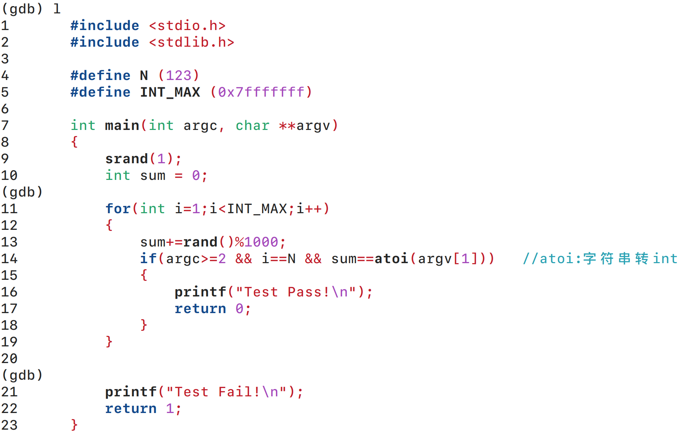
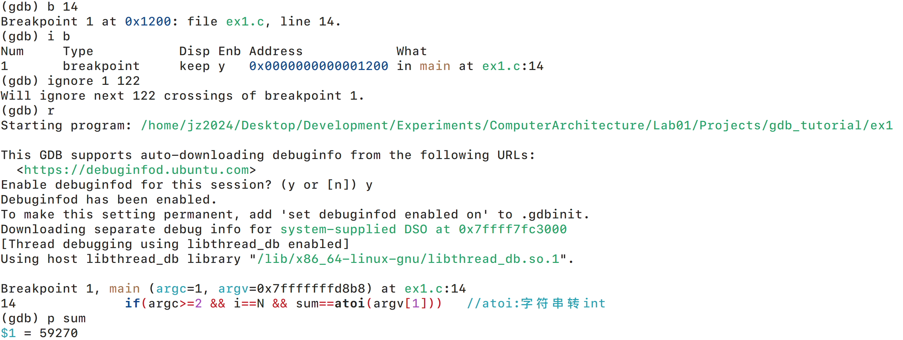
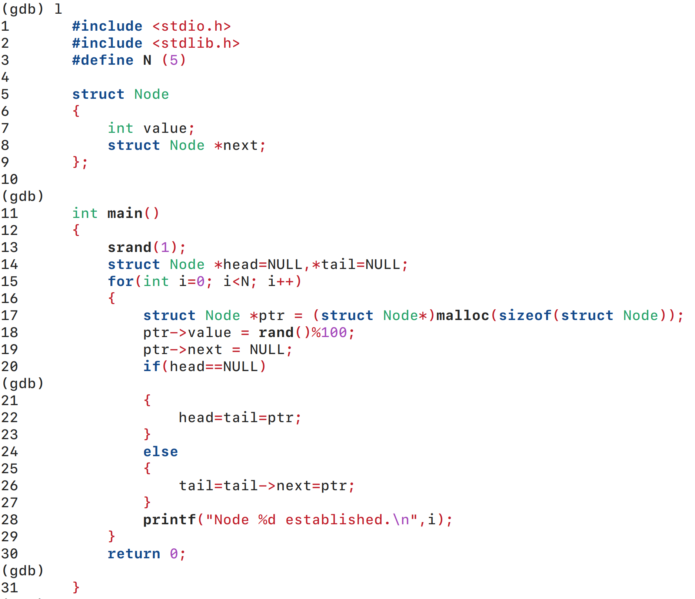
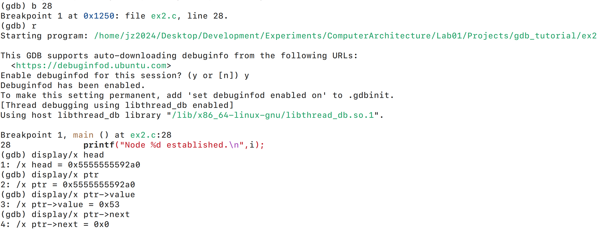
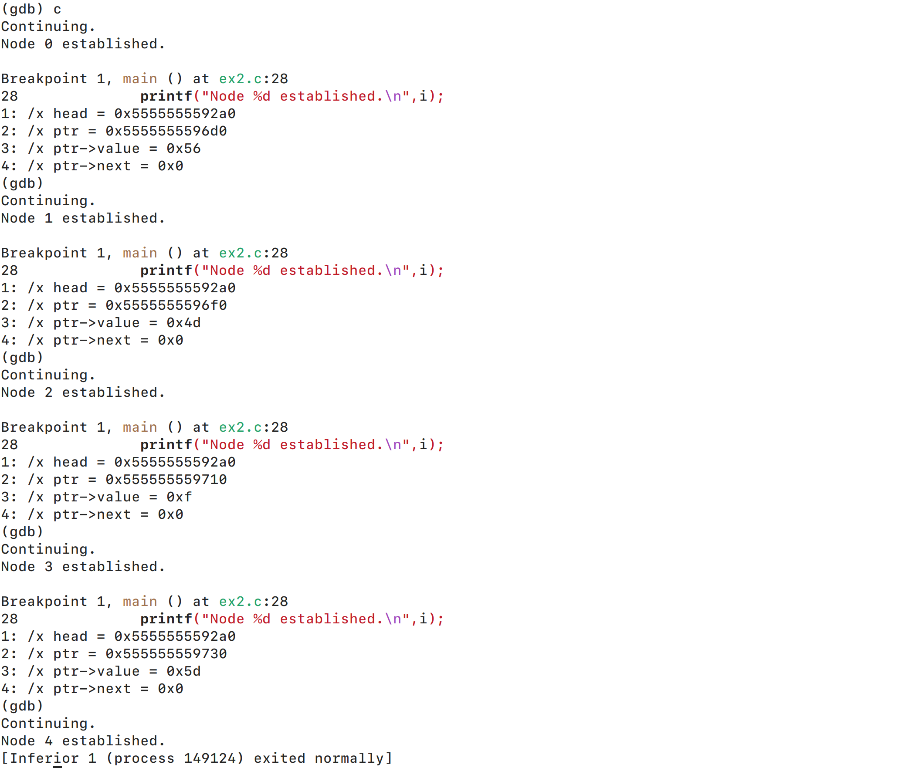

# 实验1 GDB调试实验

## 1. 实验目的

了解 `gdb` 的基本使用方法, 包括设置断点, 查看变量值, 单步执行等功能. 掌握命令行调试程序的技巧, 提高调试效率和能力.

## 2. 实验步骤

### 2.1. ex1: 断点的使用
1. 编译程序并启动 `gdb`:

   本次实验环境为个人电脑上的 Ubuntu 24.04 操作系统.

   

2. 查看程序:

   使用 `list (l)` 命令查看代码.

   

3. 查看变量值:

   使用 `break (b)` 命令设置断点, 并使用 `ignore` 忽略前 122 次断点触发, 直接跳到第 123 次.

   使用 `run (r)` 运行直至断点处, 再使用 `print (p)` 命令查看变量值.

   

4. 实验结果:

   输入 `59270` 作为参数, 程序成功输出 `Test Pass!`. 本题答案为 `59270`.

   

### 2.2. ex2: 打印的使用

1. 编译程序并启动 `gdb`:

   图略.

2. 查看程序:

   使用 `list (l)` 命令查看代码.

   

3. 查看变量值:

   使用 `break (b)` 命令设置断点. 使用 `run (r)` 运行直至断点, 再使用 `display` 将各个变量的值设为显示状态.

   

   使用 `continue (c)` 继续运行, 观察变量值的变化.

   

4. 实验结果:

   head节点的起始地址为 `0x5555555592a0`.

   | 节点编号 | value (hexadecimal) | next (hexadecimal) |
   | :---: | :---: | :---: |
   | 0 (head) | `0x53` | `0x5555555596d0` |
   | 1 | `0x56` | `0x5555555596f0` |
   | 2 | `0x4d` | `0x555555559710` |
   | 3 | `0xf` | `0x555555559730` |
   | 4 (tail) | `0x5d` | `0x0` |

## 3. 实验分析与总结

本次实验主要练习了 `gdb` 的断点和显示功能, 让我们能够深入理解程序的执行流程和变量的变化情况. 通过设置断点并忽略前几次触发, 我们能够直接跳到感兴趣的代码位置, 提高了调试效率. 显示功能则让我们能够实时观察变量的值, 更加直观地理解程序的行为.

在 ex1 中, 通过设置断点并查看变量值, 我们成功找到了程序的正确输入参数. 在 ex2 中, 通过显示变量值, 我们能够清晰地看到链表节点的结构和内容. 这些技能对于调试复杂程序非常有用, 可以帮助我们快速定位问题并理解程序的运行机制.

## 4. 实验收获与建议

通过本次实验, 我们不仅掌握了 `gdb` 的基本使用方法, 还学会了如何高效地调试程序. 这些技能对于我们未来课程的学习和实际项目开发都非常重要.

