# 实验2 RISC-V QEMU 的安装与使用

## 1. 实验目的

了解体系结构模拟器的概念和用途, 介绍 RISC-V QEMU 的安装方法. 通过在 QEMU 上运行 newlib 程序, 了解 QEMU 的基本用法, 熟悉 `gdb` 的调试过程.


## 2. 实验步骤

### 2.1. QEMU 安装

1. **启动虚拟机**

   本次实验虚拟机采用与老师所提供的虚拟机相一致的 Ubuntu 20.04 环境. 该虚拟机本身也通过 Linux 主机上的 QEMU System 运行, 安装 AMD64 架构的 Ubuntu Server, 并配置所需环境. QEMU 支持将虚拟机输出直接打印到当前窗口, 因此不必启动单独的图形界面. 在 AMD64 Linux 和 ARM64 macOS 机器上, 分别可以采用如下的 script 启动.

   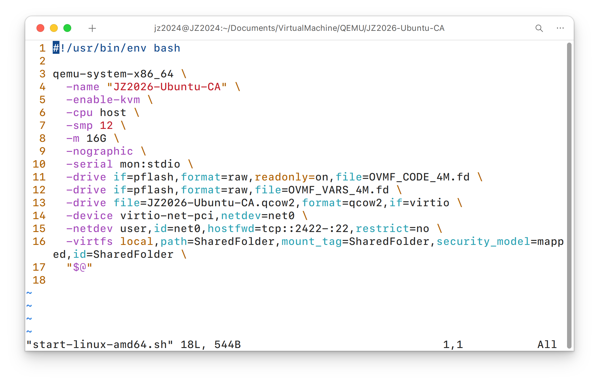

   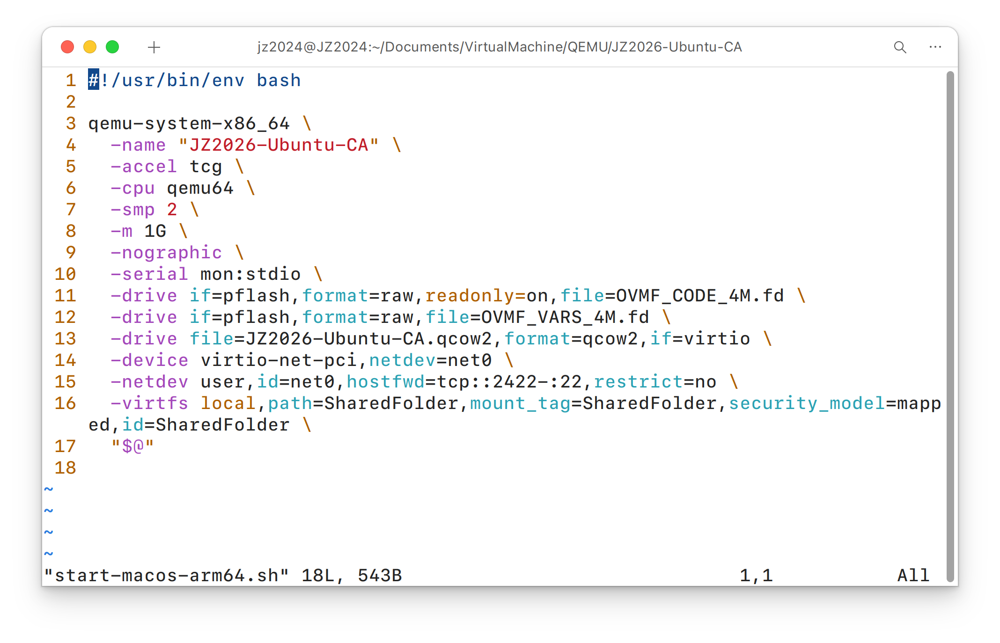

   由于老师提供的虚拟机为 Ubuntu Desktop, 默认情况下其 Linux kernel 版本会随 point release 的发布而更新. 而本实验使用的 Ubuntu 20.04.5 作为该 LTS 版本生命周期内的最后一次 point release, 其 kernel 版本更新至了 5.15. 我使用的 Ubuntu Server 默认则采用更加保守的 Linux kernel 更新策略, 为了对齐 kernel 版本, 需要手动更新至 5.15. 更新完成后 login 界面如下.

   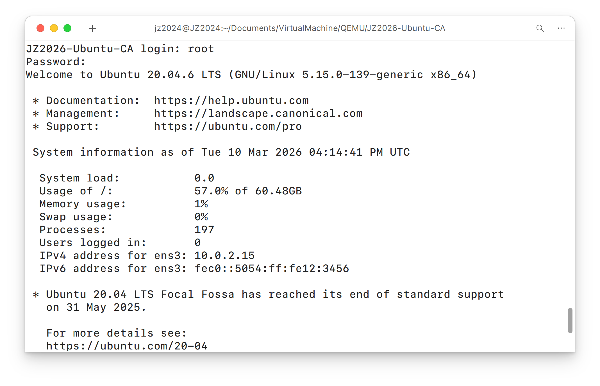

   为了使用方便, 采用了 `ssh` 连接虚拟机, 连接成功后界面如下.

   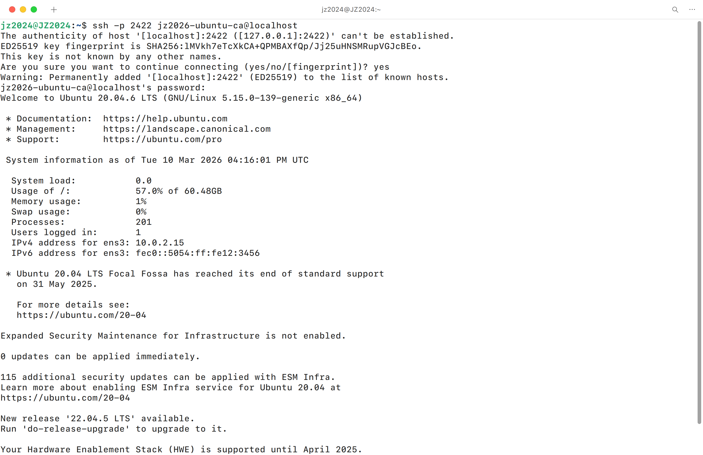

2. **使用 `apt` 包管理器安装 QEMU**

   Ubuntu 20.04 的官方软件仓库中包含了 QEMU 的安装包, 可以直接使用 `apt` 包管理器进行安装. 由于此前更新 Linux kernel 之前已经运行过 `apt update`, 因此这里直接安装.

   

   利用 Ubuntu 自带的 bash-completion 功能, 可以通过输入 `qemu-` 后按两次 Tab 键来查看可用的 QEMU 可执行文件.

   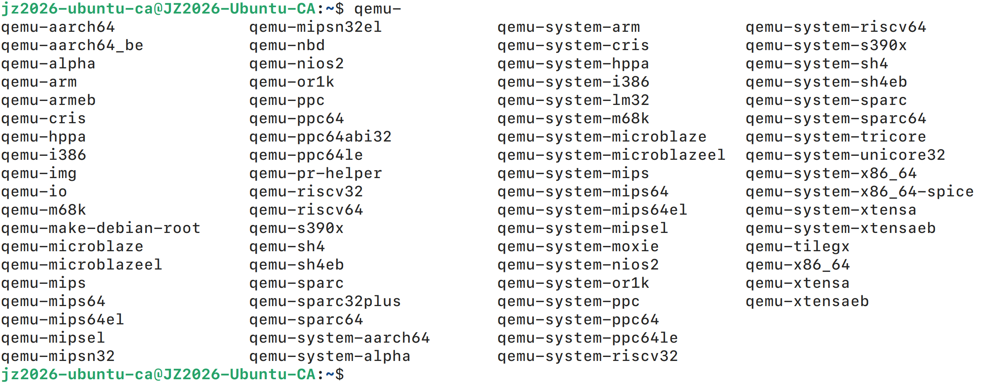

3. **从源代码编译 QEMU**

   先通过 `apt remove` 和 `apt autoremove` 卸载已经安装的 QEMU 及其依赖, 再从源代码编译安装.

   我已预先安装了 `git` 和 `build-essential` 等必要的工具, 因此直接克隆 QEMU 的源代码仓库, 并切换到指定版本.

   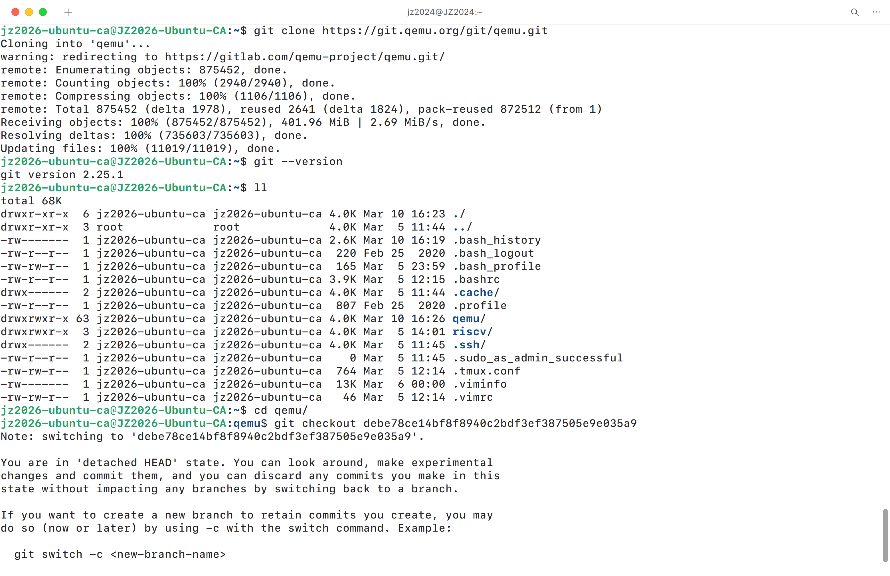

   配置编译选项.

   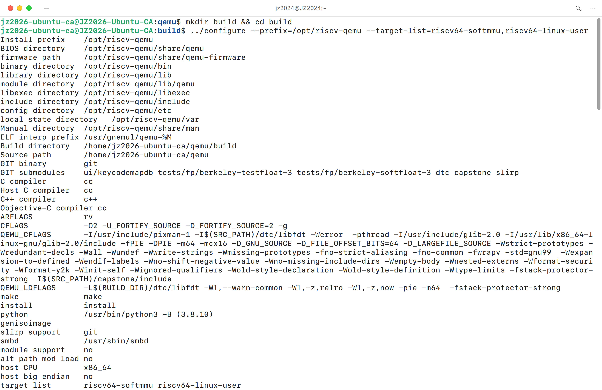

   编译.

   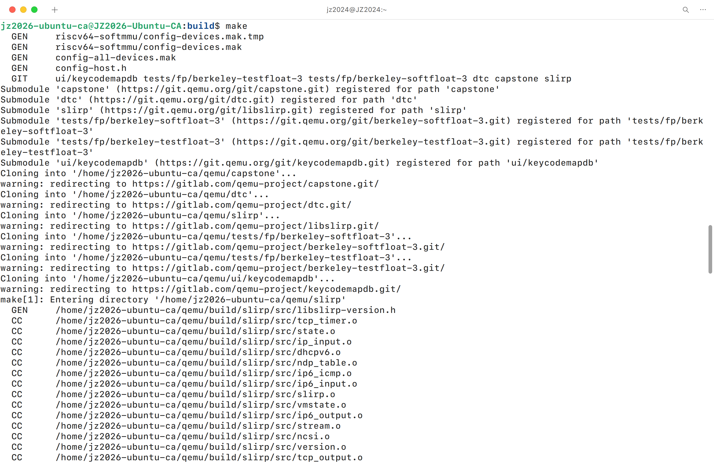

   安装.

   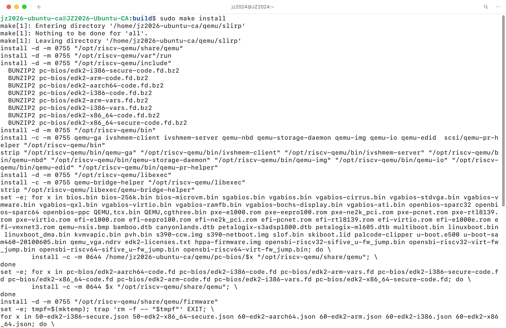

   由于安装在自定义路径, 需要将 QEMU 可执行文件路径添加到 `PATH` 环境变量中. 根据 `bash` 配置的惯例, 与环境相关的配置应放在 `~/.bash_profile` 而非 `~/.bashrc` 中, 因为 `~/.bash_profile` 只在 login shell 中加载, 而 `~/.bashrc` 则只在 interactive non-login shell 中加载. 配置完成后, `~/.bash_profile` 文件内容如下.

   ```bash
   # bashrc
   if [ -f ~/.bashrc ]; then
       source ~/.bashrc
   fi

   # riscv
   export PATH=${PATH}:/opt/riscv-newlib/bin:/opt/riscv-linux/bin
   export PATH=${PATH}:/opt/riscv-qemu/bin

   ```

   配置完成后重新登录 `bash` 即生效. 为了在当前 shell 中立即生效, 直接 `source` 该文件. 验证 QEMU 可执行文件路径已经成功添加到 `PATH` 环境变量中, 可以正确输出版本信息.

   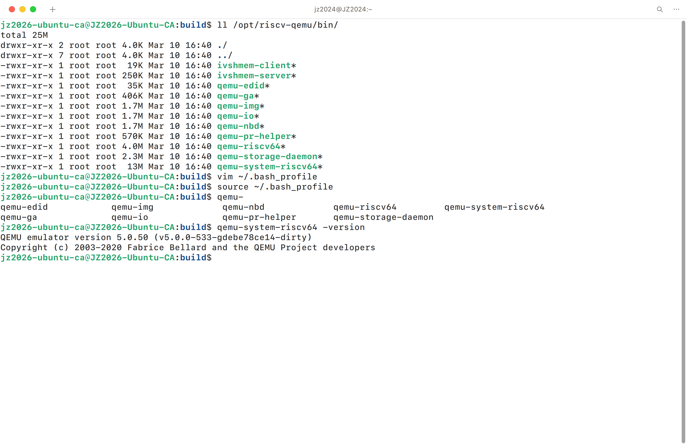

4. **C-SKY QEMU 安装**

   下载为 Ubuntu 20.04 提供的版本, 解压后安装必要的库, 即可直接运行. 此处暂时不将其添加至环境变量.

   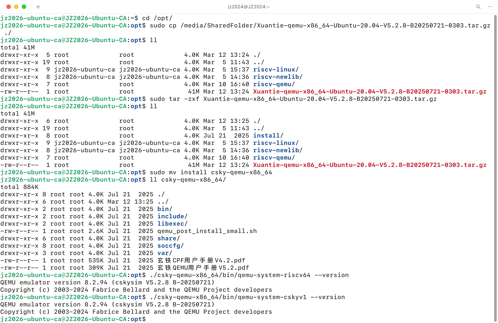

5. **解决原虚拟机配置中的网络代理问题**

   在老师提供的虚拟机中, 配置了系统级的 HTTP/HTTPS 代理. 但该代理服务器不可用, 导致网络访问异常. 具体表现为: 浏览器无法访问网页 (报错与 proxy 相关), `git clone` 等命令失败.

   关闭该代理后, 浏览器访问恢复正常, 重新 `config` 再 `make`, 可以正常下载并编译.


### 2.2. QEMU 运行 newlib 程序并调试

1. **QEMU 用户模式 (User Mode) 示例**

   先使用 `riscv64-unknown-linux-gnu-gcc` 交叉编译一个简单的 C 程序, 生成可执行文件. 然后使用 `qemu-riscv64` 以用户模式运行该程序, 可以看到输出结果.

   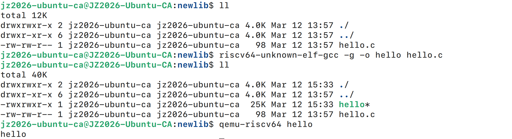

2. **QEMU 系统模式 (System Mode) 示例**

   克隆并编译 riscv-probe 项目, 生成一个可以在 QEMU 系统模式下运行的可执行文件. 为了方便使用 `gdb` 进行调试, 修改 Makefile 以生成带有调试信息的可执行文件.

   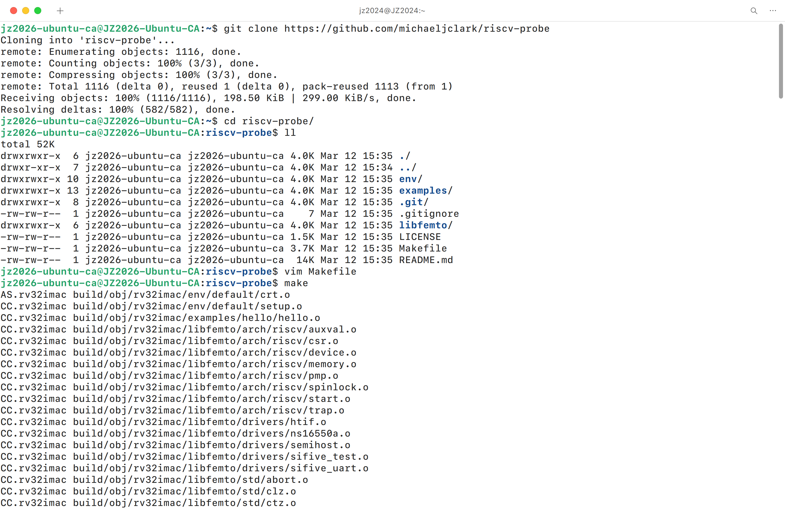

   修改后的 Makefile 主要在编译选项中添加了 `-g` 以生成调试信息.

   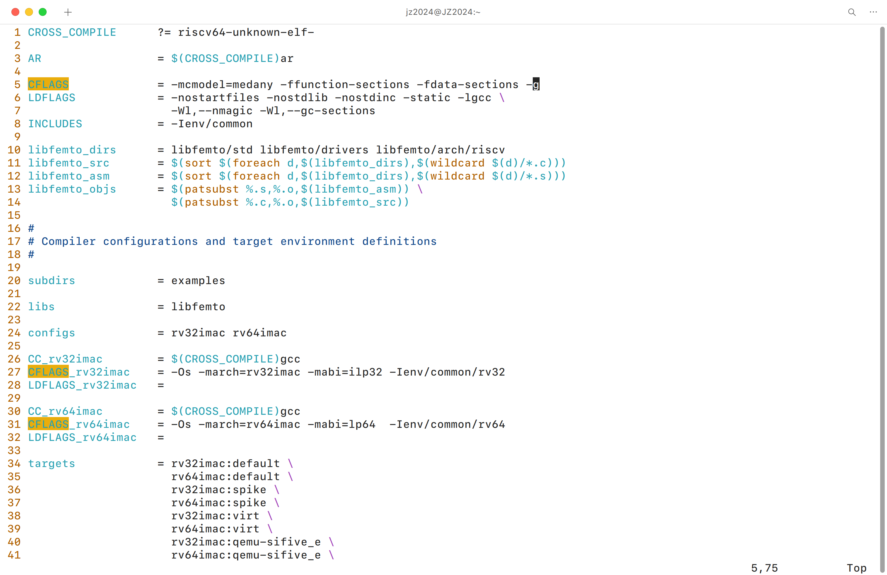

   使用 `qemu-system-riscv64` 启动一个 RISC-V 虚拟机, 并将生成的可执行文件作为内核镜像加载. 可以看到程序在虚拟机中运行的输出.

   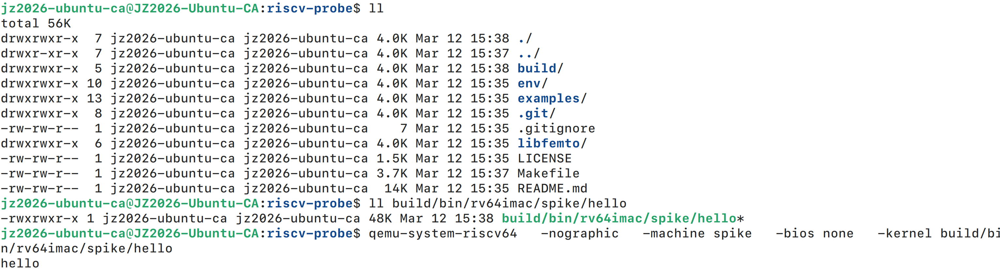

3. **用户模式下的 `gdb` 调试**

   先使用 `riscv64-unknown-linux-gnu-gcc` 交叉编译一个简单的 C 程序, 生成可执行文件. 然后使用 `qemu-riscv64` 启动程序并指定 `gdb` 调试端口. 为方便观察, 本次实验使用 `tmux` 启动了两个窗口, 分别用于运行 QEMU 和 `gdb`.

   在 `gdb` 窗口中, 连接到 QEMU 的调试端口, 加载可执行文件, 可以直接开始调试.
   
   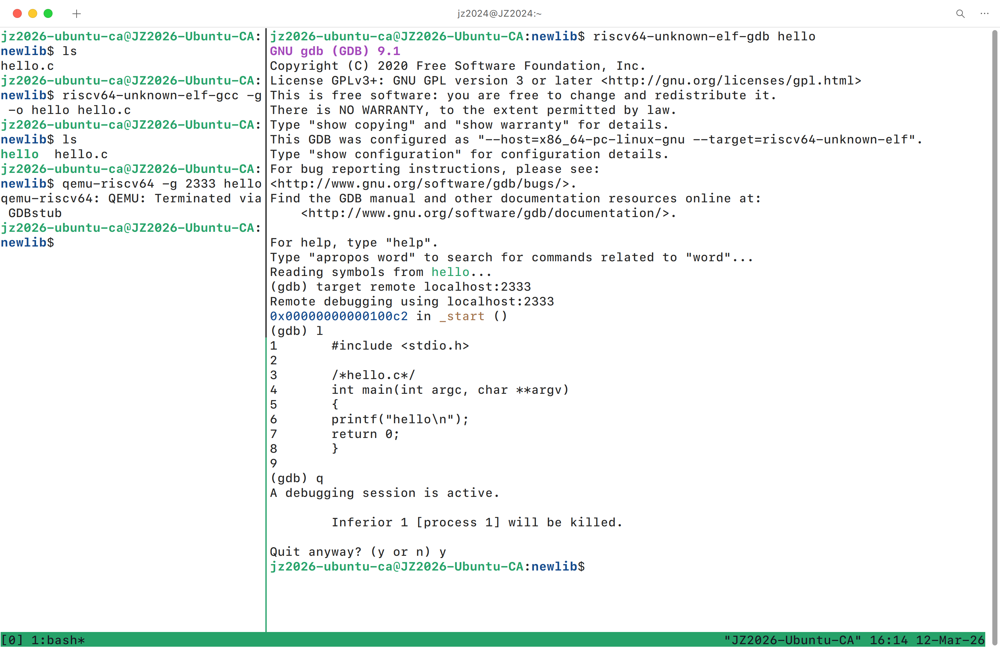

4. **系统模式下的 `gdb` 调试**

   使用 `qemu-system-riscv64` 启动一个 RISC-V 虚拟机, 并将生成的可执行文件作为内核镜像加载. 同样指定 `gdb` 调试端口. 在 `gdb` 窗口中, 连接到 QEMU 的调试端口, 加载可执行文件, 可以直接开始调试.

   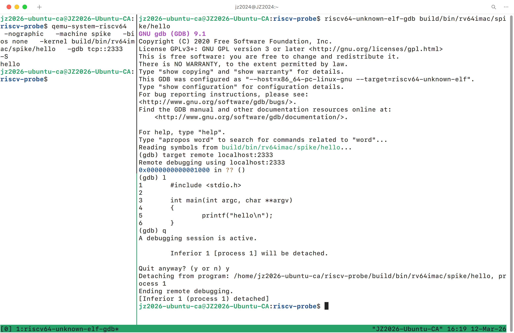

5. **练习1: 断点的使用**

   使用 QEMU 的用户模式运行实验一的 `ex1` 程序, 使用 `gdb` 调试并设置断点. 观察程序在断点处暂停, 并显示变量状态.

   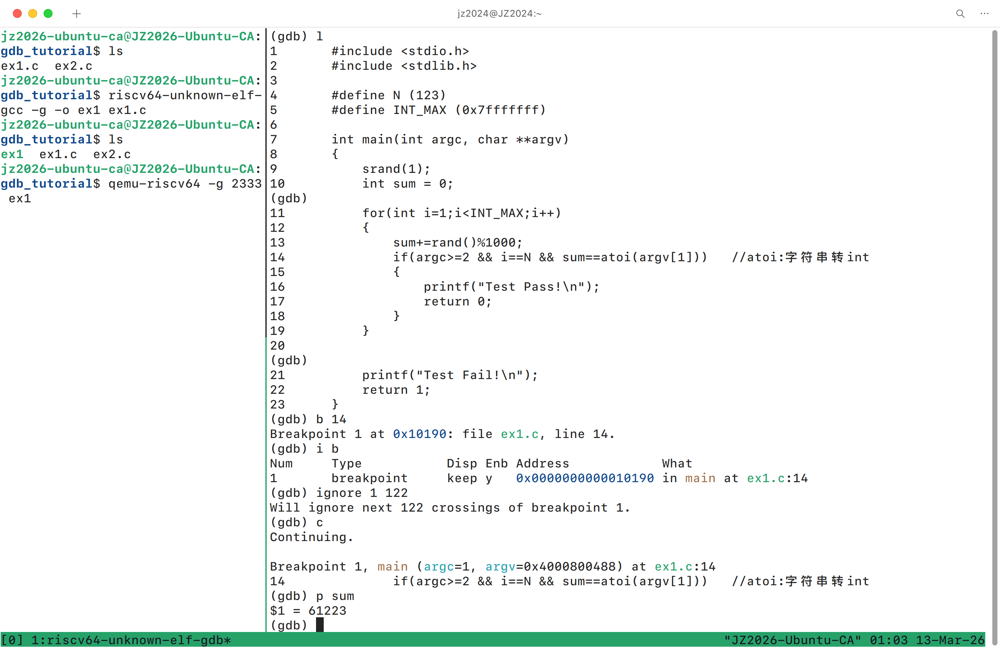

6. **练习2: 打印的使用**

   使用 QEMU 的用户模式运行实验一的 `ex2` 程序, 使用 `gdb` 调试并设置打印, 观察程序在每次断点处暂停时自动显示变量状态. 继续运行程序, 观察变量值的变化.

   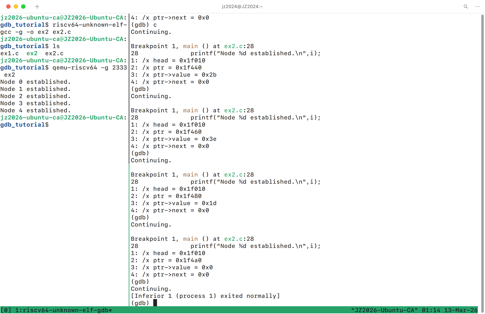


## 3. 实验分析与总结

本次实验主要涉及了 RISC-V QEMU 的安装和使用, 包括用户模式和系统模式的运行以及 `gdb` 调试. 通过实际操作, 掌握了 QEMU 的基本用法, 以及在 QEMU 上运行和调试程序的流程. 在安装过程中遇到了一些问题, 解决问题的过程也加深了对虚拟机环境配置和计算机系统的理解. 在调试过程中, 通过设置断点和打印变量值, 进一步熟悉了 `gdb` 的使用, 提高了调试效率和能力.


## 4. 实验收获与建议

1. **实验收获**

   本次实验让我重温了从源代码编译安装软件, 并处理依赖和环境变量配置等问题的过程. 这让我对 Linux 系统的包管理和软件安装有了更深入的理解. 实验中也复习了上次实验中学习的 `gdb` 使用, 并将其应用于远程调试, 这提升了我在实际开发中使用 `gdb` 的能力.

   帮其他同学配置虚拟机时还发现, 有些环境中即使关闭系统代理也无法访问网络. 经过排查发现是因为 Windows 下 VMware NAT Service 服务未启动. 启动该服务后, 虚拟机网络访问恢复正常. 这提升了我对我本不熟悉的 Windows 环境的认识, 以及对虚拟机网络配置的理解.

2. **一些建议**

   Ubuntu 20.04 的标准支持周期已经结束, 目前处于 Extended Security Maintenance (ESM) 阶段, 只有付费用户和经过认证的个人用户能够继续获得安全更新. 因此建议在后续实验中使用 Ubuntu 22.04 LTS 或更高版本, 以确保能够获得持续的安全更新和更广泛的社区支持.

   也建议在提供的虚拟机中完善配置, 以避免学生在实验过程中遇到不必要的麻烦. 例如, 在网络配置中避免使用不可用的代理服务器. 本课程实验也没有图形处理需求, 在虚拟机配置中禁用 Accelerate 3D graphics 选项, 可以提升虚拟机 GUI 的稳定性.

   此外, 希望不要在授课过程中对工具选择表达过强的倾向性, 以免限制学生的选择和发展. 例如实验讲解中过于强调 `zsh` 的功能, 可能会让偏好使用 `bash` 等 shell 的学生感到不适. 当然, 在课程中介绍一些流行的替代工具是很有意义的, 但最好保持中立, 鼓励学生根据自己的需求和喜好进行选择.

