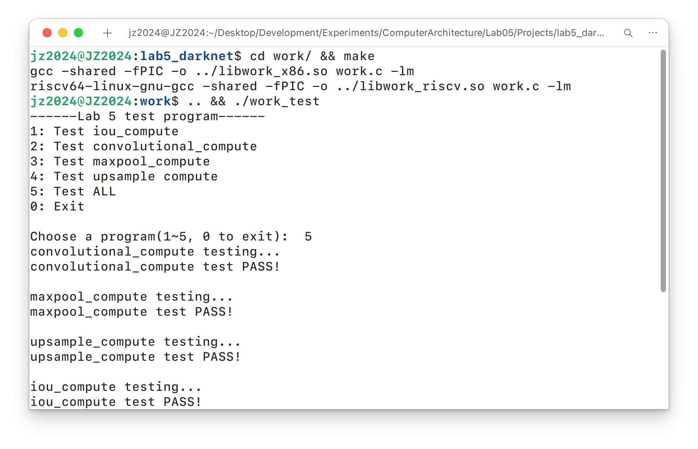
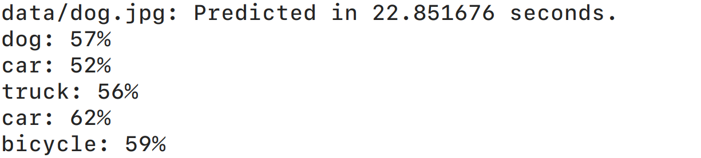
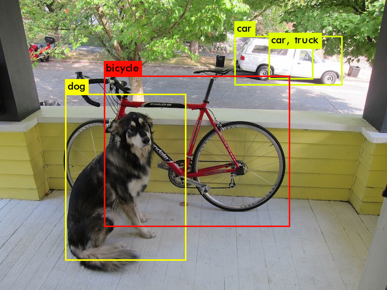
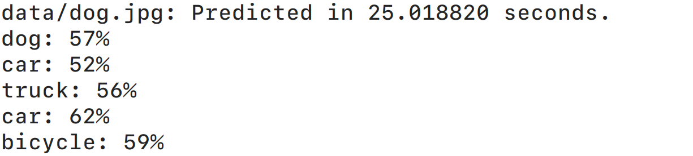
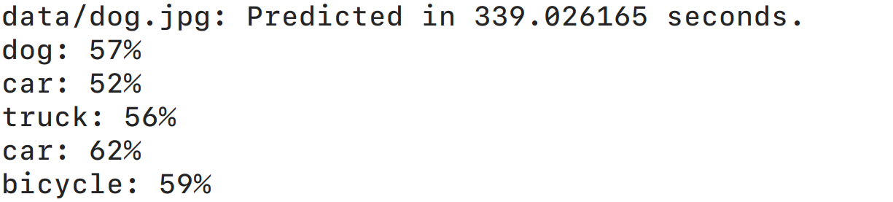

# 实验5 QEMU 上的 YOLO 算法

## 1. 实验目的

了解目标识别领域的基本算法. 通过编写 YOLO 算法网络层的部分核心函数, 了解 YOLO 算法的基本原理. 通过在 RISCV QEMU 上运行 YOLO 算法, 熟悉 C 语言的嵌入式调试和仿真.


## 2. 实验步骤

### 2.1. IOU 函数的实现

1. **交并比函数 IOU 的实现**

    交并比函数 `iou_compute` 的实现逻辑如下.

    ```C
    // IOU Computation
    float iou_compute(rectangle_box a, rectangle_box b) {
        float width_inter = fmin(
            fmin(a.w, b.w),
            (a.w + b.w) / 2 - fabs(a.x - b.x)
        );
        float height_inter = fmin(
            fmin(a.h, b.h),
            (a.h + b.h) / 2 - fabs(a.y - b.y)
        );
    
        if (width_inter <= 0 || height_inter <= 0) {
            // No intersection
            return 0.0f;
        }
    
        float area_inter = width_inter * height_inter;
        float area_union_a = a.w * a.h - area_inter;
        float area_union_b = b.w * b.h - area_inter;
    
        float iou = area_inter / (area_union_a + area_union_b + area_inter);
    
        return iou;
    
    }
    
    ```

    实现时调用了 `fmin` 和 `fabs` 函数, 需要包含 `<math.h>` 头文件, 并在编译时链接数学库.

    代码首先计算了两个矩形框的交集宽度和高度. 如果计算结果小于等于 `0`, 则说明两个框没有交集, 返回 IOU 为 `0`. 否则, 计算交集面积和并集面积, 最后返回 IOU 的值.

### 2.2. 卷积函数的实现

1. **基本定义**

    实验提供的源代码中对网络层参数和矩形框结构体提供了基本的定义.

    ```C
    // Layer Parameters Structure
    typedef struct layer_params layer_params;
    struct layer_params {
        int input_w, input_h, input_c;  // Input feature map: w * h * c
        int kernel_size, kernel_n;      // Kernel: size * size * c * n
        int stride;
        int pad; 
    };
    
    // Rectangle Box Structure
    typedef struct rectangle_box rectangle_box;
    struct rectangle_box {
        float x, y;      // The center point coordinates of the box is (x, y)
        float w, h;      // Width and height of the box
    };
    
    ```

    为了方面后续各层计算的实现, 在此基础上定义了一个 `Layer` 结构体, 提供对网络层的抽象.

    ```C
    // Layer Structure Forward Declaration
    typedef struct layer Layer;
    
    // Layer Operations Structure
    typedef struct {
        float (*at)(Layer* layer, int h, int w, int c);
        float (*kernel)(Layer* layer, int x, int y, int c, int n);
    } LayerOps;
    
    // Layer Structure
    struct layer {
        layer_params* para;     // Layer parameters
        float* input;           // Input feature map
        float* weight;          // Convolution kernel weights
        LayerOps* ops;          // Layer operations
    };
    
    // Layer Initialization
    static inline void layer_init(
        Layer* layer, layer_params* para,
        float* input, float* weight, LayerOps* ops
    ) {
        layer->para = para;
        layer->input = input;
        layer->weight = weight;
        layer->ops = ops;
    }
    
    ```

    其中 `LayerOps` 结构体包含了网络层的操作函数指针, 包括输入的访问函数 `at` 以及核的访问函数 `kernel`. 而 `Layer` 结构体含了层参数, 输入特征图, 卷积核权重和操作函数虚表等的指针. `layer_init` 函数则用于初始化 `Layer` 结构体的成员.

    这种设计下, 只需要为各层实现对应的操作函数, 就可以通过 `Layer` 结构体来抽象和统一各层的计算过程. 通过 `at` 函数对边界逻辑和数组处理进行封装, 可以简化后续计算的实现, 使得代码更清晰和易于维护. 但由于每次访问输入特征图或卷积核权重都需要通过函数指针调用, 会带来额外的开销. 本次实验规模相对较小, 因此这种设计对于性能的影响可以接受.

2. **卷积层的 `at` 操作**

    卷积层的 `at` 操作函数 `convolutional_at` 实现逻辑如下.

    ```C
    // At Operation
    static float convolutional_at(Layer* layer, int w, int h, int c) {
        // Boundaries of the convolutional layer
        int layer_left = layer->para->pad;
        int layer_right = layer->para->input_w + layer->para->pad - 1;
        int layer_top = layer->para->pad;
        int layer_bottom = layer->para->input_h + layer->para->pad - 1;
    
        // Return the value at the specified position
        if (
            w >= layer_left && w <= layer_right
            && h >= layer_top && h <= layer_bottom
        ) {
            return layer->input[
                c * layer->para->input_w * layer->para->input_h
                + (h - layer->para->pad) * layer->para->input_w
                + (w - layer->para->pad)
            ];
        }
        else {
            return 0.0f;
        }
    
    }
    
    ```

    该函数首先计算了卷积层实际输入的边界位置, 然后判断输入坐标是否在其边界内. 对于内部的坐标, 直接从输入特征图中返回对应的值. 对于边界外的坐标, 则返回 `0.0f`, 实现了卷积层的零填充逻辑.

3. **卷积层的 `kernel` 操作**

    卷积层的 `kernel` 操作函数 `convolutional_kernel` 实现逻辑如下.

    ```C
    // Kernel Operation
    static float convolutional_kernel(Layer* layer, int x, int y, int c, int n) {
        int size = layer->para->kernel_size;
        return layer->weight[
            n * size * size * layer->para->input_c
            + c * size * size
            + y * size
            + x
        ];
    
    }
    
    ```

    该函数根据卷积核的参数, 通过计算得到权重在卷积核权重数组中的位置, 返回对应的权重值.

4. **卷积层操作函数的封装**

    将卷积层的操作函数封装到一个 `LayerOps` 类型的结构体中.

    ```C
    // Convolutional Layer Operations Structure
    static LayerOps convolutional_ops = {
        .at = convolutional_at,
        .kernel = convolutional_kernel
    };
    
    ```

    后续初始化卷积层时, 只需要将该结构体的地址传入 `layer_init` 函数即可完成卷积层操作函数的设置.

5. **卷积层计算的实现**

    卷积层计算函数 `convolutional_compute` 的实现逻辑如下.

    ```C
    // Convolutional Layer Computation
    void convolutional_compute(
        layer_params para, float* input, float* weight, float* output
    ) {
        // Create and initialize the convolutional layer
        Layer layer;
        layer_init(&layer, &para, input, weight, &convolutional_ops);
    
        // Calculate the output feature map dimensions
        int output_w = (para.input_w + 2 * para.pad - para.kernel_size)
            / para.stride + 1;
        int output_h = (para.input_h + 2 * para.pad - para.kernel_size)
            / para.stride + 1;
        int output_c = para.kernel_n;
    
        // Perform convolutional computation
        float sum;
        for (int n = 0; n < output_c; n++) {
            for (int h = 0; h < output_h; h++) {
                for (int w = 0; w < output_w; w++) {
                    sum = 0.0f;
                    for (int c = 0; c < para.input_c; c++) {
                        for (int y = 0; y < para.kernel_size; y++) {
                            for (int x = 0; x < para.kernel_size; x++) {
                                sum += layer.ops->at(
                                    &layer,
                                    w * para.stride + x,
                                    h * para.stride + y,
                                    c
                                ) * layer.ops->kernel(&layer, x, y, c, n);
                            }
                        }
                    }
                    output[n * output_w * output_h + h * output_w + w] = sum;
                }
            }
        }
    
    }
    
    ```

    该函数首先创建并初始化了一个 `Layer` 结构体来表示卷积层. 由于该结构体中只存储了若干指针, 因此直接在栈上分配即可. 根据卷积层的参数计算输出特征图的宽度, 高度和通道数, 再通过六层循环实现了卷积计算. 调用 `at` 和 `kernel` 函数获取输入特征图中的值和卷积核权重, 累加得到输出特征图中对应位置的值.

### 2.3. Maxpool 函数的实现

1. **最大池化层的 `at` 操作**

    最大池化层的 `at` 操作函数 `maxpool_at` 实现逻辑如下.

    ```C
    // At Operation
    static float maxpool_at(Layer* layer, int w, int h, int c) {
        // Boundaries of the maxpool layer
        int layer_width = layer->para->input_w;
        int layer_height = layer->para->input_h;
    
        // Return the value at the specified position
        if (w >= 0 && w < layer_width && h >= 0 && h < layer_height) {
            return layer->input[
                c * layer_width * layer_height + h * layer_width + w
            ];
        }
        else {
            return -FLT_MAX;
        }
    
    }
    
    ```

    该函数首先计算了最大池化层输入的边界位置, 然后判断输入坐标是否在其边界内. 对于内部的坐标, 直接从输入特征图中返回对应的值. 对于边界外的坐标, 则返回 `-FLT_MAX`, 实现了最大池化层的边界处理逻辑.

2. **最大池化层操作函数的封装**

    将最大池化层的操作函数封装到一个 `LayerOps` 类型的结构体中.

    ```C
    // Maxpool Layer Operations Structure
    static LayerOps maxpool_ops = {
        .at = maxpool_at,
        .kernel = NULL
    };

    ```

    后续初始化最大池化层时, 只需要将该结构体的地址传入 `layer_init` 函数即可完成最大池化层操作函数的设置. 由于最大池化层不需要卷积核权重, 因此 `kernel` 函数指针设置为 `NULL`.

3. **最大池化层计算的实现**

    最大池化层计算函数 `maxpool_compute` 的实现逻辑如下.

    ```C
    // Maxpool Layer Computation
    void maxpool_compute(layer_params para, float* input, float* output) {
        // Create and initialize the maxpool layer
        Layer layer;
        layer_init(&layer, &para, input, NULL, &maxpool_ops);
    
        // Calculate the output feature map dimensions
        int output_w = (para.input_w + para.stride - 1) / para.stride;
        int output_h = (para.input_h + para.stride - 1) / para.stride;
        int output_c = para.input_c;
    
        // Perform maxpool computation
        float max_value;
        for (int c = 0; c < output_c; c++) {
            for (int h = 0; h < output_h; h++) {
                for (int w = 0; w < output_w; w++) {
                    max_value = -FLT_MAX;
                    for (int y = 0; y < para.kernel_size; y++) {
                        for (int x = 0; x < para.kernel_size; x++) {
                            float value = layer.ops->at(
                                &layer,
                                w * para.stride + x,
                                h * para.stride + y,
                                c
                            );
                            if (value > max_value) {
                                max_value = value;
                            }
                        }
                    }
                    output[c * output_w * output_h + h * output_w + w] = max_value;
                }
            }
        }
    
    }
    
    ```

    该函数首先创建并初始化了一个 `Layer` 结构体来表示最大池化层. 根据最大池化层的参数计算输出特征图的宽度, 高度和通道数, 再通过循环实现了最大池化计算. 调用 `at` 函数获取输入特征图中的值, 比较得到输出特征图中对应位置的最大值.

### 2.4. Upsample 函数的实现

1. **上采样层的 `at` 操作**

    上采样层的 `at` 操作函数 `upsample_at` 实现逻辑如下.

    ```C
    // At Operation
    static float upsample_at(Layer* layer, int w, int h, int c) {
        // Boundaries of the upsample layer
        int layer_width = layer->para->input_w;
        int layer_height = layer->para->input_h;
    
        // Return the value at the specified position
        if (w >= 0 && w < layer_width && h >= 0 && h < layer_height) {
            return layer->input[
                c * layer_width * layer_height + h * layer_width + w
            ];
        }
        else {
            return 0.0f;
        }
    
    }
    
    ```

    该函数首先计算了上采样层输入的边界位置, 然后判断输入坐标是否在其边界内. 对于内部的坐标, 直接从输入特征图中返回对应的值. 对于边界外的坐标, 则返回 `0.0f`, 本实验中不应出现边界外访问的情况.

2. **上采样层操作函数的封装**

    将上采样层的操作函数封装到一个 `LayerOps` 类型的结构体中.

    ```C
    // Upsample Layer Operations Structure
    static LayerOps upsample_ops = {
        .at = upsample_at,
        .kernel = NULL
    };
    
    ```

    后续初始化上采样层时, 只需要将该结构体的地址传入 `layer_init` 函数即可完成上采样层操作函数的设置. 由于上采样层不需要卷积核权重, 因此 `kernel` 函数指针设置为 `NULL`.

3. **上采样层计算的实现**

    上采样层计算函数 `upsample_compute` 的实现逻辑如下.

    ```C
    // Upsample Layer Computation
    void upsample_compute(layer_params para, float* input, float* output) {
        // Create and initialize the upsample layer
        Layer layer;
        layer_init(&layer, &para, input, NULL, &upsample_ops);
    
        // Calculate the output feature map dimensions
        int output_w = para.input_w * para.stride;
        int output_h = para.input_h * para.stride;
        int output_c = para.input_c;
    
        // Perform upsample computation
        for (int c = 0; c < output_c; c++) {
            for (int h = 0; h < output_h; h++) {
                for (int w = 0; w < output_w; w++) {
                    output[c * output_w * output_h + h * output_w + w] =
                        layer.ops->at(&layer, w / para.stride, h / para.stride, c);
                }
            }
        }
    
    }
    
    ```

    该函数首先创建并初始化了一个 `Layer` 结构体来表示上采样层. 根据上采样层的参数计算输出特征图的宽度, 高度和通道数, 再通过循环实现了上采样计算. 调用 `at` 函数获取输入特征图中的值, 将其复制到输出特征图中对应位置.

### 2.5. 编写的函数在 `work_test` 上的测试结果

1. **测试结果**

    编译后运行 `work_test` 程序进行测试. 由于本次实验在使用的 RISC-V 工具链来自 Ubuntu 包管理器, 其可执行文件名与从源代码编译得到的工具链不同, 因此对 `Makefile` 中的编译命令进行了修改.

    {width=80%}

    编写的函数在 `work_test` 上的测试结果完全正确, 验证了函数实现的正确性.

### 2.6. YOLO 算法在 x86 (AMD64) 环境上的运行结果

1. **在 Linux 主机直接运行**

    直接在 Linux 主机上运行 `yolo_test_x86` 程序, 输出如下.

    {width=60%}

    算法耗时约 23 秒, 能够正确生成预测结果.

    {width=60%}

2. **通过 QEMU 在 AMD64 环境运行**

    为了方便与后续在 RISC-V QEMU 上的运行结果进行对比, 也通过 QEMU 运行 Linux 虚拟机进行测试. 实验时为虚拟机分配了充足的硬件资源, 并使用 `-cpu host` 和 `-accel kvm` 选项启用 KVM 硬件加速, 以获得同架构下的最佳性能. 程序输出如下.

    {width=60%}

    算法耗时约 25 秒, 接近主机原生性能. 预测结果与主机上的结果完全一致.

### 2.7. YOLO 算法在 RISC-V QEMU 上的运行结果

1. **通过 QEMU 模拟 RISC-V 环境运行**

    通过 QEMU 运行 RISC-V Linux 虚拟机进行测试. 采用相同的基础操作系统和同样数量的硬件资源配置, 但由于需要模拟 RISC-V 硬件, 只能采用 `-accel tcg` 加速选项. 程序输出如下.

    {width=60%}

    算法耗时近 6 分钟, 是 AMD64 原生性能下运行时长的十余倍. 由于需要通过软件模拟 RISC-V 架构, 性能较差. 预测结果与主机上的结果完全一致.


## 3. 实验分析与总结

本次实验基于 C 语言手动实现并验证了 YOLO 网络前向传播中的核心环节, 并成功在 x86 (AMD64) 与 RISC-V 架构下进行了交叉编译与仿真测试.

通过实现交并比函数, 以及卷积层, 最大池化层和上采样层的等的具体操作, 理解了卷积神经网络中各部分的基本计算过程和边界处理逻辑. 在主机上测试并验证了函数的正确性后, 通过 QEMU 分别在 AMD64 和 RISC-V 环境下运行, 验证了算法功能的正确性和兼容性, 也从耗时上对跨架构模拟的性能差异有了直观的认识.


## 4. 实验收获与建议

通过本次实验, 我们深入了解了 YOLO 算法中卷积层, 最大池化层和上采样层的计算过程, 以及交并比函数的实现. 通过在 x86 (AMD64) 和 RISC-V 架构下的交叉编译和仿真测试, 熟悉了不同架构下的编译和调试流程, 以及性能差异的原因.

在实现卷积层计算时, 通过封装 `Layer` 结构体和操作函数, 实现了对网络层计算的抽象和统一. 这种设计使得代码更清晰和易于维护, 但由于每次访问输入特征图或卷积核权重都需要通过函数指针调用, 会带来额外的开销. 在本次实验规模相对较小的情况下, 这种设计对于性能的影响可以接受. 但在实际应用中, 可以考虑直接访问输入特征图和卷积核权重数组, 来获得更好的性能表现.

