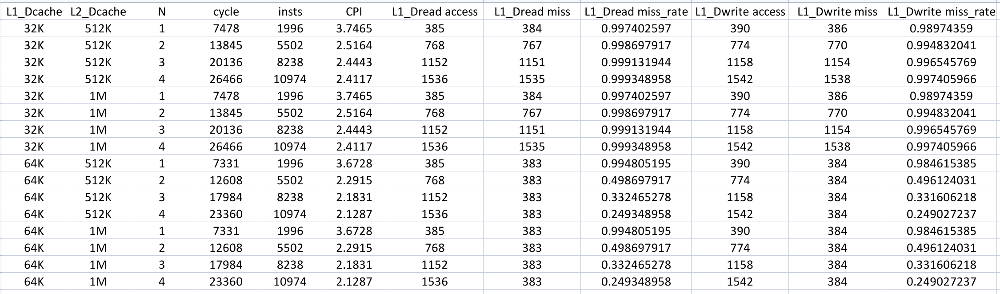
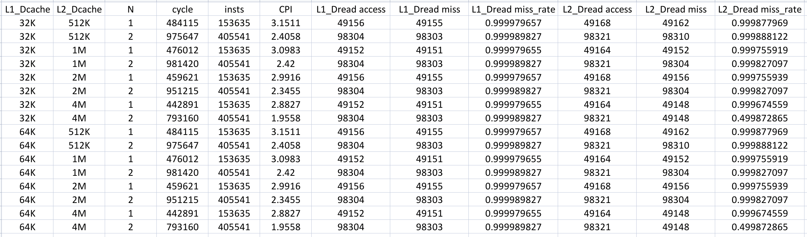
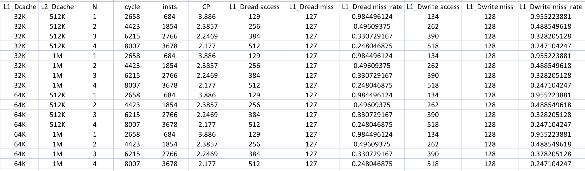
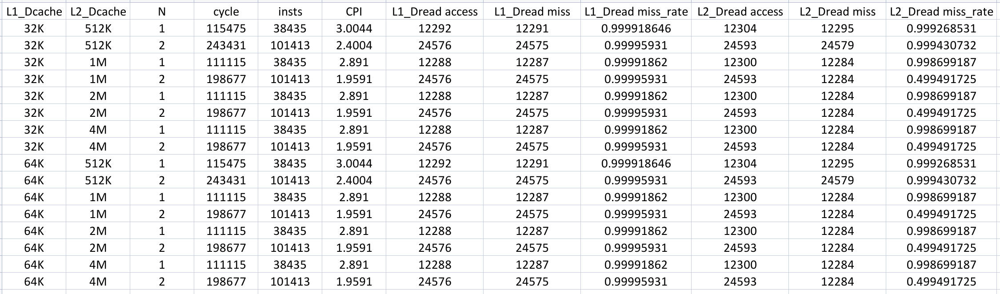

# 实验7 Cache 操作实验

## 1. 实验目的

在 SMART 平台上通过调整 Cache 参数观察示例程序的 CPI, Cache 缺失率等, 了解 Cache 大小对 CPU 性能的影响.


## 2. 实验步骤

### 2.1. 通过配置生成工具, 生成不同配置的 C910 RTL

1. **编写 RTL 生成自动化 script**

    实验中提供的 `THead_C910_Core_Config` 图形界面配置工具实际上是一个 `wish` script, 通过调用 `sc` 这一 `bash` script 来生成 RTL. 因此可以直接编写 `bash` script 调用 `sc` 来一次性生成不同配置的 RTL, 从而避免了每次都需要在图形界面手动配置和生成的繁琐过程.

    以下 `bash` script 采用 L1 Dcache 大小为 `32K` 和 `64K`, L2 Cache 大小为 `512K`, `1M`, `2M`, `4M` 的 8 种配置, 生成对应的 RTL 文件. 利用 `sed` 命令将生成的 RTL 文件中的模块名 `ct_mp_top` 替换为 `C910MP`, 并删除掉第一处 `ifdef`/`endif` 之间的宏定义, 最后将生成的 RTL 文件重命名后保存在 `Lab07/rtl_pool/` 目录下.

    将该 script 保存在 `Lab07/` 目录下, 命名为 `auto_gen_rtl.sh`, 供后续使用.

    ```bash
    #!/bin/bash
    
    # Directory configuration
    BASE_DIR="/home/ECDesign/ecd14/zfzhang_24301050026"
    C910_DIR="$BASE_DIR/C910_R1S2P19"
    RTL_POOL="$BASE_DIR/Lab07/rtl_pool"
    
    # Ensure script runs in the correct directory
    cd $C910_DIR
    mkdir -p $RTL_POOL
    
    L1_D_LIST=("32" "64")
    L2_LIST=("512" "1024" "2048" "4096")
    
    for L1D in "${L1_D_LIST[@]}"; do
        for L2 in "${L2_LIST[@]}"; do
            echo "====================================================="
            echo "Generating config: L1_Dcache=${L1D}K, L2_Cache=${L2}K ..."
            echo "====================================================="
            cat <<EOF > src_rtl/cpu_cfig.h
    \`define MULTI_PROCESSING
    \`define PROCESSOR_0
    \`define ICACHE_32K
    \`define DCACHE_${L1D}K
    EOF
            
            if [ "$L2" == "512" ]; then echo "\`define L2_CACHE_512K" >> src_rtl/cpu_cfig.h; fi
            if [ "$L2" == "1024" ]; then echo "\`define L2_CACHE_1M" >> src_rtl/cpu_cfig.h; fi
            if [ "$L2" == "2048" ]; then echo "\`define L2_CACHE_2M" >> src_rtl/cpu_cfig.h; fi
            if [ "$L2" == "4096" ]; then echo "\`define L2_CACHE_4M" >> src_rtl/cpu_cfig.h; fi
    
            echo "\`define FPGA" >> src_rtl/cpu_cfig.h
            cat setup/cpu_cfig.h >> src_rtl/cpu_cfig.h
    
            bash sc -fpga > /dev/null
    
            RTL_FILE="gen_rtl/ct_mp_top_merged.v"
            sed -i 's/ct_mp_top/C910MP/g' $RTL_FILE
            sed -i '0,/`endif/ { /`ifdef/,/`endif/d; }' $RTL_FILE
    
            if [ "$L2" == "1024" ]; then L2_STR="1M"
            elif [ "$L2" == "2048" ]; then L2_STR="2M"
            elif [ "$L2" == "4096" ]; then L2_STR="4M"
            else L2_STR="${L2}K"; fi
            
            TARGET_NAME="C910_${L1D}K_${L2_STR}.v"
            cp $RTL_FILE $RTL_POOL/$TARGET_NAME
            
            echo "--> $TARGET_NAME generated and modified, saved to $RTL_POOL"
            
        done
    done
    
    echo "All RTL configuration files generated successfully!"
    
    ```

2. **执行 RTL 生成 script**

    执行 `bash auto_gen_rtl.sh` 来生成不同配置的 RTL, 完成后可以在 `Lab07/rtl_pool/` 目录下看到生成的 RTL 文件.

    ```bash
    ecd14@admin:rtl_pool$ ls -lahF
    total 132M
    drwxr-xr-x 2 ecd14 ECDesign 4.0K Apr 26 16:35 ./
    drwxr-xr-x 4 ecd14 ECDesign 4.0K Apr 26 21:23 ../
    -rw-r--r-- 1 ecd14 ECDesign  17M Apr 26 16:27 C910_32K_1M.v
    -rw-r--r-- 1 ecd14 ECDesign  17M Apr 26 16:28 C910_32K_2M.v
    -rw-r--r-- 1 ecd14 ECDesign  17M Apr 26 16:30 C910_32K_4M.v
    -rw-r--r-- 1 ecd14 ECDesign  17M Apr 26 16:26 C910_32K_512K.v
    -rw-r--r-- 1 ecd14 ECDesign  17M Apr 26 16:32 C910_64K_1M.v
    -rw-r--r-- 1 ecd14 ECDesign  17M Apr 26 16:33 C910_64K_2M.v
    -rw-r--r-- 1 ecd14 ECDesign  17M Apr 26 16:35 C910_64K_4M.v
    -rw-r--r-- 1 ecd14 ECDesign  17M Apr 26 16:31 C910_64K_512K.v
    ```


### 2.2. 基于不同配置的 RTL, 仿真运行示例的 `cache_test.c` 程序, 完成前述的 2 个表格

1. **编写数据处理 script**

    通过 `python3` script 来处理 `cache_test.c` 程序的仿真结果. 从 `run.log` 文件中提取出 CPI, Cache 访问次数, Cache 缺失次数等数据, 计算出 CPI 和 Cache 缺失率, 最后以 CSV 格式输出到标准输出.

    该 script 需要调用者通过命令行参数指定测试类型等信息, 并手动重定向到对应的 CSV 文件中.

    将该 script 保存在 `Lab07/` 目录下, 命名为 `auto_log.py`, 供后续 script 调用.

    ```python
    #!/usr/bin/python3
    
    import sys
    import re
    
    # Get command line arguments
    test_type = sys.argv[1]  # "L1" or "L2"
    l1_size = sys.argv[2]
    l2_size = sys.argv[3]
    n_val = sys.argv[4]
    log_file = sys.argv[5]
    
    # Read log file
    try:
        with open(log_file, 'r') as f:
            log_text = f.read()
    except FileNotFoundError:
        print("Error: File not found: " + log_file)
        sys.exit(1)
    
    # Regex helper function to extract values
    def get_val(var_name):
        pattern = r'num_' + var_name + r'\s+is\s+(\d+)'
        match = re.search(pattern, log_text)
        return int(match.group(1)) if match else 0
    
    # Extract base data
    cycle = get_val("cycle")
    insts = get_val("instret")
    cpi = cycle / insts if insts > 0 else 0.0
    
    # Extract L1 data
    l1_d_r_acc = get_val("L1_Dcache_read_access")
    l1_d_r_miss = get_val("L1_Dcache_read_miss")
    l1_d_r_mr = l1_d_r_miss / l1_d_r_acc if l1_d_r_acc > 0 else 0.0
    
    if test_type == "L1":
        l1_d_w_acc = get_val("L1_Dcache_write_access")
        l1_d_w_miss = get_val("L1_Dcache_write_miss")
        l1_d_w_mr = l1_d_w_miss / l1_d_w_acc if l1_d_w_acc > 0 else 0.0
        
        print(
            f"{l1_size},{l2_size},{n_val},{cycle},{insts},{cpi:.4f},{l1_d_r_acc},"
            f"{l1_d_r_miss},{l1_d_r_mr},{l1_d_w_acc},{l1_d_w_miss},{l1_d_w_mr}"
        )
    
    else:
        l2_d_r_acc = get_val("L2_Dcache_read_access")
        l2_d_r_miss = get_val("L2_Dcache_read_miss")
        l2_d_r_mr = l2_d_r_miss / l2_d_r_acc if l2_d_r_acc > 0 else 0.0
        
        print(
            f"{l1_size},{l2_size},{n_val},{cycle},{insts},{cpi:.4f},{l1_d_r_acc},"
            f"{l1_d_r_miss},{l1_d_r_mr},{l2_d_r_acc},{l2_d_r_miss},{l2_d_r_mr}"
        )
    
    ```

2. **编写仿真 script**

    由于实验只提供了 `csh` 配置文件, 因此采用 `csh` script 来自动化执行仿真任务. 实验服务器用户的 `~/.cshrc` 文件在遇到 non-interactive shell 时会判断 `if ($?USER == 0 || $?prompt == 0) exit` 提前退出, 为避免直接修改用户的 `~/.cshrc` 文件, 直接在项目目录下重新编写一个 `cshrc` 文件供仿真 script 使用. 此外, 本次实验还依赖 `C910_R1S2P19/setup/setup.csh` 和 `smart9_release/setup.csh` 中的环境变量, 且它们需要在特定工作目录下才能正确加载.
    
    该 script 会循环遍历不同的 Cache 配置和数组大小, 每次修改 `cache_test.c` 中的相关参数, 加载对应配置的 RTL, 执行仿真, 等待仿真完成后调用 `auto_log.py` 来处理结果并保存到 CSV 文件中.

    将该 script 保存在 `Lab07/` 目录下, 命名为 `auto_sim.csh`, 供后续执行.

    ```csh
    #!/bin/csh
    
    # Directory configuration
    set BASE_DIR   = "/home/ECDesign/ecd14/zfzhang_24301050026"
    set SMART_DIR  = "$BASE_DIR/smart9_release"
    set C910_DIR   = "$BASE_DIR/C910_R1S2P19"
    set OUT_DIR    = "$BASE_DIR/Lab07"
    set RTL_POOL   = "$OUT_DIR/rtl_pool"
    set RESULT_DIR = "$OUT_DIR/csv_results"
    set TEST_FILE  = "$SMART_DIR/case/cache_test/cache_test.c"
    set WORK_DIR   = "$SMART_DIR/workdir"
    set LOG_FILE   = "$WORK_DIR/run.log"
    
    
    # Initialize CSV files with headers
    if ( -d "$RESULT_DIR" ) then
        rm -rf "$RESULT_DIR"/*
    else
        mkdir -p "$RESULT_DIR"
    endif
    echo "L1_Dcache,L2_Dcache,N,cycle,insts,CPI,L1_Dread access,L1_Dread miss,L1_Dread miss_rate,\
    L1_Dwrite access,L1_Dwrite miss,L1_Dwrite miss_rate" > "$RESULT_DIR"/result_L1.csv
    echo "L1_Dcache,L2_Dcache,N,cycle,insts,CPI,L1_Dread access,L1_Dread miss,L1_Dread miss_rate,\
    L2_Dread access,L2_Dread miss,L2_Dread miss_rate" > "$RESULT_DIR"/result_L2.csv
    
    # Setup the environment
    cd $BASE_DIR
    source cshrc >& /dev/null
    cd "$C910_DIR"
    source setup/setup.csh >& /dev/null
    cd "$SMART_DIR"
    source setup.csh >& /dev/null
    
    
    # Phase 1: L1 Cache Test
    echo ""
    echo "======================================="
    echo "        Starting L1 Cache Test         "
    echo "======================================="
    echo ""
    
    # Enable L1_TEST macro, disable L2_TEST macro
    sed -i 's/^\/\/ #define L1_TEST/#define L1_TEST/g' "$TEST_FILE"
    sed -i 's/^#define L2_TEST/\/\/ #define L2_TEST/g' "$TEST_FILE"
    
    foreach l1 (32K 64K)
        foreach l2 (512K 1M)
            echo ""
            echo "[Load RTL] Preparing config: L1=${l1}, L2=${l2}"
            rm -rf "$SMART_DIR"/rtl/cpu/C910MP.v
            cp -rf "$RTL_POOL"/C910_${l1}_${l2}.v "$SMART_DIR"/rtl/cpu/C910MP.v
            
            foreach n (1 2 3 4)
                echo "   -> Testing N = $n ..."
                sed -i "s/int N = [0-9]*;/int N = $n;/g" "$TEST_FILE"
                
                # Remove old log to prevent false positives
                if ( -e "$LOG_FILE" ) rm -f "$LOG_FILE"
                cd "$WORK_DIR"
                run ../case/cache_test/cache_test.c >& /dev/null
                
                # Polling loop to wait for job completion
                set is_done = 0
                while ( $is_done == 0 )
                    sleep 3
                    if ( -e "$LOG_FILE" ) then
                        grep "simulation finished successfully" "$LOG_FILE" >& /dev/null
                        if ( $status == 0 ) set is_done = 1
                    endif
                end
                
                python3 $OUT_DIR/auto_log.py "L1" $l1 $l2 $n $LOG_FILE \
                    >> "$RESULT_DIR"/result_L1.csv
                echo "      Done! Data recorded."
            end
        end
    end
    
    
    # Phase 2: L2 Cache Test
    echo ""
    echo "======================================="
    echo "        Starting L2 Cache Test         "
    echo "======================================="
    echo ""
    
    # Enable L2_TEST macro, disable L1_TEST macro
    sed -i 's/^\/\/ #define L2_TEST/#define L2_TEST/g' "$TEST_FILE"
    sed -i 's/^#define L1_TEST/\/\/ #define L1_TEST/g' "$TEST_FILE"
    
    foreach l1 (32K 64K)
        foreach l2 (512K 1M 2M 4M)
            echo ""
            echo "[Load RTL] Preparing config: L1=${l1}, L2=${l2}"
            rm -rf "$SMART_DIR"/rtl/cpu/C910MP.v
            cp -rf "$RTL_POOL"/C910_${l1}_${l2}.v "$SMART_DIR"/rtl/cpu/C910MP.v
            
            foreach n (1 2)
                echo "   -> Testing N = $n ..."
                sed -i "s/int N = [0-9]*;/int N = $n;/g" "$TEST_FILE"
                
                if ( -e "$LOG_FILE" ) rm -f "$LOG_FILE"
                cd "$WORK_DIR"
                run ../case/cache_test/cache_test.c >& /dev/null
                
                set is_done = 0
                while ( $is_done == 0 )
                    sleep 3
                    if ( -e "$LOG_FILE" ) then
                        grep "simulation finished successfully" "$LOG_FILE" >& /dev/null
                        if ( $status == 0 ) set is_done = 1
                    endif
                end
                
                python3 $OUT_DIR/auto_log.py "L2" $l1 $l2 $n $LOG_FILE \
                    >> "$RESULT_DIR"/result_L2.csv
                echo "      Done! Data recorded."
            end
        end
    end
    
    echo ""
    echo "======================================="
    echo "All simulation tasks completed!"
    echo "Please check result_L1.csv and result_L2.csv in $RESULT_DIR"
    echo "======================================="
    echo ""
    
    ```

    L1 Data Cache 的测试数据如下.

    {width=80%}

    L2 Cache 的测试数据如下.

    {width=80%}

### 2.3. 适当修改 `cache_test.c` 中两个数组 `arr1`, `arr2` 的大小 `len1`, `len2`, 再基于不同 cache 配置的 CPU 进行仿真

1. **修改 `cache_test.c` 中两个数组的大小**

    原 `cache_test.c` 中的两个数组 `arr1`, `arr2` 的大小分别为 48KB 和 3MB, 现在将它们分别缩小至 16KB 和 768KB, 以与之前的实验相印证.

    ```C
    int len1 = 1024 * 4;    // 16KB
    int len2 = 1024 * 192;  // 768KB
    ```

2. **进行仿真**

    同样通过执行 `auto_sim.csh` 来进行仿真.

    L1 Data Cache 的测试数据如下.

    {width=80%}

    L2 Cache 的测试数据如下.

    {width=80%}


## 3. 实验分析与总结

1. **在做 L1 TEST 时, 为什么改变 L2 cache 的 size 对 L1 cache 的命中率变化没有影响?**

    当 CPU 尝试读取数据时, 首先查看 L1 缓存; 若缓存失效, 请求才会被发送到 L2 缓存. 因此, L1 缓存的命中率主要由其自身的大小和访问模式决定, 而 L2 缓存的大小对 L1 的命中率没有直接影响.

2. **在做 L1 TEST 时, 为什么在 L1 Dcache size = 32KB 时, L1 Dcache 的缺失率一直接近 100%?**

    当 L1 Dcache 的大小为 32KB 时, 测试数组大小 48KB 超过了 L1 Dcache 的容量. 当循环中多次访问数组时, 之前访问过的数据已经根据 FIFO 策略被替换出 L1 Dcache, 导致几乎每次访问都发生缺失.

3. **在做 L1 TEST 时, 为什么在 L1 Dcache size = 64KB 时, N = 1, 2, 3, 4 情况下的 L1 Dcache 的缺失率呈现约 100%, 约 50%, 约 33%, 约 25% 这种等比下降的趋势?**

    当 L1 Dcache 的大小为 64KB 时, 测试数组大小 48KB 可以被 L1 Dcache 完全容纳. 当 N = 1 时, 数组只被访问一次, 所有数据都需要从内存中加载, 几乎每次访问缓存都发生缺失; 随着 N 的增加, 每次执行时只需要在第一轮遍历数组时将数组加载到 L1 Dcache 中, 后续的访问几乎全部命中, 因此总缺失率与 N 呈现近似反比的关系.

4. **在做 L2 TEST 时, 为什么改变 L1 Dcache size 对 L2 cache 的命中率变化没有影响?**

    在做 L2 TEST 时, 由于程序需要访问 3MB 的数组, 远大于 L1 Dcache 的容量, 因此 L1 缓存始终无法命中. 从而所有请求都会被发送到 L2 缓存, 命中率取决于 L2 缓存的大小和访问模式.

5. **在做 L2 TEST 时, 为什么 L2 cache 的缺失率始终接近 100%?**

    在做 L2 TEST 时, 程序每次都需要访问 3MB 的数组, L1 缓存此时几乎不起作用. 当 L2 缓存容量小于 3MB 时, 每次循环访问的数组数据也会根据 FIFO 策略被替换出 L2 缓存, 导致几乎每次访问都发生缺失; 当 L2 缓存容量大于 3MB 时, 由于 N = 1, 2 循环次数较少, 时间局部性带来的命中率提升尚不明显.

6. **在做 L2 TEST 时, 适当修改 `cache_test.c` 中两个数组 `arr1`, `arr2` 的大小 `len1`, `len2`, 再基于不同 cache 配置的 CPU 进行仿真, 验证你的解释.**

    在针对 L1 Cache 的补充验证中, 将测试数组 `arr1` 的大小从原先的 48KB 缩减至 16KB, 使其能够被完整驻留在 32KB 的 L1 缓存中. 仿真数据清晰地表明, 由于彻底消除了因工作集过大导致的缓存容量不足, 程序在第一遍遍历时产生的缺失全部为纯粹的强制性缺失. 而在随后的第 2, 3, 4 遍循环中, 由于这 16KB 的数据已经被完整保存在缓存内, 后续的读取实现了几乎 100% 命中. 整体缺失率随着总访问量的增长依然呈现出等比下降趋势, 同时系统的 CPI 也从初期的 3.886 显著优化并稳定在 2.177 左右. 这完美验证了原实验极高缺失率的根本原因就是容量不足, 且证明了只要工作集小于缓存容量, 程序便能充分利用时间局部性带来性能的巨大跃升.

    在针对 L2 Cache 的补充验证中, 将测试数组 `arr2` 的大小调整为介于 512KB 和 1MB 之间的 768KB, 以与此前的实验构成对照. 结果显示, 当 L2 Cache 为 512KB 时, 由于依然无法完全容纳 768KB 的工作集, 缺失率始终接近 100%. 当 L2 Cache 扩容至 1MB 时, 768KB 的数组在第一轮遍历后得以被完整保存, 使得第二轮遍历实现了近 100% 的缓存命中. 这一跨越临界点的改变, 使得 N = 2 时的整体缺失率大幅下降至 49.94%, 系统 CPI 也从 2.891 优化至 1.9591. 这直观地印证了原实验中数据过大导致的容量不足就是 L2 缺失率极高的根本原因, 同时揭示了缓存扩容只有在超过当前程序工作集大小后, 才会产生实质性的性能收益.


## 4. 实验收获与建议

1. **实验收获**

    通过本次简单的 Cache Lab, 深入理解了多级缓存与程序局部性原理的实际运作机制. 不仅熟悉了 SMART 平台下 RTL 的配置与生成流程, 还通过控制变量法观察了工作集大小与缓存容量之间的博弈. 实验数据表明, 只有当数据能够完全驻留缓存时, 程序的 CPI 才会得到显著优化; 而当数据过大引发容量缺失时, 缓存系统则会陷入严重的替换, 表现为缺失率接近 100%. 此外, 本次实验能够通过编写 Python 与 Shell script 实现全流程自动化, 极大地提升了实验效率, 也深刻证明了 Unix-like 系统的优越性和 CLI 工具的强大.

2. **实验建议**

    手动点击图形界面配置工具并逐一分析数十个 `run.log` 文件不仅极其耗时, 而且极易导致数据记录出现偏差. 希望优化实验设计以减少不必要的重复劳动, 让同学们能够更多地专注于数据分析和原理理解.

