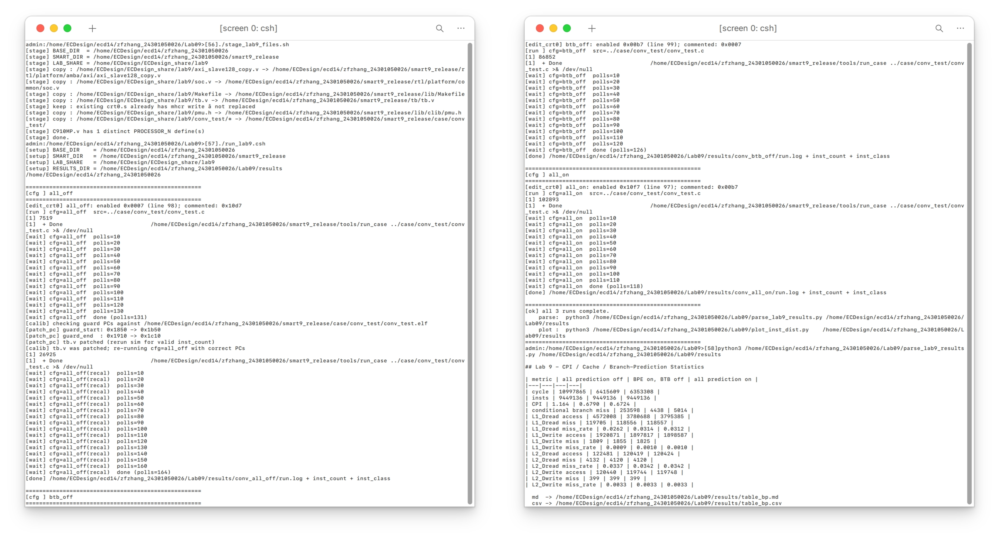
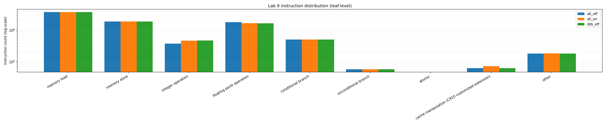
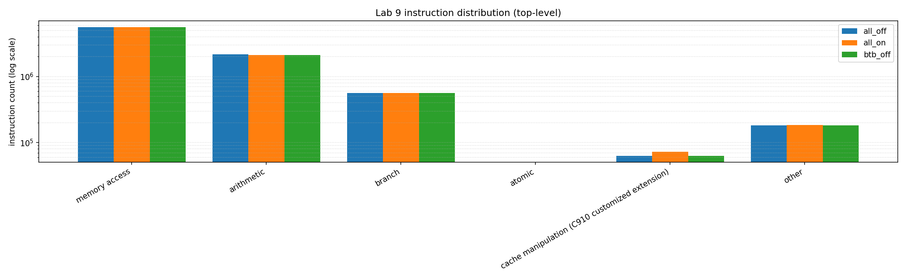

# 实验9 YOLO 卷积函数的 SMART 仿真

## 1. 实验目的

实验 5 介绍了 YOLO 算法的基本原理以及其 C 源码的代码框架, 并在基于 RISC-V QEMU 的 Linux 操作系统上验证了该算法的前向传播功能. 实验 6 至实验 8 则介绍了 C910 SMART 平台的配置和仿真方法. 本实验将在上述过程的基础上, 将 YOLO 源码的卷积函数放在 SMART 上进行仿真和性能监测, 从而进一步介绍嵌入式 C 裸机程序在 C910 上的开发过程和仿真原理.


## 2. 实验步骤

### 2.1. 文件核对和执行仿真

1. **文件核对**

    通过 `stage_lab9_files.sh` Bash Script 更新实验文件并检查 RTL 核心数为 1.

    ```bash
    #!/bin/bash
    
    set -e
    BASE_DIR="${BASE_DIR:-/home/ECDesign/ecd14/zfzhang_24301050026}"
    SMART_DIR="${SMART_DIR:-$BASE_DIR/smart9_release}"
    LAB_SHARE="${LAB_SHARE:-/home/ECDesign/ECDesign_share/lab9}"
    
    backup_then_copy() {
        local src="$1" dst="$2"
        if [ ! -f "$src" ]; then
            echo "[stage] WARN: lab9 source missing: $src"
            return
        fi
        if [ -f "$dst" ] && [ ! -f "$dst.lab9.bak" ]; then
            cp -f "$dst" "$dst.lab9.bak"
            echo "[stage] backup: $dst -> $dst.lab9.bak"
        fi
        cp -f "$src" "$dst"
        echo "[stage] copy : $src -> $dst"
    }
    
    echo "[stage] BASE_DIR  = $BASE_DIR"
    echo "[stage] SMART_DIR = $SMART_DIR"
    echo "[stage] LAB_SHARE = $LAB_SHARE"
    
    # new AXI slave
    mkdir -p "$SMART_DIR/rtl/platform/amba/axi"
    backup_then_copy "$LAB_SHARE/axi_slave128_copy.v" \
                     "$SMART_DIR/rtl/platform/amba/axi/axi_slave128_copy.v"
    
    # soc.v
    backup_then_copy "$LAB_SHARE/soc.v" \
                     "$SMART_DIR/rtl/platform/common/soc.v"
    
    # Makefile
    backup_then_copy "$LAB_SHARE/Makefile" \
                     "$SMART_DIR/lib/Makefile"
    
    # tb.v
    backup_then_copy "$LAB_SHARE/tb.v" \
                     "$SMART_DIR/tb/tb.v"
    
    # crt0.s and pmu.h
    if ! grep -q "csrs mhcr,x3" "$SMART_DIR/lib/crt0.s" 2>/dev/null; then
        backup_then_copy "$LAB_SHARE/crt0.s" "$SMART_DIR/lib/crt0.s"
    else
        echo "[stage] keep : existing crt0.s already has mhcr write — not replaced"
    fi
    if [ -f "$LAB_SHARE/pmu.h" ]; then
        backup_then_copy "$LAB_SHARE/pmu.h" "$SMART_DIR/lib/clib/pmu.h"
    fi
    
    # conv_test case dir
    mkdir -p "$SMART_DIR/case/conv_test"
    cp -rf "$LAB_SHARE/conv_test/." "$SMART_DIR/case/conv_test/"
    chmod +x "$SMART_DIR/case/conv_test/inst_proc" 2>/dev/null || true
    echo "[stage] copy : $LAB_SHARE/conv_test/* -> $SMART_DIR/case/conv_test/"
    
    # Core Num must be 1
    core_v="$SMART_DIR/rtl/cpu/C910MP.v"
    if [ -f "$core_v" ]; then
        n=$(grep -oE '^\s*`define\s+PROCESSOR_[0-9]+' "$core_v" \
            | grep -oE 'PROCESSOR_[0-9]+' \
            | sort -u | wc -l)
        echo "[stage] C910MP.v has $n distinct PROCESSOR_N define(s)"
        if [ "$n" -gt 1 ]; then
            echo "[stage] ERROR: regenerate single-core RTL via C910_R1S2P19 (lab section 4.1)"
            exit 1
        fi
    else
        echo "[stage] WARN: $core_v missing — make sure RTL is in place before running sim"
    fi
    
    echo "[stage] done."
    ```

2. **仿真执行**

    通过 `run_lab9.csh` C Shell Script 执行仿真.

    ```csh
    #!/bin/csh
     
    # paths
    if ( ! $?BASE_DIR )   setenv BASE_DIR   "/home/ECDesign/ecd14/zfzhang_24301050026"
    if ( ! $?SMART_DIR )  setenv SMART_DIR  "$BASE_DIR/smart9_release"
    if ( ! $?LAB_SHARE )  setenv LAB_SHARE  "/home/ECDesign/ECDesign_share/lab9"
    if ( ! $?LAB_DIR )    setenv LAB_DIR    "$BASE_DIR/Lab09"
     
    set RESULTS_DIR = "$LAB_DIR/results"
    set EDIT_PY     = "$LAB_DIR/edit_crt0.py"
    set PATCH_PY    = "$LAB_DIR/patch_guard_pcs.py"
    set CRT0        = "$SMART_DIR/lib/crt0.s"
    set TB_V        = "$SMART_DIR/tb/tb.v"
    set WORK_DIR    = "$SMART_DIR/workdir"
    set CASE_DIR    = "$SMART_DIR/case/conv_test"
    set SRC         = "../case/conv_test/conv_test.c"
    set ELF         = "$CASE_DIR/conv_test.elf"
    set INST_PROC   = "$CASE_DIR/inst_proc"
    set LOG_FILE    = "$WORK_DIR/run.log"
    set INST_FILE   = "$WORK_DIR/inst_count"
    set OBJDUMP     = "$SMART_DIR/tools/toolchain/RV64GC/bin/riscv64-unknown-elf-objdump"
    set POLL_SEC    = 30
    set MAX_WAITS   = 1200       # 1200 * 30s = 10h ceiling per sim
     
    mkdir -p "$RESULTS_DIR"
    echo "[setup] BASE_DIR    = $BASE_DIR"
    echo "[setup] SMART_DIR   = $SMART_DIR"
    echo "[setup] LAB_SHARE   = $LAB_SHARE"
    echo "[setup] RESULTS_DIR = $RESULTS_DIR"
     
    # backup pristine crt0.s
    if ( ! -e "$RESULTS_DIR/crt0.s.orig" ) cp -f "$CRT0" "$RESULTS_DIR/crt0.s.orig"
     
    # source SMART env
    cd "$BASE_DIR"
    if ( -e cshrc ) source cshrc >& /dev/null
    if ( $?C910_DIR ) then
        cd "$C910_DIR"
        if ( -e setup/setup.csh ) source setup/setup.csh >& /dev/null
    endif
    cd "$SMART_DIR"
    source setup.csh >& /dev/null
     
    # 3 configs
    set CFGS = ( all_off btb_off all_on )
    set patched_already = 0
     
    foreach cfg ( $CFGS )
        echo ""
        echo "===================================================="
        echo "[cfg ] $cfg"
        echo "===================================================="
        python3 "$EDIT_PY" "$CRT0" "$cfg"
        if ( $status != 0 ) then
            echo "[error] edit_crt0 failed for cfg=$cfg - aborting"
            rm -f "$CRT0" >& /dev/null
            cp -f "$RESULTS_DIR/crt0.s.orig" "$CRT0"
            exit 1
        endif
     
        cd "$WORK_DIR"
        rm -f "$LOG_FILE" "$INST_FILE" >& /dev/null
        echo "[run ] cfg=$cfg  src=$SRC"
        run "$SRC" >& /dev/null &
     
        # inline wait loop
        set _waits = 0
        while ( $_waits < $MAX_WAITS )
            if ( -e "$LOG_FILE" ) then
                grep "simulation finished successfully" "$LOG_FILE" >& /dev/null
                if ( $status == 0 ) break
            endif
            sleep $POLL_SEC
            @ _waits ++
            if ( $_waits % 10 == 0 ) echo "[wait] cfg=$cfg  polls=$_waits"
        end
        if ( $_waits >= $MAX_WAITS ) then
            echo "[error] sim for cfg=$cfg timed out after $_waits polls"
            rm -f "$CRT0" >& /dev/null
            cp -f "$RESULTS_DIR/crt0.s.orig" "$CRT0"
            exit 1
        endif
        echo "[wait] cfg=$cfg  done (polls=$_waits)"
     
        # one-time guard-PC discovery & patch on the very first run
        if ( $patched_already == 0 ) then
            if ( -e "$ELF" ) then
                echo "[calib] checking guard PCs against $ELF"
                python3 "$PATCH_PY" "$ELF" "$TB_V" "$OBJDUMP"
                set rc = $status
                set patched_already = 1
                if ( $rc == 1 ) then
                    echo "[calib] tb.v was patched; re-running cfg=$cfg with correct PCs"
                    cd "$WORK_DIR"
                    rm -f "$LOG_FILE" "$INST_FILE" >& /dev/null
                    run "$SRC" >& /dev/null &
     
                    set _waits = 0
                    while ( $_waits < $MAX_WAITS )
                        if ( -e "$LOG_FILE" ) then
                            grep "simulation finished successfully" "$LOG_FILE" >& /dev/null
                            if ( $status == 0 ) break
                        endif
                        sleep $POLL_SEC
                        @ _waits ++
                        if ( $_waits % 10 == 0 ) echo "[wait] cfg=$cfg(recal)  polls=$_waits"
                    end
                    if ( $_waits >= $MAX_WAITS ) then
                        echo "[error] recal sim timed out"
                        rm -f "$CRT0" >& /dev/null
                        cp -f "$RESULTS_DIR/crt0.s.orig" "$CRT0"
                        exit 1
                    endif
                    echo "[wait] cfg=$cfg(recal)  done (polls=$_waits)"
                else if ( $rc == 0 ) then
                    echo "[calib] tb.v already matched elf; keeping this run"
                else
                    echo "[calib] ERROR rc=$rc; aborting"
                    rm -f "$CRT0" >& /dev/null
                    cp -f "$RESULTS_DIR/crt0.s.orig" "$CRT0"
                    exit 1
                endif
            else
                echo "[calib] WARN: $ELF not found after run - skipping PC check"
                set patched_already = 1
            endif
        endif
     
        # archive
        set out = "$RESULTS_DIR/conv_${cfg}"
        mkdir -p "$out"
        rm -f "$out/run.log" "$out/inst_count" "$out/inst_class" "$out/crt0.s.used" >& /dev/null
        cp -f "$LOG_FILE"  "$out/run.log"
        if ( -e "$INST_FILE" ) cp -f "$INST_FILE" "$out/inst_count"
        cp -f "$CRT0"      "$out/crt0.s.used"
     
        # produce inst_class
        if ( -x "$INST_PROC" && -e "$out/inst_count" ) then
            cd "$out"
            rm -f ./inst_proc >& /dev/null
            cp -f "$INST_PROC" ./inst_proc
            ./inst_proc >& /dev/null
            if ( -e inst_class ) then
                echo "[done] $out/run.log + inst_count + inst_class"
            else
                echo "[done] $out/run.log + inst_count (inst_proc produced no inst_class)"
            endif
            rm -f ./inst_proc
        else
            echo "[done] $out/run.log only (inst_proc or inst_count missing)"
        endif
    end
     
    # restore pristine crt0.s
    rm -f "$CRT0" >& /dev/null
    cp -f "$RESULTS_DIR/crt0.s.orig" "$CRT0"
     
    echo ""
    echo "===================================================="
    echo "[ok] all 3 runs complete."
    echo "    parse:  python3 $LAB_DIR/parse_lab9_results.py $RESULTS_DIR"
    echo "    plot :  python3 $LAB_DIR/plot_inst_dist.py    $RESULTS_DIR"
    echo "===================================================="
    ```

    其中, `edit_crt0.py` 用于根据配置修改 `crt0.s`.

    ```python
    #!/usr/bin/env python3
    
    import sys, re, pathlib
    
    # cfg name -> hex value (lowercase, no 0x prefix)
    HEX = {
        'all_on':  '10f7',
        'all_off': '0007',
        'btb_off': '00b7',
    }
    
    # every candidate we expect to find in the vicinity - toggled as a group
    KNOWN_HEXES = {'10f7', '0007', '00b7', '10d7', '0017'}
    VICINITY = 12   # lines either side of the csrs-mhcr line
    
    def find_csrs_mhcr(lines):
        """Return index of the active `csrs mhcr,x3` (or `csrs 0x7c1,x3`) line.
    
        Prefers an uncommented match; falls back to a commented one so we can
        still locate the vicinity even if the user pre-commented everything.
        """
        csrs_re = re.compile(r'^\s*(#\s*)?csrs\s+(mhcr|0x7c1)\s*,\s*x3\b',
                             re.IGNORECASE)
        live_idx, any_idx = None, None
        for i, ln in enumerate(lines):
            m = csrs_re.match(ln)
            if not m: continue
            if any_idx is None: any_idx = i
            if not ln.lstrip().startswith('#'):
                live_idx = i; break
        return live_idx if live_idx is not None else any_idx
    
    def main():
        if len(sys.argv) != 3 or sys.argv[2] not in HEX:
            print(f"usage: {sys.argv[0]} <crt0.s> <{'|'.join(HEX)}>", file=sys.stderr)
            sys.exit(2)
    
        path = pathlib.Path(sys.argv[1])
        cfg_name = sys.argv[2]
        target_hex = HEX[cfg_name]
    
        lines = path.read_text().splitlines()
        csrs_idx = find_csrs_mhcr(lines)
        if csrs_idx is None:
            print(f"[edit_crt0] ERROR: could not find csrs (mhcr|0x7c1) in {path}",
                  file=sys.stderr)
            sys.exit(1)
    
        lo = max(0, csrs_idx - VICINITY)
        hi = min(len(lines), csrs_idx + VICINITY + 1)
    
        # match li x3, 0xVAL whether commented or not
        li_re = re.compile(
            r'^(\s*)(#\s*)?(li\s+x3\s*,\s*)0x([0-9a-fA-F]+)(.*)$',
            re.IGNORECASE,
        )
    
        selected = None
        toggled_off = []
        for i in range(lo, hi):
            m = li_re.match(lines[i])
            if not m: continue
            indent, comment, instr, hexval, rest = m.groups()
            hex_low = hexval.lower()
            if hex_low not in KNOWN_HEXES:
                continue   # not one of ours, leave it alone
    
            if hex_low == target_hex:
                # ensure uncommented (preserve indent + rest including trailing comment)
                lines[i] = f"{indent}{instr}0x{hex_low}{rest}"
                selected = (i, hex_low)
            else:
                # ensure commented
                if comment is None:
                    lines[i] = f"{indent}#{instr}0x{hex_low}{rest}"
                    toggled_off.append(hex_low)
    
        if selected is None:
            print(f"[edit_crt0] ERROR: target 0x{target_hex} ({cfg_name}) not found "
                  f"in window lines {lo+1}-{hi} around csrs-mhcr at line {csrs_idx+1}",
                  file=sys.stderr)
            sys.exit(1)
    
        path.write_text('\n'.join(lines) + '\n')
        sel_i, sel_h = selected
        msg = f"[edit_crt0] {cfg_name}: enabled 0x{sel_h} (line {sel_i+1})"
        if toggled_off:
            msg += f"; commented: {', '.join('0x'+h for h in toggled_off)}"
        print(msg)
    
    if __name__ == '__main__':
        main()
    ```

    而 `patch_guard_pcs.py` 则用于根据 ELF 文件修补 `tb.v`.

    ```python
    #!/usr/bin/env python3
    
    import sys, re, subprocess, pathlib
    
    def find_symbol(objdump_path, elf, sym):
        """Return integer PC of symbol, or None."""
        out = subprocess.check_output([objdump_path, '-t', str(elf)],
                                       stderr=subprocess.DEVNULL).decode()
        pat = re.compile(rf'^([0-9a-fA-F]+)\s+\S+\s+F\s+\S+\s+[0-9a-fA-F]+\s+{sym}\b', re.M)
        m = pat.search(out)
        return int(m.group(1), 16) if m else None
    
    def patch_define(text, name, new_pc):
        """Rewrite `define <name>  40'hXXXX` line. Returns (new_text, old_pc_or_None)."""
        pat = re.compile(rf"(`define\s+{name}\s+)40'h([0-9a-fA-F]+)")
        m = pat.search(text)
        if not m:
            return text, None
        old_pc = int(m.group(2), 16)
        new_text = pat.sub(rf"\g<1>40'h{new_pc:x}", text, count=1)
        return new_text, old_pc
    
    def main():
        if len(sys.argv) < 3:
            print(f"usage: {sys.argv[0]} <conv_test.elf> <tb.v> [<objdump>]", file=sys.stderr)
            sys.exit(2)
        elf = pathlib.Path(sys.argv[1])
        tbv = pathlib.Path(sys.argv[2])
        objdump = sys.argv[3] if len(sys.argv) > 3 else 'riscv64-unknown-elf-objdump'
    
        if not elf.is_file():
            print(f"[patch_pc] ERROR: elf not found: {elf}", file=sys.stderr); sys.exit(2)
        if not tbv.is_file():
            print(f"[patch_pc] ERROR: tb.v not found: {tbv}", file=sys.stderr); sys.exit(2)
    
        start_pc = find_symbol(objdump, elf, 'guard_start')
        end_pc   = find_symbol(objdump, elf, 'guard_end')
        if start_pc is None or end_pc is None:
            print(f"[patch_pc] ERROR: guard_start/guard_end not in elf symbol table",
                  file=sys.stderr)
            print(f"           did -fno-inline -g get applied? did the call sites exist?",
                  file=sys.stderr)
            sys.exit(2)
    
        text = tbv.read_text()
        text, old_start = patch_define(text, 'GUARD_START_PC', start_pc)
        text, old_end   = patch_define(text, 'GUARD_END_PC',   end_pc)
    
        changed = (old_start != start_pc) or (old_end != end_pc)
        tbv.write_text(text)
    
        print(f"[patch_pc] guard_start: 0x{old_start:x} -> 0x{start_pc:x}")
        print(f"[patch_pc] guard_end  : 0x{old_end:x} -> 0x{end_pc:x}")
        if changed:
            print(f"[patch_pc] tb.v patched (rerun sim for valid inst_count)")
            sys.exit(1)
        else:
            print(f"[patch_pc] tb.v already correct")
            sys.exit(0)
    
    if __name__ == '__main__':
        main()
    ```

    为相应 Script 赋予执行权限后, 依次执行 `stage_lab9_files.sh` 和 `run_lab9.csh` 即可完成仿真并生成结果文件. 之后, 执行 `parse_lab9_results.py` 可以从仿真日志中提取性能统计数据并生成 Markdown 和 CSV 格式的表格.

    ```python
    #!/usr/bin/env python3
    
    import sys, re, pathlib, csv
    
    CONFIGS = ["all_off", "btb_off", "all_on"]
    LABEL = {
        "all_off": "all prediction off",
        "btb_off": "BPE on, BTB off",
        "all_on":  "all prediction on",
    }
    
    PMU_VARS = {
        "cycle":                    "cycle",
        "instret":                  "insts",
        "conditional_branch_mis":   "cond_miss",
        "L1_Dcache_read_access":    "l1_dr_acc",
        "L1_Dcache_read_miss":      "l1_dr_miss",
        "L1_Dcache_write_access":   "l1_dw_acc",
        "L1_Dcache_write_miss":     "l1_dw_miss",
        "L2_Dcache_read_access":    "l2_dr_acc",
        "L2_Dcache_read_miss":      "l2_dr_miss",
        "L2_Dcache_write_access":   "l2_dw_acc",
        "L2_Dcache_write_miss":     "l2_dw_miss",
    }
    
    def parse_log(p: pathlib.Path) -> dict:
        if not p.is_file():
            return {}
        txt = p.read_text(errors="ignore")
        row = {}
        for var, key in PMU_VARS.items():
            matches = re.findall(rf'num_{var}\s+is\s+(-?\d+)', txt)
            row[key] = int(matches[-1]) if matches else None
        if row.get("cycle") and row.get("insts"):
            row["cpi"] = row["cycle"] / row["insts"]
        for prefix in ("l1_dr", "l1_dw", "l2_dr", "l2_dw"):
            acc, miss = row.get(f"{prefix}_acc"), row.get(f"{prefix}_miss")
            if acc and miss is not None:
                row[f"{prefix}_mr"] = miss / acc if acc else 0.0
        return row
    
    def fmt(v):
        if v is None:        return "-"
        if isinstance(v, float):
            return f"{v:.4f}" if abs(v) < 1 else f"{v:.3f}"
        return str(v)
    
    METRICS = [
        ("cycle",                   "cycle"),
        ("insts",                   "insts"),
        ("CPI",                     "cpi"),
        ("conditional branch miss", "cond_miss"),
        ("L1_Dread access",         "l1_dr_acc"),
        ("L1_Dread miss",           "l1_dr_miss"),
        ("L1_Dread miss_rate",      "l1_dr_mr"),
        ("L1_Dwrite access",        "l1_dw_acc"),
        ("L1_Dwrite miss",          "l1_dw_miss"),
        ("L1_Dwrite miss_rate",     "l1_dw_mr"),
        ("L2_Dread access",         "l2_dr_acc"),
        ("L2_Dread miss",           "l2_dr_miss"),
        ("L2_Dread miss_rate",      "l2_dr_mr"),
        ("L2_Dwrite access",        "l2_dw_acc"),
        ("L2_Dwrite miss",          "l2_dw_miss"),
        ("L2_Dwrite miss_rate",     "l2_dw_mr"),
    ]
    
    def main():
        root = pathlib.Path(sys.argv[1] if len(sys.argv) > 1 else "results")
        rows = {c: parse_log(root / f"conv_{c}" / "run.log") for c in CONFIGS}
    
        # markdown
        md = []
        md.append("| metric | " + " | ".join(LABEL[c] for c in CONFIGS) + " |")
        md.append("|" + "---|" * (len(CONFIGS) + 1))
        
        for lbl, key in METRICS:
            md.append(f"| {lbl} | " + " | ".join(fmt(rows[c].get(key)) for c in CONFIGS) + " |")
        md_text = "\n".join(md)
    
        print("\n## Lab 9 - CPI / Cache / Branch-Prediction Statistics\n")
        print(md_text)
    
        md_path = root / "table_bp.md"
        md_path.write_text(md_text + "\n")
        print(f"\n  md  -> {md_path}")
    
        # csv
        csv_path = root / "table_bp.csv"
        with csv_path.open("w", newline="") as f:
            w = csv.writer(f)
            w.writerow(["metric"] + [LABEL[c] for c in CONFIGS])
            for lbl, key in METRICS:
                w.writerow([lbl] + [fmt(rows[c].get(key)) for c in CONFIGS])
        print(f"  csv -> {csv_path}")
    
    if __name__ == '__main__':
        main()
    ```

    执行后的输出如下所示.

    {width=90%}

### 2.2. CPI, Cache 缺失率和分支预测统计

| **metric** | **all prediction off** | **BPE on, BTB off** | **all prediction on** |
| :---: | :---: | :---: | :---: |
| **cycle** | 10997865 | 6415609 | 6353308 |
| **insts** | 9449136 | 9449136 | 9449136 |
| **CPI** | 1.164 | 0.6790 | 0.6724 |
| **conditional branch miss** | 253598 | 4438 | 5014 |
| **L1_Dread access** | 4572008 | 3780688 | 3795385 |
| **L1_Dread miss** | 119705 | 118556 | 118557 |
| **L1_Dread miss_rate** | 0.0262 | 0.0314 | 0.0312 |
| **L1_Dwrite access** | 1920871 | 1897817 | 1898587 |
| **L1_Dwrite miss** | 1809 | 1855 | 1825 |
| **L1_Dwrite miss_rate** | 0.0009 | 0.0010 | 0.0010 |
| **L2_Dread access** | 122481 | 120419 | 120424 |
| **L2_Dread miss** | 4132 | 4120 | 4120 |
| **L2_Dread miss_rate** | 0.0337 | 0.0342 | 0.0342 |
| **L2_Dwrite access** | 120440 | 119744 | 119748 |
| **L2_Dwrite miss** | 399 | 399 | 399 |
| **L2_Dwrite miss_rate** | 0.0033 | 0.0033 | 0.0033 |

### 2.3. 指令分布统计绘图

{width=96%}

{width=72%}


## 3. 实验分析与总结

通过对比三种分支预测配置的测试数据可知, 程序在不同状态下退休的总指令数保持恒定. 从宏观的总时钟周期和 CPI 来看, 开启分支预测功能有效提升了处理器的执行效率. 由于避免了取指阶段的频繁等待, 系统完成相同计算任务所需的时间明显缩短.

在分支预测器的具体组件表现上, 历史方向预测 (BPE) 在当前的算法负载中发挥了主要作用. 相较于关闭所有预测机制, 仅开启 BPE 就能有效降低条件分支指令的未命中频率, 从而规避了流水线冲刷带来的额外周期损耗. 进一步开启跳转目标缓冲区 (BTB) 后, 各项性能指标未出现明显的改变. 这主要是因为卷积计算过程多由高度结构化的嵌套循环构成, 分支跳转具备较强的规律性, 针对间接跳转优化的 BTB 在此类场景中发挥的空间相对有限.

此外, 访存层面的统计数据体现了推测执行机制与缓存行为的交互关系. 当关闭分支预测时, 处理器会在错误的分支路径上执行一定数量的投机性数据加载指令, 导致 L1 数据缓存的总访问请求量较高. 但由于卷积算法固有的数据局部性, 不同预测状态下的绝对缓存未命中数基本维持稳定. 因此, 在开启分支预测减少了无效访问之后, L1 的读取未命中率在数学计算上呈现出小幅的上升. 总体而言, 各级缓存系统有效分担了大部分访存压力, 但由于底层主存延迟的存在, 这部分未命中的访存请求仍是影响计算密集型系统性能的客观限制因素.


## 4. 实验收获与建议

通过本次裸机程序的部署与测试, 熟悉了嵌入式C程序从编译, 链接到在底层硬件模型上加载运行的完整流程, 加深了对哈佛架构内存映射, 启动代码初始化以及软硬件边界交互的理解. 结合性能监测单元导出的运行数据, 直观验证了分支预测与多级缓存机制在超标量处理器中的实际作用. 这不仅巩固了对指令级并行和访存局部性原理的认识, 也锻炼了透过底层硬件事件推导程序宏观性能表现的分析能力.

建议未来的实验中减少不必要的重复劳动, 以便将更多精力集中在分析和理解上.

