# 实验10 wujian 平台介绍和 FPGA 调试

## 1. 实验目的

了解 wujian100 SoC 的组成架构, 掌握 wujian 平台的前端仿真和 FPGA 调试.


## 2. 实验步骤

### 2.1. 依照 "二、wujian100 SoC 的前端仿真" 的步骤完成 `case/` 目录下的示例的 `timer_test.c` 仿真, 对测试结果进行截图.

1. **实验环境**

    连接实验服务器, 获取实验相关文件并配置实验环境.

    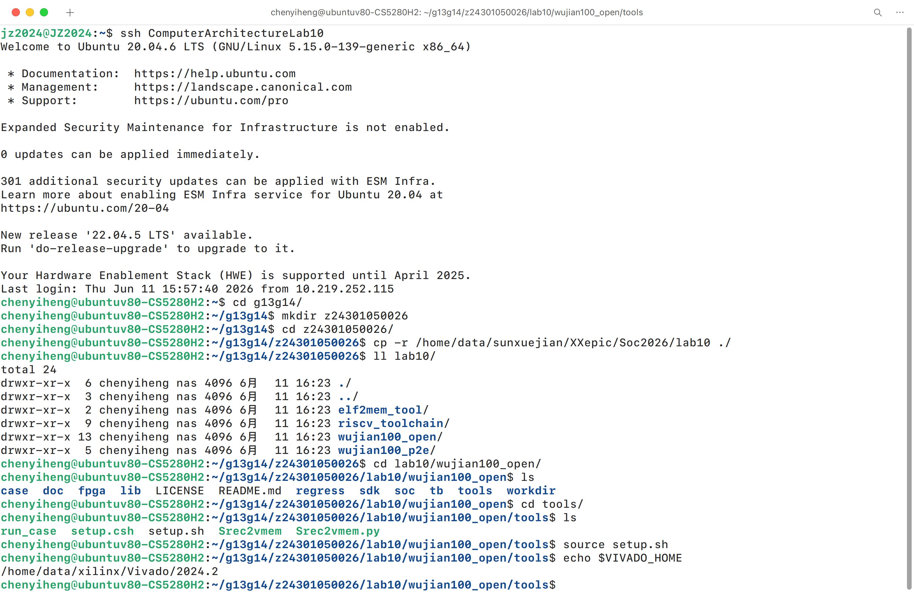{width=80%}

2. **前端仿真**

    进入实验目录, 运行 GalaxSim 仿真, 进行 `timer_test.c` 的仿真测试.

    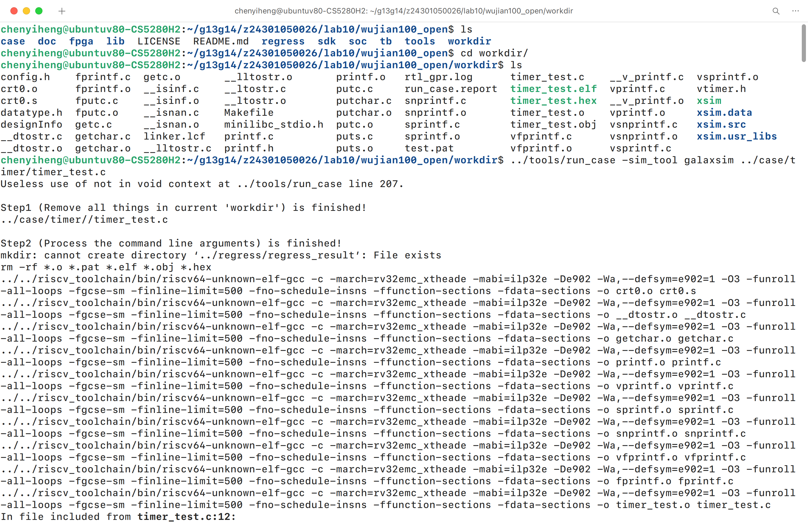{width=80%}

    观察仿真结果, 可以看到程序正确输出了 `Hello!` 字样, 说明前端仿真成功.

    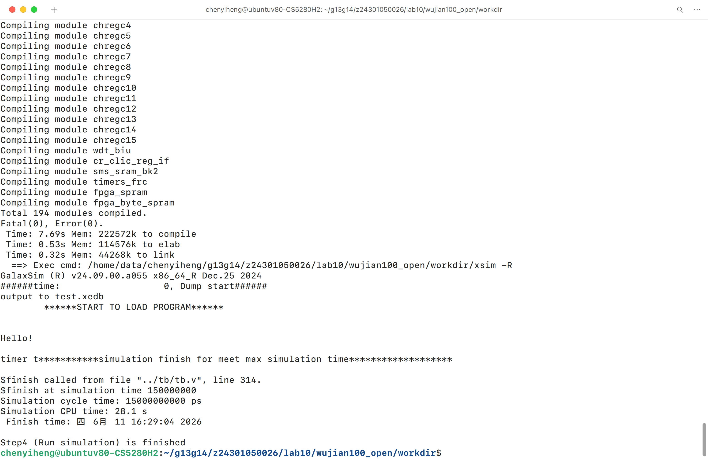{width=80%}

### 2.2. 依照 "三、wujian100 SoC 的 FPGA 仿真测试" 的步骤完成示例的项目测试, 对测试结果进行截图 (请截取不同于示例部分的波形图片), 并说说捕获的波形是如何得到的, 为什么用这种方法来捕捉.

1. **项目编译**

    在 Windows 系统下安装实验所需的 CDK 软件. 修改示例项目中的 `putc()` 实现后, 编译成 `.elf` 文件.

    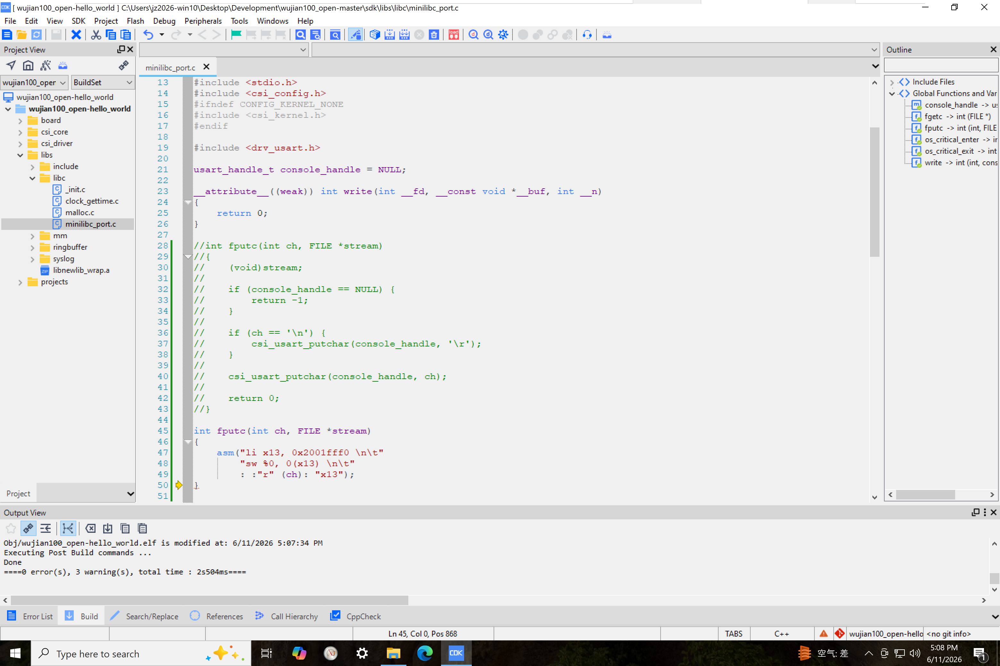{width=80%}

2. **文件转换**

    将编译好的 `.elf` 文件上传到服务器上, 并使用 `elf2mem_tool/` 目录下的 Python 脚本进行转换和分割.

    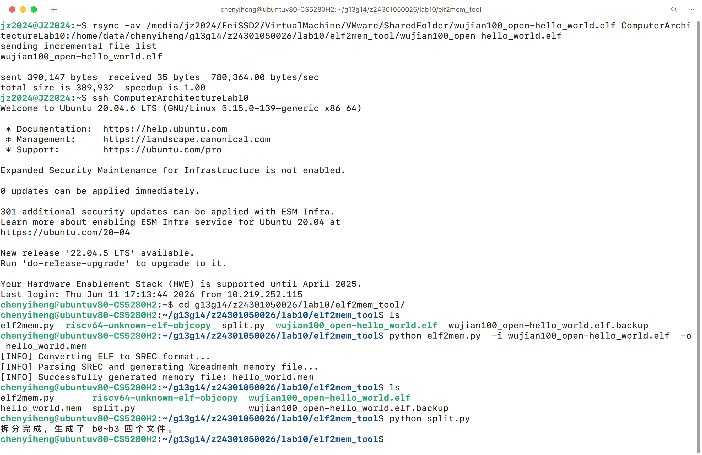{width=80%}

3. **vSyn 综合**

    进入 `wujian100_p2e/` 目录进行 FPGA测试. 将分割后的 `.mem` 文件复制到 `src/` 目录下, 并执行 `./run_tb.sh` 进行 vSyn 综合.

    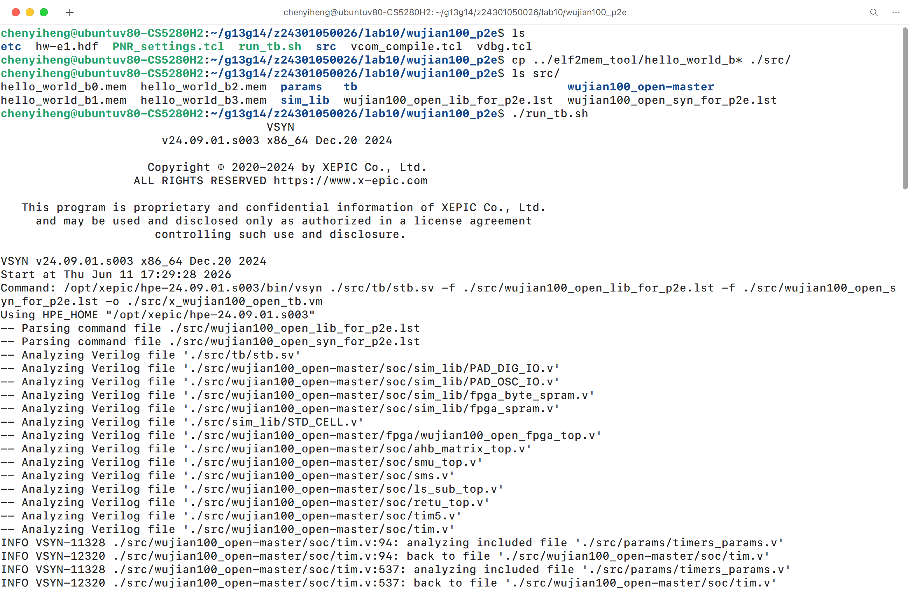{width=80%}

    完成后打开 `vsyn.log`, 确认无错误.

    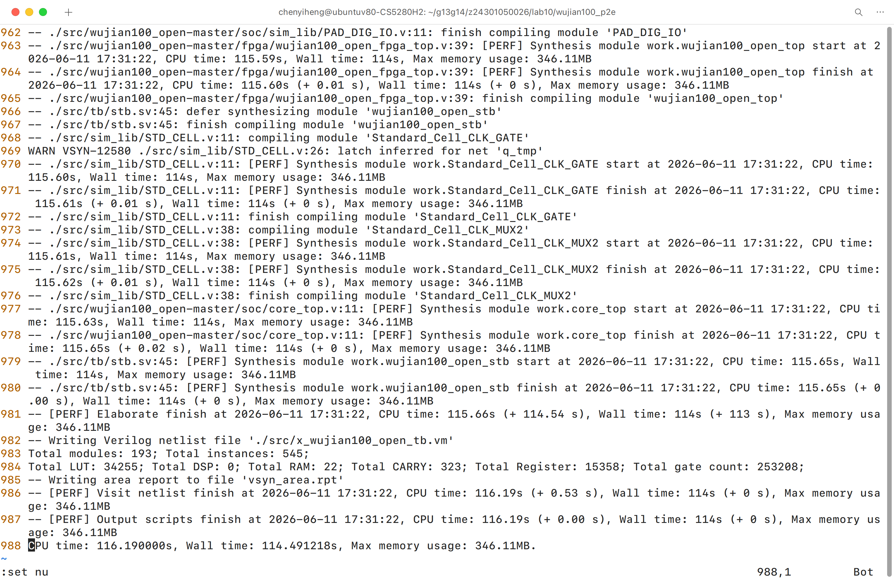{width=80%}

4. **vCom 编译**

    修改 `vdbg.tcl` 中定义的 `.mem` 文件路径, 实验文档中将需要修改的文件名称误写成了 `tb/stb.sv`. 随后执行 `vcom vcom_compile.tcl` 进行 vCom 编译.

    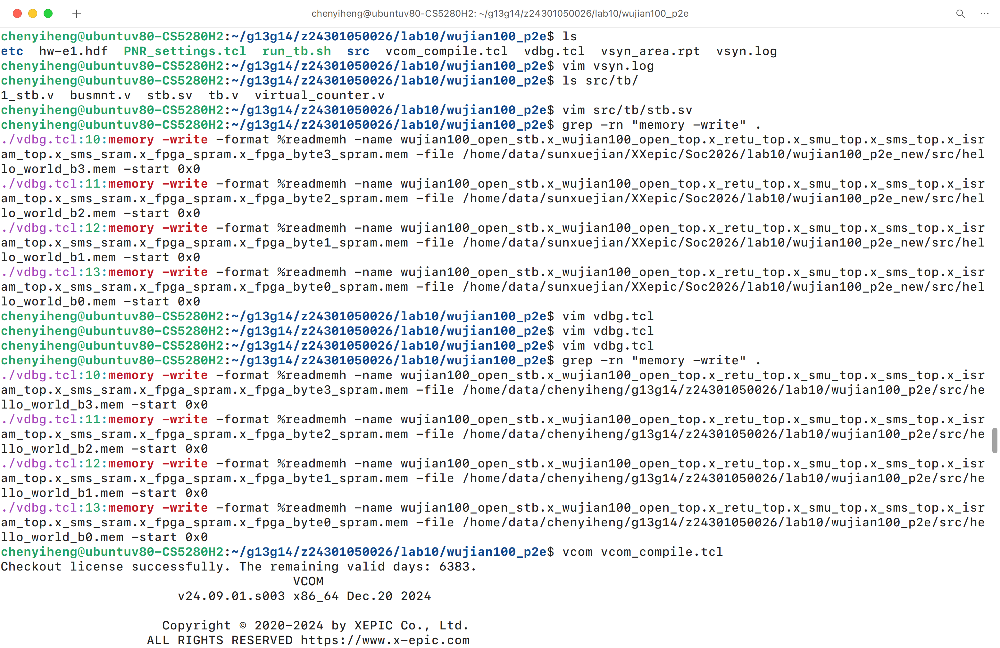{width=80%}

    完成后打开 `vcom.log`, 确认无错误.

    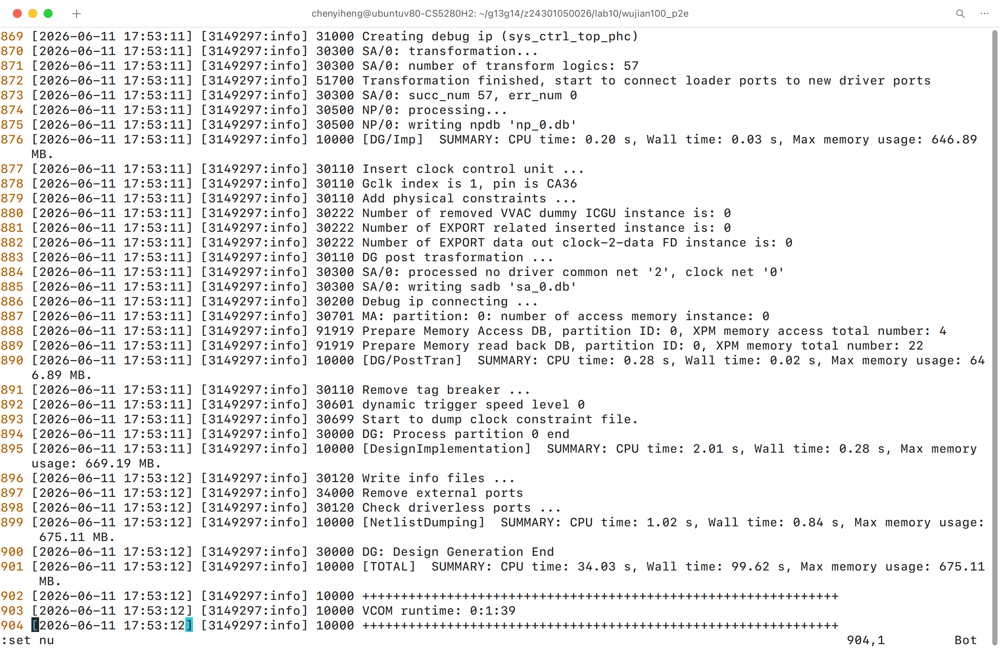{width=80%}

5. **PnR 生成比特流**

    进入 `fpgaCompDir/` 目录，运行 `make all` 命令进行 PnR 生成比特流文件.

    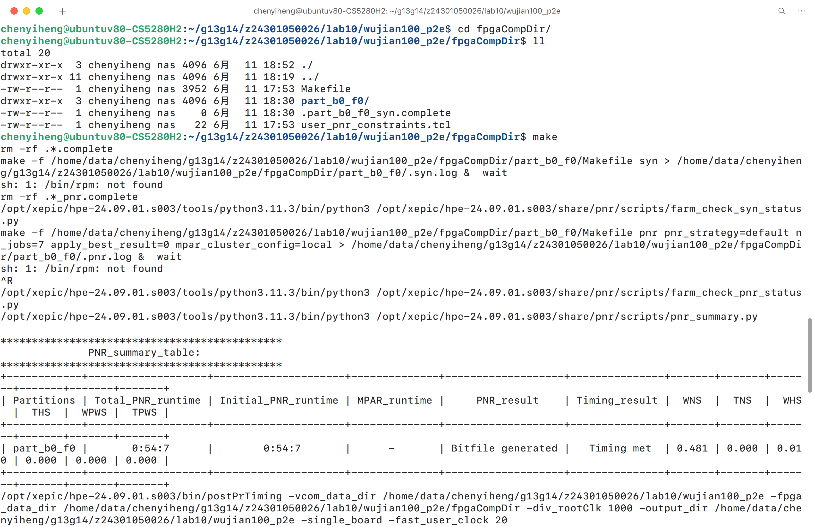{width=80%}

6. **vDbg 上板测试**

    执行 `vdbg vdbg.tcl`, 使用 vDbg 进行上板测试, 可以看到生成了波形文件.

    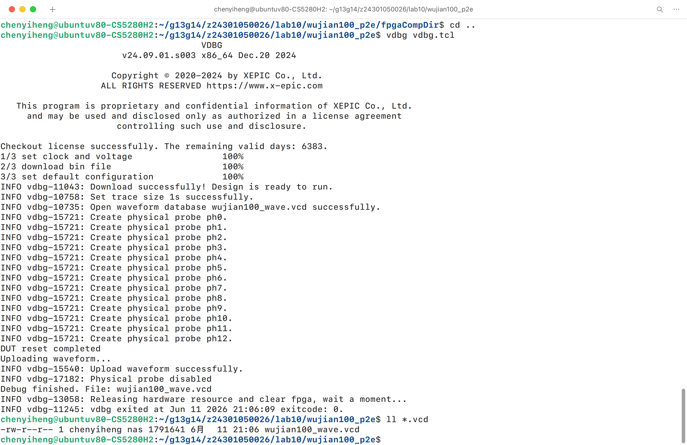{width=80%}

7. **初步波形分析**

    将生成的波形文件下载到本地, 并使用 GTKWave 打开进行分析. 将 `monitor_hwdata[31:0]` 的 Data Format 设置为 ASCII, `monitor_haddr[31:0]` 保持默认 Hex, 对后者按照 String 搜索 `2001FFF0`. 并未观察到 C 程序中 `printf("Hello World!\n");` 的预期输出, 而是显示 `Exception: NO.4` 等异常信息. 说明程序执行发生了异常, 需要进一步分析.

    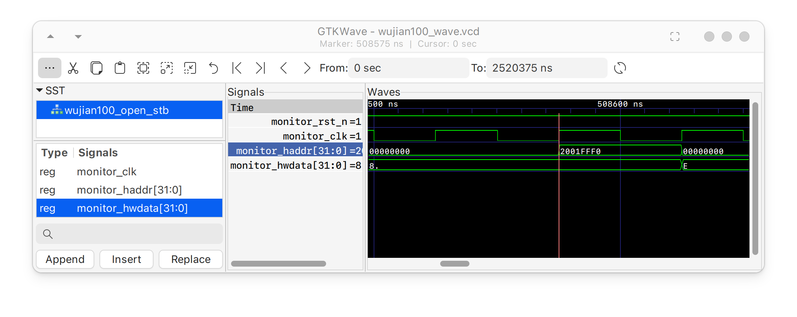{width=80%}

    {width=80%}

    {width=80%}

    {width=80%}

    {width=80%}

    {width=80%}

    {width=80%}

    {width=80%}

    {width=80%}

8. **波形分析方法**

    为获取实际信号波形, 首先需要在 vCom 编译阶段将关键信号标记为硬件级的物理探针, 随后在 vDbg 运行期间按时钟周期实时采集信号跳变并将数据暂存至板载存储器中, 测试结束后再将缓存数据上传至主机.

    采用这种方法是因为 FPGA 内部的高速信号很难直接从外部捕捉, 只能通过片内探针来获取真实物理波形, 同时按需捕捉以平衡资源消耗和观测需求. 这提供了最接近真实的信号状态, 避免了纯软件仿真可能存在的假象.

9. **错误原因分析**

    经排查发现, 实验提供的 `elf2mem.py` 脚本的间隙填充逻辑中存在错误, 导致在 ELF 的每个地址空洞处都会丢失一个 32 位字. 而本次实验使用的 CDK 编译生成的 `.elf` 文件恰好包含一个这样的空洞, 即 `.eh_frame` (结束于 `0x49EC`) 和 `.rodata` (起始于 `0x49F0`) 之间的一个 4 字节对齐间隙. 因此, 从 `.rodata` 开始的所有内容都被加载到了比其链接地址低 4 个字节的位置, 这导致了 CPU 在后续执行过程中触发了加载地址未对齐异常, 并没有执行到 `main()` 函数. 此前捕获的波形实际上是这次崩溃的过程, 而不是程序的正常输出.

    转换脚本 `elf2mem.py` 的 `hex2mem()` 函数中, `cur_mem_addr` 会在每次写入一个字后进行后置递增, 然后保存 `prev_mem_addr = cur_mem_addr`. 因此, `prev_mem_addr` 保存的实际上是下一个需要写入的字的索引. 当遇到空洞后的下一条记录开始时, 缺失的间隙字计数恰好为 `mem_addr_incr = cur_mem_addr − prev_mem_addr`, 此时需要输出全零的字的个数也就等于 `mem_addr_incr`. 然而, 原始代码认为 `prev_mem_addr` 代表最后一个写完的字, 因此对空洞采用了如下写入逻辑, 导致每次遇到空洞时都会少写入一次.

    ```Python
    if mem_addr_incr > 1:
        for i in range(mem_addr_incr - 1):
            ofile_id.write("00000000\n")
    ```

    这可以在任何现有的文件上通过 `wc -l` 命令进行验证. 生成的镜像跨度为 `0x0–0x5C00`, 共 5888 个字. 而生成的`hello_world.mem` 文件则只有 5887 行, 少了一个字. 正确的逻辑只需要修改两个符号即可.

    ```Python
    if mem_addr_incr > 0:
        for i in range(mem_addr_incr):
            ofile_id.write("00000000\n")
    ```

    修改后采用同样的 `.elf` 文件重新生成, `wc -l` 的结果变为了正确结果 5888. 通过 vDbg 重新加载这分割后的 4 个 `.mem` 文件后上板验证, 异常写入操作消失, `0x2001FFF0` 地址成功接收到 13 次写入操作, 即 `main` 函数中输出的 `Hello World!\n`.

    该 bug 具有很强的隐蔽性, 仅在加载镜像包含地址空洞的 `.elf` 文件上才会触发. 不幸的是, 该程序在 CDK 中生成的布局总是会产生一个空洞, 因此本实验的每一次作业提交都受到了影响. 并且这种故障模式极具欺骗性, 虽然产生了看似合理的波形输出, 但实际上得到的只是一行崩溃信息. 建议及时修改服务器上提供的 `elf2mem.py` 脚本文件, 即使这并不影响整体的实验流程.

10. **最终波形分析**

    修改脚本后重新生成 `.mem` 文件并上板测试, 可以看到 `0x2001FFF0` 地址成功接收到了 `Hello World!\n`. 这说明程序已经正确执行到了 `main()` 函数, 并且成功调用了 `printf()` 输出了预期的字符串.

    {width=80%}

    {width=80%}

    {width=80%}

    {width=80%}

    {width=80%}

    {width=80%}

    {width=80%}

    {width=80%}

    {width=80%}

    {width=80%}

    {width=80%}

    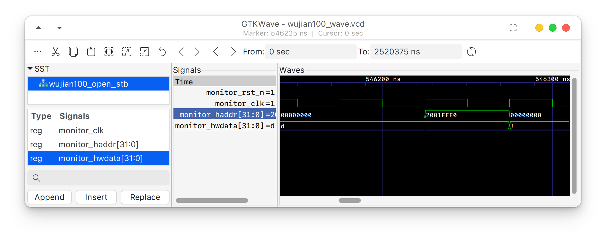{width=80%}

    {width=80%}

### 2.3. 自行编写一个 C 语言的简单算法程序, 进行仿真测试, 步骤参考 "三、wujian100 SoC 的 FPGA 原型测试-5", 对测试结果进行截图, 并说明其正确性.

1. **项目编译**

    编写一个简单的快速排序 C 程序, 进行仿真测试. 程序中定义了一个整数数组, 并调用快速排序函数对其进行排序. 最后通过 `printf()` 输出排序后的结果. 使用 CDK 编译生成 `.elf` 文件.

    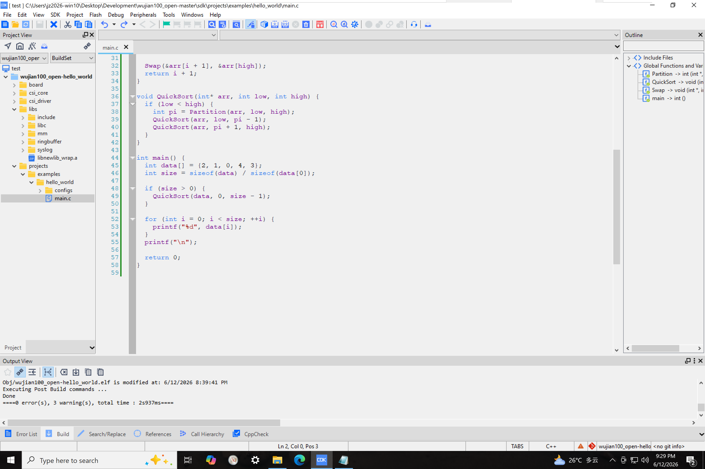{width=80%}

2. **测试结果**

    将生成的 `.elf` 文件上传到服务器, 保持文件命名不变, 使用更新后的 Python 脚本转换并分割. 由于之前已经执行过综合, 编译并生成比特流, 因此可以直接使用 vDbg 进行上板测试. 测试成功后观察生成的波形文件, 可以看到程序成功输出了排序后的数组, 说明程序执行正确.

    {width=80%}


## 3. 实验分析与总结

本次实验主要围绕基于 MCU 的 wujian100 SoC 平台展开, 深入剖析了从软件 C 代码编译到 FPGA 硬件原型的完整验证工作流. 在此过程中不仅理解了 CPU, 多级总线与各类外设的系统互联架构, 更掌握了 EDA 工具的底层运行逻辑与硬件调试技巧. 通过动手排查高度隐蔽的地址错位 Bug, 极大提升了阅读底层指令, 理解内存映射机制以及使用 GTKWave 观察波形的实战分析能力. 这种面对由上层软件引发底层硬件执行崩溃的跨域调试经验, 打破了纯软件或者纯硬件视角的局限, 得以更加全面地理解 SoC 设计与验证的复杂性, 以及软硬件协同调试在现代计算系统开发中的重要性.

总体而言, 本实验完整地进行了 wujian100 SoC 的前端仿真与基于芯华章 P2E 工具链的 FPGA 原型测试流程. 实验依次完成了基于 CDK 的 C 语言交叉编译, 物理内存镜像文件的转换与分割, vSyn 综合, vCom 编译, 以及 PnR 比特流生成, 最终使用 vDbg 工具完成了真实的硬件上板调试. 在成功定位并修复了内存转换工具的 bug 后, 实验不仅顺利完成了标准字符输出的测试, 还实现了快速排序算法的硬件级原型验证, 最终通过正确的逻辑波形输出了排序结果, 使得整个软硬件协同设计的闭环得到了严格且全面的检验.


## 4. 实验收获与建议

此次实验不仅提供了从顶层软件编译到底层硬件验证的完整流程, 更加深了对处理器架构与 EDA 工具链的理解, 也大幅提升了应对软硬件接口的跨层级调试能力. 通过动手操作全过程中的核心环节, 不仅掌握了前端仿真与物理硬件测试的方法差异, 更深入探索了底层内存空间布局, 目标文件段对齐, 以及 CPU 硬件异常陷阱的触发机制等问题. 最深刻的体会在于, 系统级开发绝不能盲从既有的中间工具链, 当硬件执行状态与预期产生分歧时, 必须具备深入源码排查的怀疑精神, 以确保指令执行的绝对可靠.

针对实验中暴露出的工具链问题, 建议在实验平台的服务器环境中尽早修复 `elf2mem.py` 的地址空洞填充逻辑. 此外, 鉴于纯粹依靠肉眼在 GTKWave 中排查指令集级别的异常难度较高且极耗费时间, 而直接处理 `.vcd` 波形文本文件又需要对其格式和内容有较为深入的理解, 建议在实验文档中增加相关指南或提供相关工具, 以帮助学生专注于对有效信息的分析, 提升实验体验.

