# 实验11 D1 开发板部署神经网络

## 1. 实验目的

熟悉一个 RISC-V 架构的硬件平台, 并在之上启动一个 Linux 操作系统. 然后在此之上运行 YOLO 算法, 之后需要对卷积层进行优化, 在此过程会使用嵌入的汇编代码进行性能监测, 并对优化的性能进行分析, 在这个过程中我们可以把书中学习到的缓存原理知识应用到实际的工程开发中, 并真切地感受到其发挥的作用. 最后通过 HHB 流程对 RISC-V 的向量扩展的应用有一个初步的认识.

## 2. 实验步骤

### 2.1. 将修改过的 Tina Linux 固件烧写到 D1 开发板中.

运行 PhoenixSuit 并执行刷机, 将修改过的 Tina Linux 固件烧写到 D1 开发板中.

{width=60%}

### 2.2. 在 D1 开发板上运行 `hello_world` 的全流程.

在实验提供的 Ubuntu 虚拟机中, 将本次实验所需的工具添加到环境变量中.

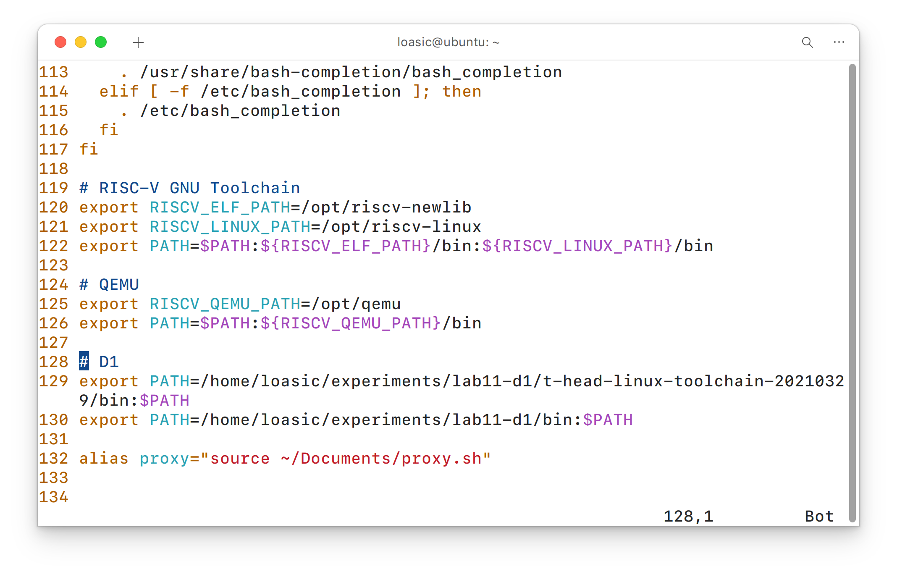{width=80%}

编译并使用 QEMU 运行 `hello_world` 程序.

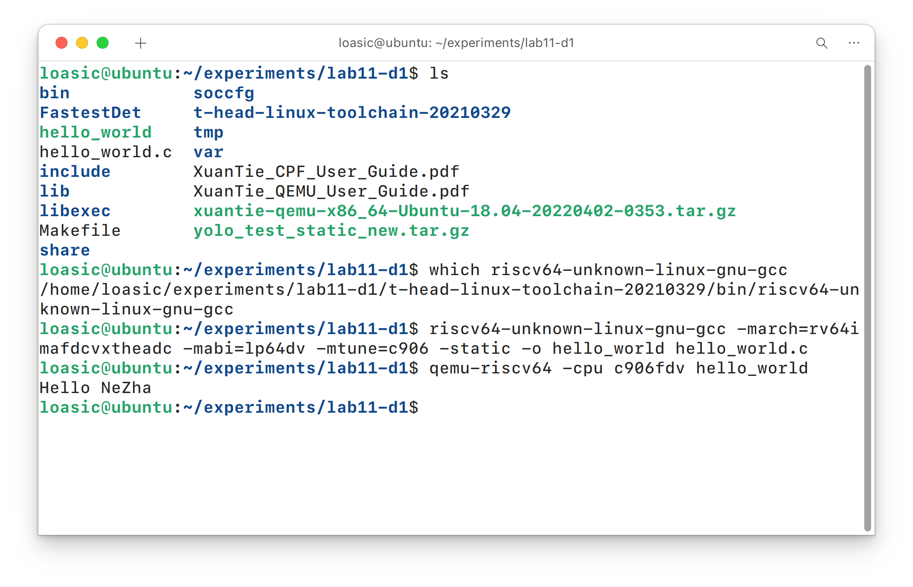{width=80%}

通过 ADB 工具连接 D1 开发板, 将 `hello_world` 程序推送到开发板上并运行.

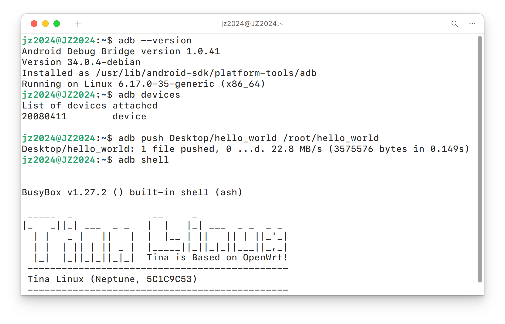{width=80%}

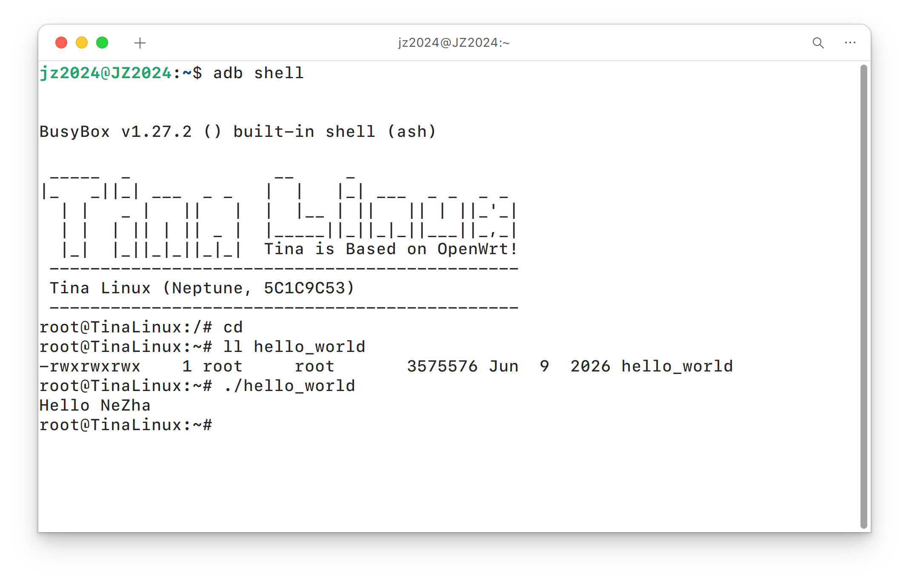{width=80%}

### 2.3. 撰写带有缓存优化版本的卷积函数, 并通过 QEMU 的测试. (需要写出优化思路, 以及优化的原理.)

根据内存访问的局部性原理优化卷积函数的具体实现. 通过重新排布循环执行顺序, 使得内层循环在遍历整个特征图面时, 始终复用权重切片和输入切片, 有效减少内存的跳跃访问.

通过循环互换, 将当前空间遍历时活跃的计算工作集收敛至 L1 数据缓存大小以内, 解决了顺序流水线因等待内存搬运而产生的数据停顿, 同时避免了 `im2col` 算法高昂空间开销.

### 2.4. 在 D1 开发板上进行三个版本的 YOLO 性能测试, 并撰写分析报告. (关于 GEMM 库版本的分析, 同学们需要额外查找资料, 重点放在 `img2col` 算法上. 下面表格中统计的数据除了 "执行时间", 其他的数据可以使用计算量最大的一个层 `conv12` 来代表.)

实验中部分输出如下.

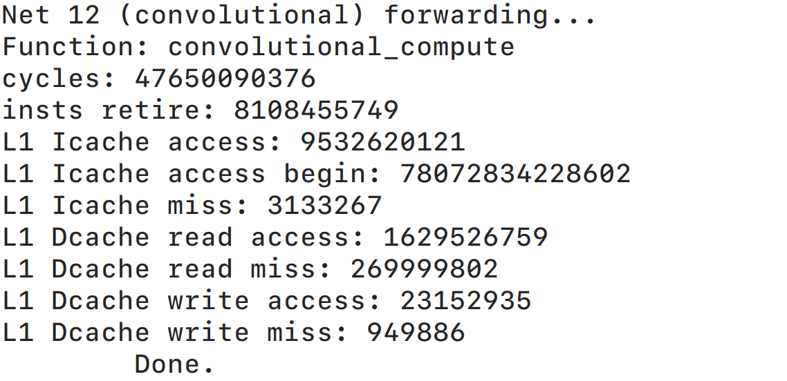{width=32%}

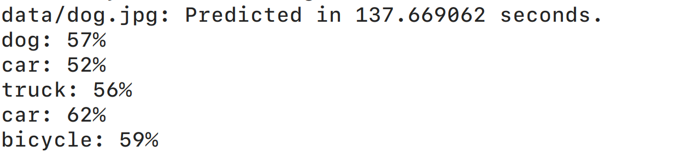{width=36%}

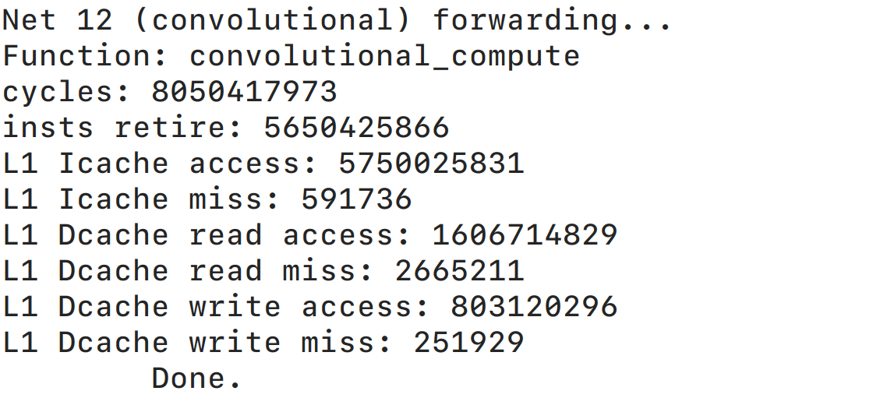{width=32%}

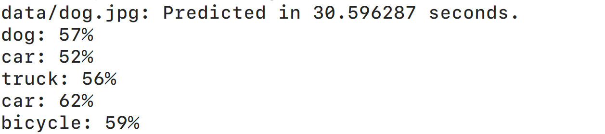{width=36%}

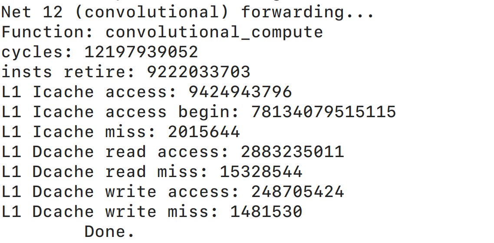{width=32%}

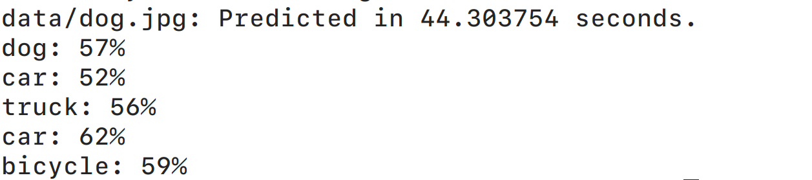{width=36%}

将上述输出结果整理成表格形式如下.

| | **Base** | **GEMM** | **Cache-opt** |
| :---: | :---: | :---: | :---: |
| **cycles** | 47,650,090,376 | 8,050,417,973 | 12,197,939,052 |
| **instructions** | 8,108,455,749 | 5,650,425,866 | 9,222,033,703 |
| **L1D cache read access** | 1,629,526,759 | 1,606,714,829 | 2,883,235,011 |
| **L1D cache read miss** | 269,999,802 | 2,665,211 | 15,328,544 |
| **L1D cache read hit ratio** | 83,43% | 99.83% | 99.47% |
| **L1D cache write access** | 23,152,935 | 803,120,296 | 248,705,424 |
| **L1D cache write miss** | 949,886 | 251,929 | 1,481,530 |
| **L1D cache write hit ratio** | 95.90% | 99.97% | 99.40% |
| **执行时间 (s)** | 137.669 | 30.596 | 44.304 |

`base` 版本使用六层嵌套循环直接计算卷积, 存在对内存数据的跨步访问, 故缓存命中率较低, 运行时间也较长.

`gemm` 版本使用 `im2col` 算法将卷积转换为矩阵乘法, 通过调用高效的 GEMM 库实现卷积计算, 大幅提升了性能. 该版本的缓存命中率极高, 因为 `im2col` 将输入数据重排成连续的内存块, 使得访问模式更友好于缓存系统. 但是 `im2col` 算法会带来较高的空间开销, 增加了内存的使用量.

`cache-opt` 版本通过优化循环顺序和数据布局, 使得缓存命中率较 `base` 版本有显著提升, 有效减少了内存访问的跳跃, 从而降低了执行时间. 该方法引入了多级指针, 带来了额外的内存访问开销, 但由于缓存性能的大幅改善, 整体仍显著优于 `base` 版本.

### 2.5. 使用平头哥 HBB 流程编译 `mobilenet` 生成两个版本的可执行文件 (一个带向量扩展, 一个不带扩展), 并分别在 QEMU 和 D1 开发板运行. 另行选取三张图片重复上述过程, 并将实验结果统计在如下表格中.

在 Ubuntu 虚拟机中通过 docker 启动 HBB 环境.

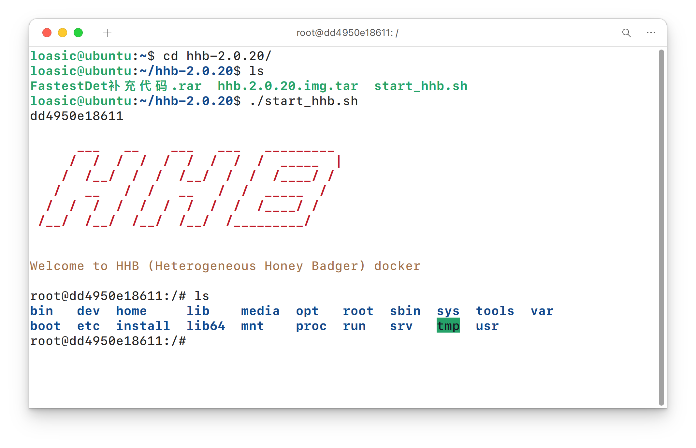{width=80%}

调用 HBB 工具. 将所需 C 语言代码复制到 `hhb_out/` 目录下. 修改 C 语言代码并执行编译.

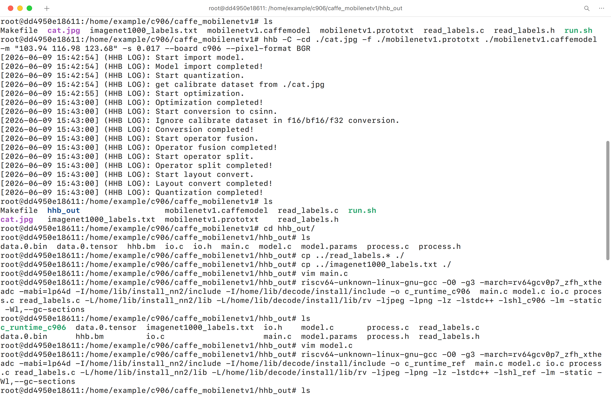{width=80%}

使用 QEMU 进行测试.

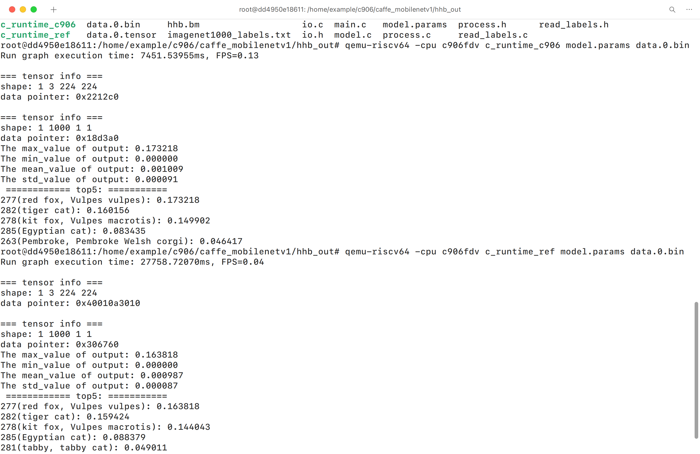{width=80%}

将文件转移至 D1 开发板上, 同样能够正确运行.

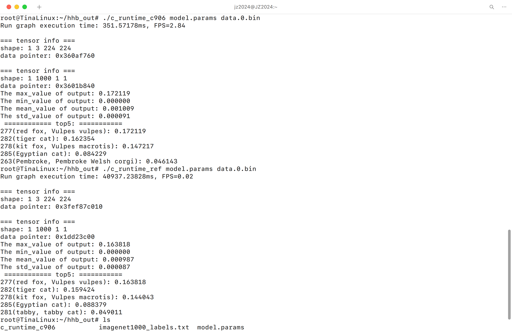{width=80%}

再选取三张图片重复上述过程, 并将实验结果统计在如下表格中.

在不同平台下不同输入的执行时间如下.

| | **QEMU_ref** | **QEMU_c906** | **D1_ref** | **D1_c906** |
| :---: | :---: | :---: | :---: | :---: |
| **图片 1** | 25284.25 | 7387.89 | 41164.05 | 358.48 |
| **图片 2** | 25354.57 | 7060.39 | 41194.71 | 607.63 |
| **图片 3** | 25198.65 | 7025.86 | 41194.57 | 358.56 |

在不同平台下不同输入的分类结果如下.

| | **QEMU_ref** | **QEMU_c906** | **D1_ref** | **D1_c906** |
| :---: | :---: | :---: | :---: | :---: |
| **图片 1** | 354 Arabian camel | 354 Arabian camel | 354 Arabian camel | 354 Arabian camel |
| **图片 2** | 207 Golden retriever | 207 Golden retriever | 207 Golden retriever | 207 Golden retriever |
| **图片 3** | 404 Airliner | 404 Airliner | 404 Airliner | 404 Airliner |

### 2.6. 完成手势识别网络的后处理函数编程, 使用 D1 开发板部署手势识别网络. 要求提供对 `test_case` 中测试图片的输出图片.

调用 HHB 进行网络编译.

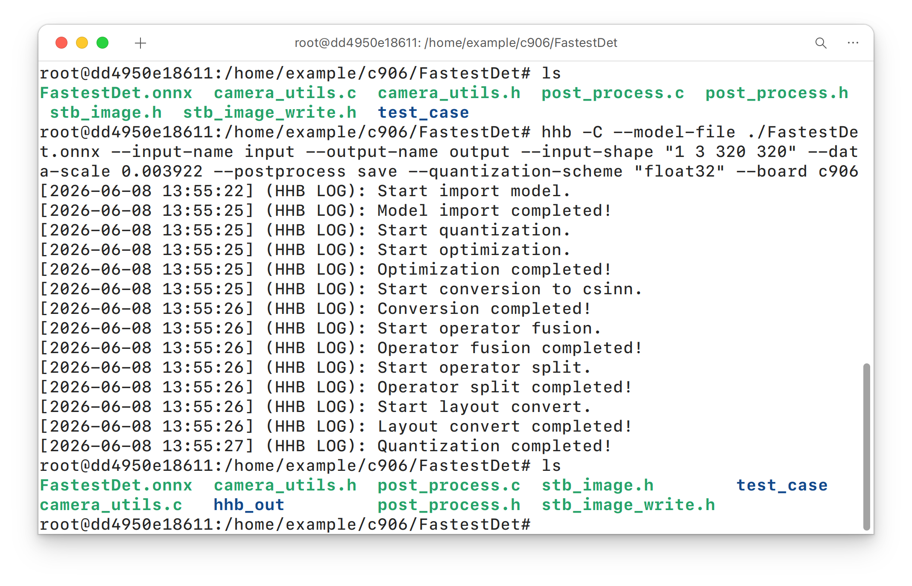{width=80%}

将所需 C 语言代码复制到 `hhb_out/` 目录下. 修改 C 语言代码, 并补全非极大值抑制算法的实现.

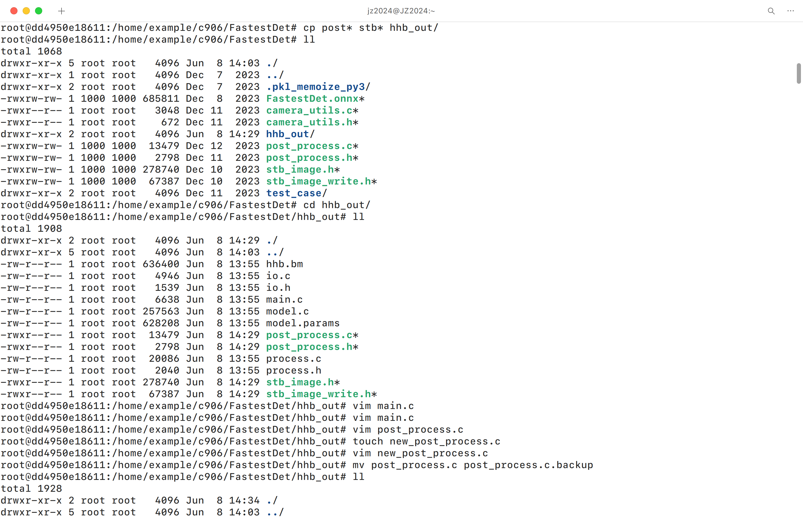{width=80%}

执行编译. 将上级目录下的 `test_case/` 复制到 `hhb_out/` 目录下, 随后使用 QEMU 进行测试.

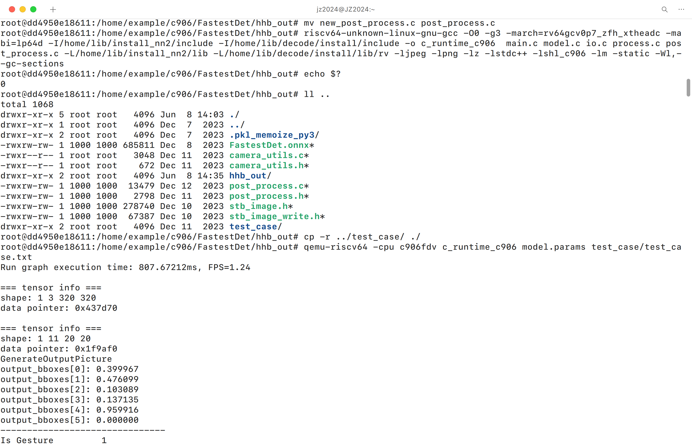{width=80%}

所有图片中的手势均被正确识别.

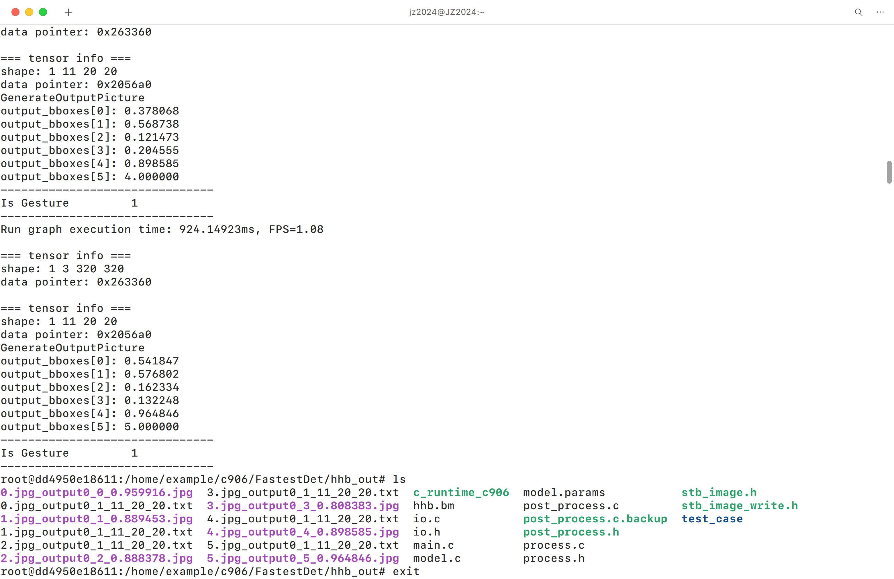{width=80%}

使用简单的 BitMap, 将识别结果可视化在输出图片上. 最终输出的图片如下.

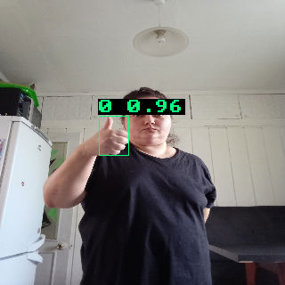{width=30%}

{width=30%}

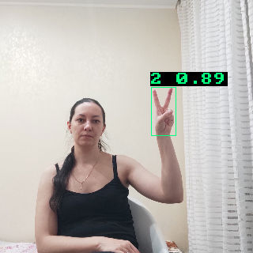{width=30%}

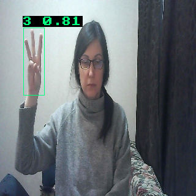{width=30%}

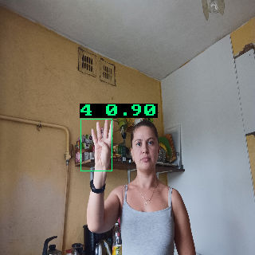{width=30%}

{width=30%}

将文件转移至 D1 开发板上, 同样能够正确识别手势并输出结果.

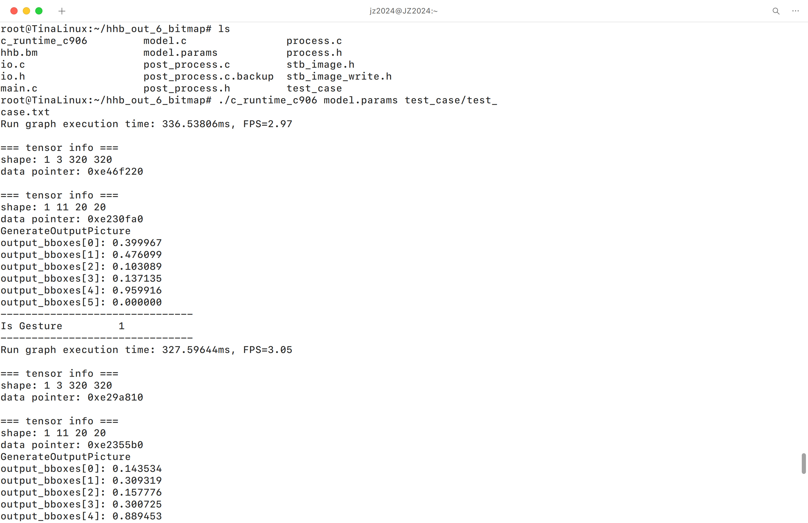{width=80%}

### 2.7. D1 开发板调用摄像头组件, 完成实时手势识别, 对六种识别手势分别进行测试.

修改 `main.c`, 并且将 `camera_utils.c` 和 `camera_utils.h` 搬运至 `hhb_out/` 目录下. 接着调用平头哥工具链完成编译. 在D1开发板上运行运行该程序, 摄像头进行图像捕捉. 在开发板上得到运行结果, 能够成功检测出手势.

{width=30%}

## 3. 实验分析与总结

本次实验通过在平头哥 C906 处理器上运行不同版本的 YOLO 卷积层以及部署 MobileNet 和 FastestDet 网络, 深入分析了软硬件协同优化对推理效率的巨大提升效果. 在 YOLO 卷积层性能测试中, 通过数据重排的 Cache-opt 版本利用内存访问的局部性原理, 有效降低了 L1D 缓存数据读取的缺失率, 显著缩短了整体执行时间. 而借助 im2col 算法转换矩阵运算的 GEMM 版本则在空间开销与极致计算效率之间做出了权衡, 取得了最短的运行耗时. 此外, 在 MobileNet 的模型部署对比测试中, 链接了 RISC-V 向量扩展指令集算子库的 C906 版本相较于无硬件加速的 ref 版本, 在真实的 D1 开发板上实现了极大的推理速度提升, 充分证明了硬件加速的在特定场景下的显著优势.

本次实验覆盖了从底层嵌入式系统到上层神经网络部署的全流程. 实验首先基于 Tina Linux 完成了 D1 开发板的基础环境搭建, 利用平头哥交叉编译工具链与 QEMU 实现了 C 语言裸机程序的编译与功能验证, 并将可执行文件通过 ADB 工具传输至开发板. 随后, 实验从软件仿真跨越到了真实环境部署, 不仅手动验证了缓存优化在 YOLO 网络计算中的工程价值, 还借助了 HHB 编译框架将前端模型转化为能在目标机器上运行的 C 代码. 最终, 通过自主编写非极大值抑制后处理代码并成功调用摄像头, 系统在 D1 平台上实现了实时手势识别的完整功能链路.

## 4. 实验收获与建议

本次综合性较强的硬件与 AI 交叉实验带来了丰富的理论与实践经验, 将体系结构中抽象的缓存命中与缺失原理真实地应用到了卷积计算的代码优化中, 深刻体会到了数据局部性原理对系统整体吞吐率的影响. 同时, 通过对比 ref 与开启向量扩展的 C906 数据模型, 直观地领略到了 RISC-V 架构通过硬件层面的向量指令和算数增强扩展, 在应对矩阵运算与图像处理时的强大底层硬件优势. 此外, 熟练掌握设备控制, 交叉编译工作流, HHB 算子转化流程, 以及处理复杂的多维数据内存变换, 极大拓宽了嵌入式 Linux 开发和软硬件协同开发的实际应用能力.

本次实验内容较少且部分步骤需要使用开发板, 在十几人的小组合作中难以保证每个同学都能亲自进行实验操作. 建议在硬件资源允许的情况下减少单组人数, 提升实验的参与度. 此外, 实验最后一步依赖特定摄像头组件, 然而由于没有足够的摄像头供每组使用, 实验进度严重受限. 建议增加实验相关设备的数量, 或者提供更多的替代方案, 以确保每个同学都能顺利进行实验.

