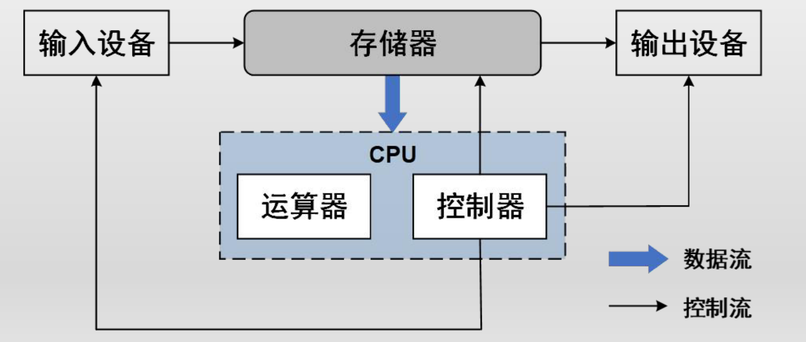
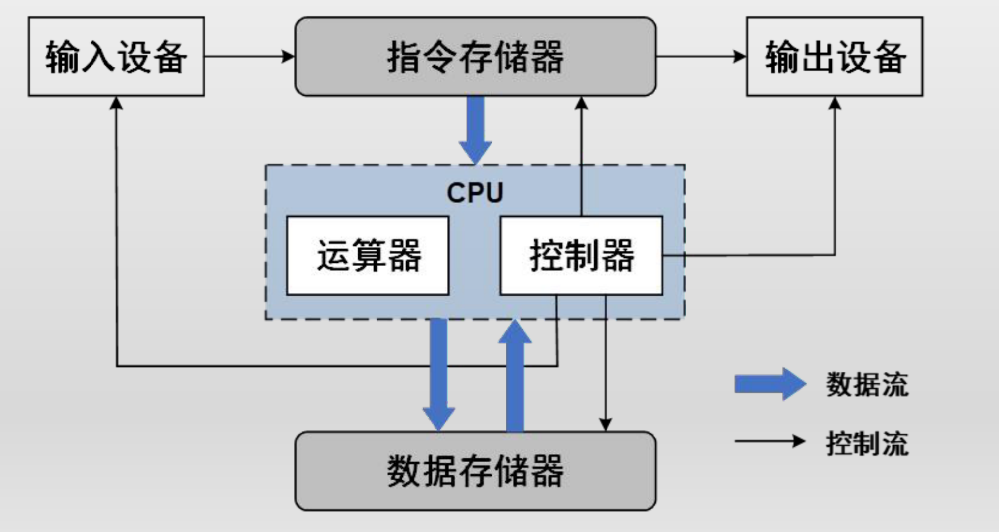
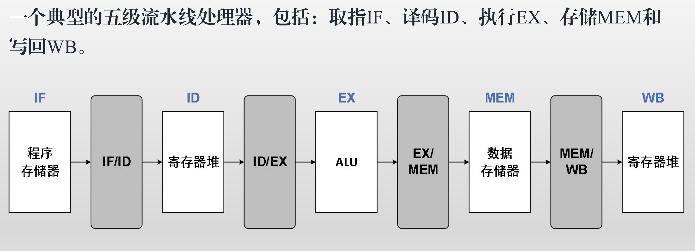
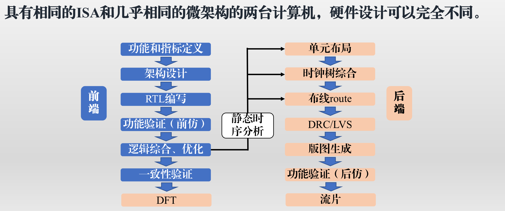
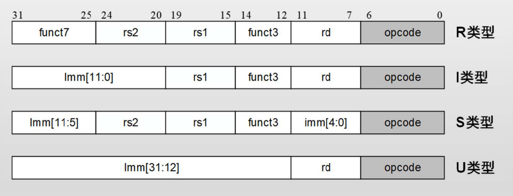
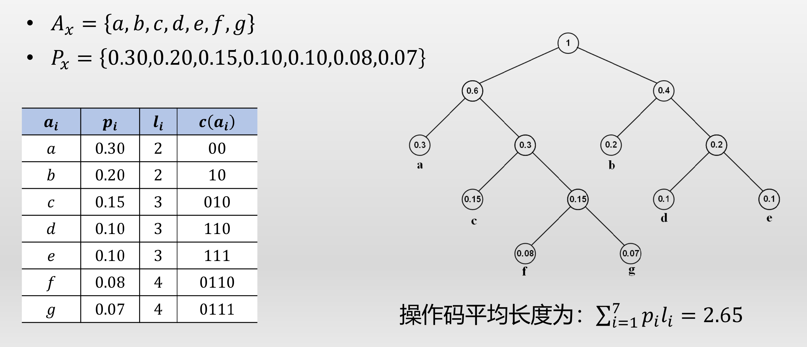
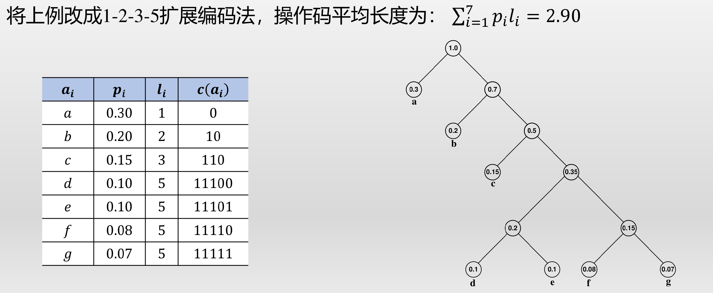
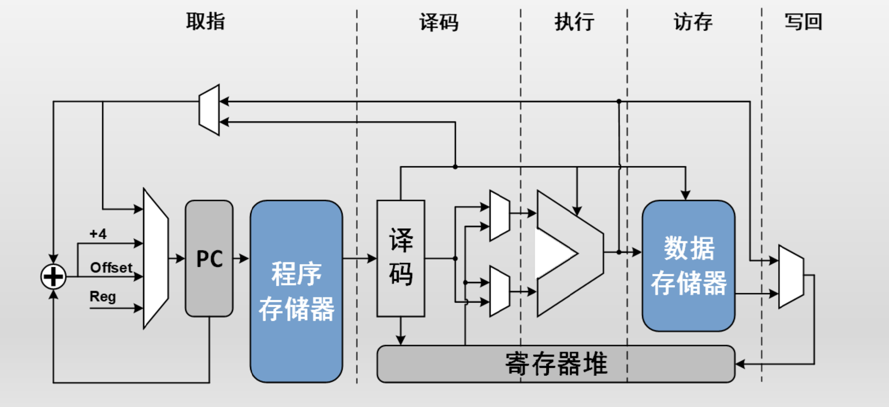
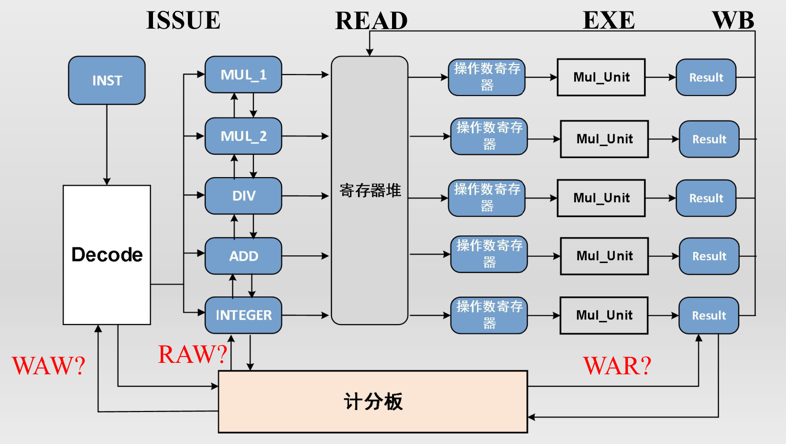

# 嵌入式处理器与芯片系统设计

## 第1章 计算机体系结构简介

### 1. 图灵机 (Turing Machine) 及其性质

#### 1.1 图灵机的前身与理论

* **差分机 (Difference Engine, 1822)**: 人类历史上第一台基于机械部件实现多项式求值的计算机, 计算精度可达 6 位小数.
* **分析机 (Analytical Engine, 1834)**: 包含存储程序 (Stored Program), 通用运算 (General Purpose Computation), 指令控制 (Instruction Control) 三大核心思想, 被视为图灵完备 (Turing Completeness) 的通用计算机原型.
* **希尔伯特第十问题 (Hilbert's 10th Problem)**: 探讨是否能构造机器判断整系数不定方程的可解性, 这是构造图灵机的最初动机.

#### 1.2 图灵机的定义与结构

* 任意图灵机可定义为一个六元组 $S(K, \Sigma, \Gamma, \delta, s, H)$:
  * **$K$**: 一组有限状态集合, 包括初始态和终止态.
  * **$\Sigma$**: 一组输入的符号集合 (不包括 blank $\Box$).
  * **$\Gamma$**: 纸带上的符号集合, 满足 $\Gamma \supseteq \Sigma \cup \{\Box\}$.
  * **$s \in K$**: 初始状态.
  * **$H \subseteq K$**: 终止状态 (停机态).
  * **$\delta$**: 状态转移函数, 将 $(K-H, \Gamma)$ 映射到 $(K, \Gamma, \{\rightarrow, \leftarrow\})$.

#### 1.3 图灵机的三大性质

* **离散性 (Discreteness)**: 具有有限的离散状态与符号.
* **确定性 (Determinism)**: 无限次执行同一图灵机, 其状态转移过程始终相同.
* **条件性 (Conditionality)**: 状态转移基于条件推理 (If-Then-Else 结构).

#### 1.4 可计算性与停机问题

* **停机问题 (Halting Problem)**: 证明不存在万能算法能判断任意程序在给定输入下是否会停机.
* **邱奇-图灵论题 (Church-Turing Thesis)**: 任何在算法上可计算的问题同样可由图灵机计算.
* **不可计算函数 (Non-computable Function)**: 如海狸很忙函数 (Busy Beaver Function), 随输入规模增长超越任何可计算函数的增长速度.
* **通用图灵机 (Universal Turing Machine)**: 能够模拟任意图灵机 $M$ 运作的特殊图灵机, 是存储程序计算机的理论原型.
* **图灵机的物理实现**: 香农证明了布尔代数可以通过电子开关来物理实现, 从而为图灵机的 “控制逻辑” 和 “运算单元” 提供了切实可行的硬件方案.


### 2. 计算机的历史回顾与分类

#### 2.1 体系架构对比

| **特性** | **冯·诺依曼架构 (Von Neumann Architecture)** | **哈佛架构 (Harvard Architecture)** |
| :---: | :---: | :---: |
| **总线结构** | 统一的数据和指令总线 | 独立的指令总线和数据总线 |
| **存储器** | 指令和数据存储在同一物理空间 | 指令和数据存储在不同的物理空间 |
| **执行效率** | 指令获取和数据访问需分时进行, 存在瓶颈 | 允许同时获取指令和存取数据, 效率较高 |

{width=60%}

{width=60%}

#### 2.2 集成电路与摩尔定律

* **摩尔定律 (Moore's Law)**: 集成电路上可容纳的晶体管数目大约每 18 个月增加一倍, 即处理器性能每隔两年翻一倍.
* **Intel 4004**: 世界上第一款商用微处理器 (1971), 集成 2250 个晶体管, 4-bit 位宽, 时钟频率 108 KHz.


### 3. 后摩尔时代的挑战与创新

#### 3.1 Amdahl 定律

* **Amdahl 定律**: 系统中对某一部件采用更快执行方式所能获得的系统性能改进程度, 取决于这种执行方式被使用的频率, 或所占总执行时间的比例.
$$S_{overall} = \frac{1}{(1 - F) + \frac{F}{S_{enhanced}}}$$
$$\begin{align*} S_{overall}&: \text{系统可加速比} \\ S_{enhanced}&: \text{系统可改进部分的加速比} \\ F&: \text{系统可改进比例} \end{align*}$$

#### 3.2 体系结构创新

* **多核架构 (Multi-core Architecture)**:
  * **集中式共享存储**: 处理器共享单个主存, 扩展性有限.
  * **分布式存储**: 存储器分布在核内, 增大带宽并降低延时.
* **网络拓扑 (Network Topology)**: 包括 Crossbar (复杂度 $O(N^2)$), 2D Mesh, 3D Cube 等.
* **领域专用处理器 (DSA)**: 通过抽取软件行为设计定制化架构 (如 AI 加速器, 安全领域处理器).

#### 3.3 敏捷硬件开发 (Agile Hardware Development)

* **Chisel**: 基于 Scala 的硬件构建语言, 支持高级抽象和硬件生成器 (Circuit Generator).
* **优势对比**:

| **特性** | **Chisel** | **Verilog** |
| :---: | :---: | :---: |
| **类型系统** | 强大, 支持 Vec 和 Aggregate | 仅有 wire 和 reg, 类型无语义 |
| **代码重用** | 支持继承, 多态, 泛型 | 无继承多态, 功能有限 |
| **可综合性** | 设计与电路唯一对应, 全语义可综合 | 语义混杂, 许多语法不可综合 |


### 4. 计算机体系结构的层次 (Hierarchy)

#### 4.1 指令集体系结构 (ISA)

* ISA 是软硬件的交界面, 对软件编程者而言它是唯一可见的计算机结构特征. ISA 定义了指令格式和语义. 同一指令集可以有不同的硬件实现.
* **CISC (Complex Instruction Set Computer)**: 如 x86.
  * **优点**: 实现相同操作所需的指令数少, 指令类型丰富, 操作灵活.
  * **缺点**: 指令的利用率很不均衡; 译码困难, 不利于处理器流水线的分割, 增加了高性能处理器的设计难度.
* **RISC (Reduced Instruction Set Computer)**: 如 ARM, MIPS, RISC-V.
  * **优点**: 指令格式统一, 类型简单, 硬件开发周期可以更短.
  * **缺点**: 指令灵活性弱于 CISC, 实现相同操作所需的指令数可能更多.

#### 4.2 微架构与硬件实现

* **微架构 (Microarchitecture)**: 微架构是指体系结构的具体设计, 可以认为是对ISA的一个具体实现, 对软件透明.

{width=80%}

* **硬件实现 (Implementation)**: 硬件实现指计算机具体的实现细节, 包括具体的逻辑设计, 制造工艺和封装技术等.

{width=80%}


## 第2章 指令集基本原理

### 1. 指令集的发展历史与分类

#### 1.1 CISC 与 RISC 的对比

| **特性** | **CISC** | **RISC** |
| :---: | :---: | :---: |
| **代表架构** | x86 (Intel, AMD) | RISC-V, MIPS, ARM |
| **指令特点** | 单条指令完成的任务量大且功能复杂, 指令长度灵活可变. | 单条指令完成的任务量少且功能单一, 指令长度相对固定. |
| **优点** | 对编译器和程序存储空间的要求较低, 代码密度高. | 硬件设计较为简单, 非常适合利用流水线 (Pipeline) 提升性能, 设计周期短. |
| **缺点** | 硬件设计复杂, 微码控制导致设计与测试验证难度极高. | 对编译器设计的要求较高, 程序的代码密度较低. |

#### 1.2 存储空间与指令集分类

* 指令集可以按照对处理器存储空间 (Memory, Working Store, Control Store) 的分配方式进行分类.

| **分类** | **架构特点** | **优点** | **缺点** |
| :---: | :---: | :---: | :---: |
| **堆栈型 (Stack)** | 无通用寄存器; ALU 指令无操作数, 仅堆栈操作 (PUSH, POP) 有一个操作数. | 指令较短, 无需显式指定操作数. | 效率较低, 指令执行顺序相对固定. |
| **累加器型 (Accumulator)** | 具有单一的累积寄存器 (Acc); 每条指令有单一的显式操作数. | 指令短, 内部实现简单, 适合连续运算. | 访存压力大. |
| **寄存器-内存型 (Register-Memory)** | 操作数既可以在寄存器也可以在存储器中; 运算指令可直接访存; 显式指定 2-3 个操作数. | 节省指令数量. | 运算指令访问存储器造成延迟比较高. |
| **寄存器-寄存器型 (Register-Register)** | 又称加载/存储型 (Load/Store); 仅 Load/Store 指令可访问内存; 运算基于通用寄存器; 显式指定 2-3 个操作数. | 访问内存少, 存取速度快; 寻址空间短, 改善目标代码大小. | 指令数量相对较多. |


### 2. 指令的寻址模式 (Instruction Addressing Modes)

#### 2.1 寻址模式定义

* **寻址模式**: 体系结构如何指定指令操作对象的地址.
  * 指令操作对象包括常数 (Constants), 寄存器 (Registers) 以及内存空间 (Memory).
* **指令的组成**: 指令由操作码 (Opcode) 和地址码 (Address) 组成.
  * 地址包括内存地址, 立即数 (Immediate Values), 寄存器 (Registers), 变址寄存器 (Index Registers) 等.
  * 地址的附加信息包括偏移量 (Offset), 块长度 (Block Length), 跳距 (Jump Distance) 等.

{width=90%}

#### 2.2 常见的指令寻址模式

| **寻址模式 (Addressing Mode)** | **举例** | **含义** | **使用场景** |
| :---: | :---: | :---: | :---: |
| **寄存器直接寻址 (Register Direct)** | `Add R4, R3` | $Regs[R4] \leftarrow Regs[R4] + Regs[R3]$ | 操作数已加载到寄存器中时使用. |
| **立即数寻址 (Immediate)** | `Add R4, 3` | $Regs[R4] \leftarrow Regs[R4] + 3$ | 某个操作数为常数时使用. |
| **偏移量寻址 (Offset)** | `Add R4, 100(R1)` | $Regs[R4] \leftarrow Regs[R4] + Mem[100 + Regs[R1]]$ | 访问局部变量时使用. |
| **寄存器间接寻址 (Register Indirect)** | `Add R4, (R1)` | $Regs[R4] \leftarrow Regs[R4] + Mem[Regs[R1]]$ | 访问指针内容或计算的地址时使用. |
| **索引寻址 (Indexed)** | `Add R3, (R1+R2)` | $Regs[R3] \leftarrow Regs[R3] + Mem[Regs[R1] + Regs[R2]]$ | 访问数组内容时使用. |
| **内存直接寻址 (Memory Direct)** | `Add R1, (1001)` | $Regs[R1] \leftarrow Regs[R1] + Mem[1001]$ | 访问静态数据时使用. |
| **内存间接寻址 (Memory Indirect)** | `Add R1, @(R3)` | $Regs[R1] \leftarrow Regs[R1] + Mem[Mem[Regs[R3]]]$ | 访问二级指针时使用. |
| **自动递增寻址 (Autoincrement)** | `Add R1, (R2)+` | $Regs[R1] \leftarrow Regs[R1] + Mem[Regs[R2]]$; $Regs[R2] \leftarrow Regs[R2] + d$ | 遍历数组时使用. |
| **自动递减寻址 (Autodecrement)** | `Add R1, -(R2)` | $Regs[R2] \leftarrow Regs[R2] - d$; $Regs[R1] \leftarrow Regs[R1] + Mem[Regs[R2]]$ | 遍历数组时使用. |
| **比例寻址 (Scaled)** | `Add R1, 100(R2)[R3]` | $Regs[R1] \leftarrow Regs[R1] + Mem[100 + Regs[R2] + Regs[R3] \times d]$ | 索引数组时使用. |

#### 2.3 RISC-V 支持的寻址模式

* **寄存器直接寻址**:
  ```riscvasm
  add a1, a1, a2
  ```
* **立即数寻址**:
  ```riscvasm
  addi a1, a1, 4
  ```
* **偏移量寻址**:
  ```riscvasm
  lw a1, 4(a2)
  jal x1, 0x1234          # x1=pc+4; pc=pc+0x1234 (用于控制流指令)
  ```
* **寄存器间接寻址**: 偏移量寻址中偏移量为 0.
  ```riscvasm
  lw a1, 0(a2)
  ```
* **内存直接寻址**: 偏移量寻址中基址寄存器为 `x0`.
  ```riscvasm
  lw a1, 0x100(x0)
  jalr x1, 0x100(x0)      # to 0x100
  ```


### 3. 数据类型与指令操作

#### 3.1 常见数据类型

| **C 语言类型** | **描述** | **RV32 大小 (bytes)** | **RV64 大小 (bytes)** |
| :---: | :---: | :---: | :---: |
| `char` | Character value | 1 | 1 |
| `short` | Short integer | 2 | 2 |
| `int` | Integer | 4 | 4 |
| `long` | Long integer | 4 | 8 |
| `long long` | Long long integer | 8 | 8 |
| `void*` | Pointer type | 4 | 8 |
| `float` | Single-precision floating-point | 4 | 4 |
| `double` | Double-precision floating-point | 8 | 8 |
| `long double` | Quad-precision floating-point | 16 | 16 |

#### 3.2 主要指令操作分类

* **算术和逻辑指令 (Arithmetic and Logical)**: 加, 减, 乘, 除, AND, OR, XOR, 移位 (Shift).
* **数据转移指令 (Data Transfer)**: 加载 (Load) 与存储 (Store).
* **控制流指令 (Control Flow)**: 条件分支 (Branch), 跳转 (Jump), 过程调用和返回.
* **其他**: 系统指令 (System), 浮点运算指令 (Floating Point), 十进制指令, 字符串指令, 图形指令等.

#### 3.3 RISC-V 指令操作

| **指令集** | **指令操作类型** |
| :---: | :---: |
| **RV32I/RV64I/RV128I** | 包括算术和逻辑指令, 数据转移指令, 控制流指令, 系统指令等 |
| **RVM** | 乘除法操作, 取余操作 |
| **RVF/RVD/RVQ** | 单精度/双精度/四精度浮点操作, 包括浮点运算/转换/比较/加载/存储 |
| **RV-Zicsr** | CSR 控制指令 |
| **RVV** | 向量扩展指令 |

* **RV64I 算术运算 (加减)**:
  ```riscvasm
  addi a1, a1, 4        # a1 = a1 + 4
  add a1, a2, a3        # a1 = a2 + a3
  sub a1, a2, a3        # a1 = a2 - a3
  ```
* **RV64I 逻辑运算 (`and`, `or`, `xor`)**:
  ```riscvasm
  andi a1, a1, 7        # a1 = a1 & 7
  and a1, a1, a2        # a1 = a1 & a2
  ```
* **RV64I 移位运算 (左移, 右移)**:
  ```riscvasm
  sll a1, a1, a2        # a1 = a1 << a2
  srli a1, a1, 2        # a1 = a1 >> 2 (逻辑右移, 高位无符号扩展)
  srai a1, a1, 2        # a1 = a1 >> 2 (算术右移, 高位符号扩展)
  ```
* **RV64I 比较运算 (`slt[i][u]`)**:
  ```riscvasm
  slt a1, a2, a3        # a1 = (a2 < a3) ? 1 : 0 (有符号比较)
  slti a1, a2, 10       # a1 = (a2 < 10) ? 1 : 0 (有符号比较)
  sltu a1, a2, a3       # a1 = (a2 < a3) ? 1 : 0 (无符号比较)
  ```
* **RV64I 加载指令 (Load)**:
  ```riscvasm
  lb a1, 4(a2)          # a1 = Mem[a2+4][0:7]  加载字节 (Byte, 8 bit), 符号扩展至 64 bit
  lbu a1, 4(a2)         # a1 = Mem[a2+4][0:7]  加载字节 (Byte, 8 bit), 无符号扩展至 64 bit
  lh a1, 4(a2)          # a1 = Mem[a2+4][0:15] 加载半字 (Half Word, 16 bit), 符号扩展至 64 bit
  lw a1, 4(a2)          # a1 = Mem[a2+4][0:31] 加载字 (Word, 32 bit), 符号扩展至 64 bit
  ld a1, 4(a2)          # a1 = Mem[a2+4][0:63] 加载双字 (Double Word, 64 bit)
  ```
* **RV64I 存储指令 (Store)**:
  ```riscvasm
  sb a1, 4(a2)          # Mem[a2+4][0:7]  = a1[7:0]  存储字节
  sh a1, 4(a2)          # Mem[a2+4][0:15] = a1[15:0] 存储半字
  sw a1, 4(a2)          # Mem[a2+4][0:31] = a1[31:0] 存储字
  sd a1, 4(a2)          # Mem[a2+4][0:63] = a1[63:0] 存储双字
  ```
* **RV64I 分支指令 (条件分支)**:
  ```riscvasm
  beq a1, a2, offset    # 如果 a1 == a2, 则跳转到 PC+offset 的地址上, 否则 PC+4 (有符号比较)
  bge a1, a2, offset    # 如果 a1 >= a2, 则跳转至 PC+offset 的地址上, 否则 PC+4 (有符号比较)
  ```
* **RV64I 跳转指令 (无条件跳转)**:
  ```riscvasm
  jal rd, imm           # 无条件跳转到 PC+imm 的地址上, 同时把 PC+4 的值记录到 rd 中
  jalr rd, rs1, imm     # 无条件跳转到 rs1+imm 的地址上, 同时把 PC+4 的值记录到 rd 中
  ```

| **机制名称** | **代表架构** | **详述** | **优点** | **缺点** |
| :---: | :---: | :---: | :---: | :---: |
| **条件码 (Condition Code, CC)** | x86, ARM, PowerPC | ALU 在计算中设置条件码 (如结果为 0, 溢出, 为负), 分支指令根据 CC 判断. | 条件码的设置比较灵活. | 需要额外状态寄存器; 由于依赖上一条指令的 CC, 减少了乱序执行 (Out-of-Order Execution) 的可能性. |
| **有限制的比较** | MIPS | 只比较指定寄存器之间是否相等, 是否为 0 等. | 实现较为简单. | 复杂分支条件需要额外的前置指令进行计算. |
| **完整的比较系统** | RISC-V | 比较即为分支指令的一部分, 指令自身支持大多数比较操作 (如 `<`, `>=`, `==`). | 分支只需要一条指令. | 造成分支指令的逻辑延时较长. |

* **RISC-V 浮点运算指令**:
  ```riscvasm
  fadd f1, f2, f3       # f1 = f2 + f3
  fmul f1, f2, f3       # f1 = f2 * f3
  fsqrt f1, f2          # f1 = sqrt(f2)
  ```
* **RISC-V 浮点转换指令**:
  ```riscvasm
  fcvt.w.s a1, f2       # a1 = (int)f2
  fcvt.s.w f1, a2       # f1 = (float)a2
  ```
* **RISC-V 浮点比较指令**:
  ```riscvasm
  flt.s a1, f2, f3       # a1 = f2 < f3
  ```


### 4. 指令集编码 (Instruction Set Encoding)

#### 4.1 编码概念与分类

* **指令集编码 (Instruction Encoding)**: 用二进制机器码来表征指令, 包括操作码 (Opcode) 编码和地址 (Address) 编码.
  * **固定长度编码 (Fixed Length Encoding)**: 所有指令长度相同 (如 RISC-V 基础指令, ARM, MIPS), 适用于简单的操作数和寻址方式, 译码器设计简单.
  * **可变长度编码 (Variable Length Encoding)**: 不同指令长度不同 (如 x86), 适用于复杂的操作数和寻址方式, 译码器设计复杂.
  * **混合编码方式 (Hybrid Encoding)**: 提供固定与变长的折中 (如 RVC 指令压缩扩展).

#### 4.2 前缀码与霍夫曼编码

* **前缀码 (Prefix Code)**: 任何一个字符的编码都不能是其他字符编码的前缀, 保证了指令译码的唯一性.
* **信息和熵**:
  * **信息 (Information)**: $l(x_i) = -\log_2 p(x_i)$. 其中 $\log_n q$ 表示具有总概率 $q$ 的那些最可能序列为了描述序列所需要的二进制位数.
  * **熵 (Entropy)**: $H = -\sum_{i=0}^{n} p(x_i) l(x_i) = -\sum_{i=0}^{n} p(x_i) \log_2 p(x_i)$. 熵是信息的数学期望. 熵确定了要编码集合 $S$ 中任意成员 (即以均匀的概率随机抽取一个成员) 的分类所需要的最少的二进制位数.
  * **操作码的最短平均长度**: $H = -\sum_{i=1}^{n} p_i \log_2 p_i$, 其中 $p_i$ 表示第 $i$ 种操作码在程序中出现的概率.
  * **固定长编码的信息冗余量**: $R = 1 - \frac{H}{[\log_2 n]} = 1 - \frac{-\sum_{i=1}^{n} p_i \log_2 p_i}{[\log_2 n]}$.
* **霍夫曼编码 (Huffman Coding)**: 出现频率高的字符使用较少的位编码, 频率低的字符使用较多的位编码.
  * **优点**: 霍夫曼编码得到霍夫曼树, 其平均带权重路径长度最短, 因此霍夫曼树也被称为最优二叉树.
  * **缺点**: 操作码很不规整, 硬件译码困难; 与地址码组成固定长度指令比较困难.
  * **Huffman 树构造过程**:
    1. 将所有字符作为单节点树加入优先队列, 按照频率排序.
    2. 从队列中取出频率最低的两个节点, 合并成一个新节点, 频率为两者之和, 将新节点重新加入队列.
    3. 重复步骤 2 直到队列中只剩一个节点, 该节点即为霍夫曼树的根.

{width=60%}

* **扩展编码法 (Expanded Coding)**: 在固定码长与 Huffman 编码之间进行折中.

{width=60%}


#### 4.3 RISC-V 的指令编码结构

| **指令格式** | **主要用途** | **`rd`** | **`rs1`** | **`rs2`** | **`imm`** |
| :---: | :---: | :---: | :---: | :---: | :---: |
| **R 类型** | 寄存器-寄存器的 ALU 操作 | 目标寄存器 | 第一个源操作数 | 第二个源操作数 | --- |
| **I 类型** | 立即数 ALU 操作或 Load 指令 | 目标寄存器 | 第一个源操作数/基址寄存器 | --- | 常数/偏移值 |
| **S 类型** | Store 指令或比较分支指令 | --- | 基址寄存器/第一个源操作数 | 待存储的数据/第二个操作数 | 偏移值 |
| **U 类型** | 跳转指令 | 返回值目标寄存器 | --- | --- | 跳转目的地址 |

{width=80%}

* **指令长度扩展**: RISC-V 指令长度是可变的.
  * 基础长度为 32 bit, 但可按 16 bit 为单位扩展.
  * 长度信息被直接定义在最低位的 opcode 区间中.


### 5. 特权指令与 ABI 规定 (Privileged Instructions and ABI)

#### 5.1 特权等级与保护环 (Privilege Levels and Protection Rings)

* **保护环 (Protection Ring)**: 一种分级的 CPU 数据和功能保护机制.
  * 保护操作系统内核和固件不受用户程序的破坏
  * 旨在实现系统的隔离, 安全和可维护性.

| **RISC-V 的特权等级** | **编码** | **名称** | **缩写** | **描述** |
| :---: | :---: | :---: | :---: | :---: |
| **0** | `00` | 用户模式 (User) | U | 运行普通应用程序. |
| **1** | `01` | 管理员模式 (Supervisor) | S | 通常用于运行操作系统内核. |
| **2** | `10` | Reserved | N/A | 保留. |
| **3** | `11` | 机器模式 (Machine) | M | 最高权限, 可信代码, 所有处理器强制要求实现. |

#### 5.2 特权指令与 CSR (Privileged Instructions and CSRs)

* **特权指令 (Privileged Instructions)**: RISC-V 规定了一些指令只能在指定的特权等级下执行. 同时有些指令虽然能在各种特权等级下执行, 但执行结果不同.
  * **`ecall`**: 用于向系统执行环境发出请求 (程序主动执行的 trap 指令, 使得处理器的控制权发生转移). 在 `M|S|U` 模式执行时会产生不同的异常 (exception), PC 将跳转到不同的处理函数入口, 并把当前 PC 保存到目标特权模式下的 `xepc` 寄存器中 (`x=m|s|u`, `uepc` 通常不实现).
  * **`xret`**: 从对应等级的 trap 处理函数返回, 设置 `PC=xepc`, 使得指令只能在 `x` 或比 `x` 更高的特权等级中执行 (`x=m|s|u`, `uepc` 通常不实现).
* **控制状态寄存器 (Control and Status Registers, CSR)**: 用于控制并记录处理器的运行状态.
  * 较高特权等级可以访问并修改属于较低等级的 CSR.
  * RISC-V 的 CSR 主要包括中断的开关以及入口设置, 物理内存保护 (PMP), 性能监测模块等功能.
  * **示例**: MIE (Machine Interrupt Enable) 寄存器, 仅在机器模式下访问, 用于控制外部中断, 定时器中断和软件中断.

#### 5.3 应用程序二进制接口 (Application Binary Interface, ABI)

* **寄存器分配 (Register Allocation)**:
  * `x0` (`zero`): 硬件恒为 0.
  * `x1` (`ra`): 返回地址 (Return Address). 由 Caller 保存.
  * `x2` (`sp`): 栈指针 (Stack Pointer). 由 Callee 保存.
  * `x10-x17` (`a0-a7`): 函数参数 (Function Arguments). `a0-a1` 用于返回值. 由 Caller 保存.
  * `x5-x7`, `x28-x31` (`t0-t6`): 临时寄存器 (Temporary). 由 Caller 保存.
  * `x8-x9`, `x18-x27` (`s0-s11`): 保存寄存器 (Saved). `x8` (`s0` 或 `fp`) 用于 Frame Pointer. 由 Callee 保存.
* **在函数调用者和被调用者之间跳转**:
  * **调用 `jal/jalr` 指令**:
    * `jal/jalr` 指令将当前 PC+4 存放到目的寄存器中 (按照规定为 `ra` 寄存器), 同时将跳转地址写入当前 PC, 即完成了从调用者跳转到被调用者.
    * 当子函数返回时, 将 `ra` 寄存器记录的地址写入 PC 继续执行, 即完成了从被调用者跳转回调用者.
  * **函数调用栈 (Call Stack)**:
    * 每一次函数的调用, 都会在调用栈 (call stack) 上维护一个独立的栈帧 (stack frame).
    * 每个独立的栈帧包括函数的返回地址和参数, 函数运行过程中的局部变量.
    * 栈帧的地址由寄存器 `sp` 记录.


### 6. RISC-V 汇编程序设计

#### 6.1 伪指令与关键字 (Pseudo-instructions and Keywords)

* **伪指令 (Pseudo-instructions)**: 汇编器将其映射为等价的基础指令.

| **伪指令** | **基础指令** | **意义** |
| :---: | :---: | :---: |
| `la rd, symbol` | `auipc rd, symbol[31:12]`<br>`addi rd, rd, symbol[11:0]` | 地址加载. |
| `l{b\|h\|w\|d} rd, symbol` | `auipc rd, symbol[31:12]`<br>`l{b\|h\|w\|d} rd, symbol [11:0](rd)` | 全局加载. |
| `s{b\|h\|w\|d} rd, symbol, rt` | `auipc rt, symbol[31:12]`<br>`s{b\|h\|w\|d} rd, symbol [11:0](rt)` | 全局保存. |
| `fl{w\|d} rd, symbol, rt` | `auipc rt, symbol[31:12]`<br>`fl{w\|d} rd, symbol [11:0](rt)` | 浮点全局加载. |
| `fs{w\|d} rd, symbol, rt` | `auipc rt, symbol[31:12]`<br>`fs{w\|d} rd, symbol [11:0](rt)` | 浮点全局保存. |

* **段控制关键字 (Section Keywords)**:
  * **`.align`**: 将接下来的指令地址对齐到 $2^n$ 字节.
  * **`.globl`**: 将该符号写入全局符号表.
  * **`.section`**: 标志接下来的内容所属段.
  * **`.text`**: 代码段.
  * **`.data`**: 初始化数据段.
  * **`.rodata`**: 只读数据段.
  * **`.bss`**: 未初始化数据段.

* **标签 (Labels)**: 汇编语言用标签标识跳转地址.
  * **文字标签**: 写入符号表中, 用于进行分支和跳转.
  * **数字标签**: 用于局部跳转, `b` 指向前面的标签, `f` 指向后面的标签.


## 第3章 处理器流水线结构

### 1. 实现 RISC 指令集的典型硬件结构

#### 1.1 经典五级硬件结构

* **取指 (Instruction Fetch, IF)**: 处理器根据当前 PC (Program Counter) 从程序存储器中取出即将执行的指令.
* **译码 (Instruction Decode, ID)**: 提取操作码和地址码, 确定寄存器堆和数据存储器的读写控制信号. 由于 RISC 指令格式固定, 指令译码和寄存器读取可同时进行 (固定字段译码, Fixed-field Decoding).
* **执行 (Execution, EX)**: ALU 根据译码阶段得到的操作数和操作码进行运算. 对于载入/存储指令 (Load/Store), 在此阶段计算数据存储器的访问地址.
* **访存 (Memory, MEM)**: 载入和存储类指令在此阶段读写数据存储器.
* **写回 (Write Back, WB)**: 将运算结果写回到寄存器堆中的相应位置.

{width=60%}


### 2. 基础流水线

#### 2.1 流水线基础概念

* **流水线 (Pipeline)**: 将指令执行过程分解为多个阶段, 允许多条指令在不同阶段重叠执行.
* **硬件实现**: 通过在各个执行阶段对应的组合逻辑之间插入边缘触发的流水线寄存器来实现. 寄存器保证了相邻两级指令之间不会互相干扰.

#### 2.2 流水线术语

* **指令发射与退休**:
  * **指令发射 (Issue)**: 指令经过译码后, 派发到对应的硬件计算单元进行执行的过程.
  * **指令退休 (Retire)**: 代表一条指令已经完整执行完毕并提交其结果.
* **前端与后端**:
  * **前端 (Front-end)**: 流水线中负责获取和解析指令的部分 (通常为 IF 和 ID 阶段).
  * **后端 (Back-end)**: 流水线中负责指令具体执行的部分 (包括 EX, MEM, WB 阶段).

#### 2.3 处理器性能的定量分析

* **完成同一计算任务所需的总时间公式**:
  $$T = T_{cycle} \times N_{cycle} \,.$$ $$T = T_{cycle} \times \frac{N_{cycle}}{N_{instruction}} \times N_{instruction} = T_{cycle} \times CPI \times N_{instruction} \,.$$
  * **$N_{instruction}$**: 执行任务所需的总指令数.
  * **$T_{cycle}$**: 时钟周期长度 (Clock Cycle Time), 与硬件工艺和电路设计相关.
  * **$CPI$ (Cycles Per Instruction)**: 执行每条指令所需的平均时钟周期数. 其倒数为吞吐率 $IPC$ (Instructions Per Cycle).
* **流水线带来的性能加速比 (Speedup)**:
  * 假设 K 级流水线的最大级延时为 $T_{pipe}$, 无流水线单周期延时为 $T_{cycle}$, 那么相同任务有无流水线的执行时间之比为:
    $$S = \frac{T_{pipe} \times CPI_{pipe} \times N_{instruction}}{T_{cycle} \times CPI_{cycle} \times N_{instruction}} = \frac{T_{pipe} \times CPI_{pipe}}{T_{cycle} \times CPI_{cycle}} \,.$$
  * **时钟周期长度之比**: 假设流水线寄存器将原有的组合电路延时均匀分割, 流水线寄存器自身引入的延时相比原有电路可忽略不计.
    $$\frac{T_{pipe}}{T_{cycle}} \approx \frac{1}{K} \,.$$
  * **CPI 之比**: 基础流水线每个周期均发射一条指令并退休一条指令, 完成 $N$ 条指令共需要 $N+K-1$ 个周期.
     $$\frac{CPI_{pipe}}{CPI_{cycle}} = \frac{N+K-1}{N} \,.$$
  * 在理想流水线且 $N$ 足够大时, $\frac{T_{pipe}}{T_{cycle}} \approx \frac{1}{K}$, $CPI_{pipe} \approx 1$. 从而加速比 $S \approx K$. 即 K 级单发射流水线在理想情况下可获得 K 倍的性能提升.


### 3. 流水线冲突

#### 3.1 冲突分类

| **冲突类型** | **描述** | **示例** |
| :---: | :---: | :---: |
| **结构冲突 (Structural Hazard)** | 硬件资源不足导致的暂停. | ALU 多周期占用; 冯·诺依曼架构下 IF 和 MEM 阶段同时争抢单一存储器端口. |
| **控制冲突 (Control Hazard)** | 分支转移指令未能立刻确定目标地址引起的暂停. | 执行 `jalr` 或条件分支时, 流水线需等待计算出跳转目标才能继续取指. |
| **数据冲突 (Data Hazard)** | 指令操作数之间存在依赖关系 (真实依赖) 或资源竞争 (名称依赖) 引起的暂停. | 前一条指令尚未写回结果, 后续指令就需要读取该数据. |

#### 3.2 数据冲突的三种类型

* **写后读 (Read After Write, RAW)**: 真实数据依赖. 后续指令需要读取前序指令尚未写回的结果.
* **写后写 (Write After Write, WAW)**: 乱序执行或不同指令执行周期长度不一致时, 后续指令先于前序指令写回同一目的寄存器, 导致结果被错误覆盖.
  * 对于严格顺序执行的基础流水线, 前面指令的停顿会在流水线上向后续指令传播, WAW 冲突不会发生.
  * 流水线允许指令乱序执行, 或不同指令完成 EX 需要的时间不同时, 可能发生 WAW 冲突.
* **读后写 (Write After Read, WAR)**: 前序指令读取操作数之前, 后续指令就改写了该寄存器, 导致读到错误值.
  * 基础五级流水线模型中, 在严格顺序执行指令时不会发生 WAR 冲突.

#### 3.3 前馈技术 (Forwarding)

* **前馈 (Forwarding)**: 将已经计算出但尚未写回到寄存器堆的结果, 直接从 ALU 输出端或流水线寄存器 (如 EX/MEM 或 MEM/WB) "短路" 传输到 ALU 输入端.
  * 前馈使得 ALU 的输入不仅来自寄存器堆, 还可以来自流水线寄存器. 前馈可以发生在不同的硬件位置.
  * 前馈可以消除部分 RAW 冲突带来的停顿.
  * 某些情形下, 不需要额外添加前馈硬件就可以避免冲突.
  * 前馈无法解决所有数据冲突.


### 4. 乱序执行与超标量流水线 (Out-of-Order Execution and Superscalar)

#### 4.1 动态调度与乱序执行 (Dynamic Scheduling and OoO Execution)

* **严格顺序执行的缺陷**: 若发生冲突停顿, 阻塞点之后的所有后续无关指令都必须一起等待.
* **乱序执行 (Out-of-Order Execution, OoO)**: 当某条指令因冲突停顿时, 允许后续无依赖关系的指令越过阻塞指令, 提前进入执行阶段.
* **动态调度 (Dynamic Scheduling)**: 硬件在运行时动态安排指令的执行顺序和时机, 使得硬件在缓存缺失 (Cache Miss) 等意外延迟时仍能执行其他代码, 提高资源利用率.

#### 4.2 多发射 (Multiple Issue) 与超标量 (Superscalar)

* **多发射技术**: 允许处理器在一个时钟周期内发射多条指令到待执行队列中, 使得每个周期可以产生多条准备好进入执行阶段的指令.
* **超标量技术**: 处理器拥有多个并行的流水线执行单元, 使得待执行队列中的指令可以进入不同的功能单元进行处理, 从而使得每个周期可以完成多条指令.

| **架构类型** | **调度方式** | **执行顺序** | **特点** |
| :---: | :---: | :---: | :---: |
| **超长指令字 (VLIW)** | 静态 | 顺序 | 编译器负责打包无冲突的指令集合, 硬件设计简单. |
| **静态超标量 (Static Superscalar)** | 静态 | 顺序 | 硬件具备多个执行单元, 依序发射 1 至多条指令. |
| **动态超标量 (Dynamic Superscalar)** | 动态 | 乱序 | 硬件动态检测依赖并乱序派发, 结合重排序保证结果正确. |

#### 4.3 超标量流水线的性能分析

* **一个 K 级单发射基础流水线的 CPI 为**:
  $$CPI_{pipe} = \frac{N_{pipe}}{N_{instruction}} = \frac{N+K-1}{N} \,.$$
* **假设一个超标量流水线每个周期可以退休 $W$ 条指令, 则执行 $N$ 条指令所需要的总周期数由 $N+K-1$ 降低为**:
  $$N_{multi\_pipe} = \frac{N+K-1}{W} \,.$$
* **流水线的 CPI 降低为**:
  $$CPI = \frac{N+K-1}{NW} \,.$$


### 5. 记分牌结构 (Scoreboard)

* **记分牌结构**: 将顺序执行的指令进行动态调度, 从而实现高效无误的乱序执行. 该方法最早在 CDC 6600 计算机中引入.
  * **超标量结构**: 4 个浮点单元, 5 个存储器引用单元和 7 个整数运算单元.
  * **解决数据冲突**:
    * **WAR**: 阻塞写回操作直到所有寄存器被读取; 只在操作数读取这一流水级进行寄存器读取操作.
    * **WAW**: 检测到冲突以后, 阻塞新指令直到相关指令完成执行.
* **计分牌的四级控制结构**:
  * **发射 (ID1)**: 指令译码并检查结构冲突.
    * 按程序本来的顺序发射指令 (以便于检查冲突).
    * 如果有结构冲突就不发射当前指令.
    * 如果当前指令与前面发射但未完成的指令之间有输出依赖则不发射该指令 (保证不出现 WAW 冲突).
  * **读操作数 (ID2)**: 当没有数据依赖时读操作数.
    * 所有真实数据依赖 (即 RAW 冲突) 在这一级得到解决, 等待相应的指令写回数据.
    * 不存在数据前馈.
  * **执行 (EX)**: 对操作数进行操作.
    * 接到操作数后功能单元开始工作, 得到结果以后, 它会通知记分牌它已经完成操作.
  * **写回 (WB)**: 完成执行.
    * 阻塞直到和前面的指令之间没有 WAR 冲突.

{width=60%}

* **计分牌的执行过程分析**:
  * **是否可以 Issue**: 检查结构冲突和 WAW.
  * **是否可以 Read**: 检查 RAW (操作数是否准备好).
  * **是否可以 Execute**: 功能单元 (FU) 是否空闲.
  * **是否可以 Write**: 检查 WAR.
* **记分牌的主要控制部件**:
  * **指令状态寄存器 (Instruction Status)**: 记录指令处于四级中的哪一级.
  * **功能单元状态寄存器 (Functional Unit Status)**: 指明了功能单元 (FU) 的状态. 每个功能单元有 9 个状态.
    * **`Busy`**: 该单元是否繁忙.
    * **`Op`**: 该单元执行的操作.
    * **`Fi`**: 目的寄存器.
    * **`Fj`, `Fk`**: 源操作数寄存器.
    * **`Qj`, `Qk`**: 产生源操作数的功能单元 `Fj`, `Fk`.
    * **`Rj`, `Rk`**: 表明 `Fj`, `Fk` 已准备好的标志位.
  * **写回状态寄存器 (Register Result Status)**: 针对每个寄存器指明对其写回结果的相应功能单元. 空白表明没有正在执行的指令需要写回结果到该寄存器.

<!-- Last Update: 2026-04-20 -->

