# 嵌入式处理器与芯片系统设计

## 第1章 计算机体系结构简介

### 1. 图灵机其性质

#### 1.1. 图灵机的前身与理论

* **差分机 (Difference Engine, 1822)**:
  * 人类历史上第一台基于机械部件实现多项式求值的计算机, 计算精度可达 6 位小数.
* **分析机 (Analytical Engine, 1834)**:
  * 包含存储程序 (Stored Program), 通用运算 (General Purpose Computation), 指令控制 (Instruction Control) 三大核心思想.
  * 被视为图灵完备 (Turing Completeness) 的通用计算机原型.
* **希尔伯特第十问题 (Hilbert's 10th Problem)**:
  * 探讨是否能构造机器判断整系数不定方程的可解性, 这是构造图灵机的最初动机.

#### 1.2. 图灵机的定义与性质

* **图灵机 (Turing Machine)**: 任意图灵机可定义为一个六元组 $S(K, \Sigma, \Gamma, \delta, s, H)$:
  * **$K$**: 一组有限状态集合, 包括初始态和终止态.
  * **$\Sigma$**: 一组输入的符号集合 (不包括 blank $\Box$).
  * **$\Gamma$**: 纸带上的符号集合, 满足 $\Gamma \supseteq \Sigma \cup \{\Box\}$.
  * **$s \in K$**: 初始状态.
  * **$H \subseteq K$**: 终止状态 (停机态).
  * **$\delta$**: 状态转移函数, 将 $(K-H, \Gamma)$ 映射到 $(K, \Gamma, \{\rightarrow, \leftarrow\})$.
* **图灵机的性质**:
  * **离散性 (Discreteness)**: 具有有限的离散状态与符号.
  * **确定性 (Determinism)**: 无限次执行同一图灵机, 其状态转移过程始终相同.
  * **条件性 (Conditionality)**: 状态转移基于条件推理 (If-Then-Else 结构).

#### 1.3. 可计算性与停机问题

* **可计算性与停机问题**:
  * **停机问题 (Halting Problem)**:
    * 证明不存在万能算法能判断任意程序在给定输入下是否会停机.
  * **邱奇-图灵论题 (Church-Turing Thesis)**:
    * 任何在算法上可计算的问题同样可由图灵机计算.
  * **不可计算函数 (Non-computable Function)**:
    * 如海狸很忙函数 (Busy Beaver Function), 随输入规模增长超越任何可计算函数的增长速度.
  * **通用图灵机 (Universal Turing Machine)**:
    * 能够模拟任意图灵机 $M$ 运作的特殊图灵机, 是存储程序计算机的理论原型.
  * **图灵机的物理实现**:
    * 香农证明了布尔代数可以通过电子开关来物理实现, 从而为图灵机的 “控制逻辑” 和 “运算单元” 提供了切实可行的硬件方案.


### 2. 计算机的历史回顾与分类

#### 2.1. 体系架构对比

| **特性** | **冯·诺依曼架构 (Von Neumann Architecture)** | **哈佛架构 (Harvard Architecture)** |
| :---: | :---: | :---: |
| **总线结构** | 统一的数据和指令总线 | 独立的指令总线和数据总线 |
| **存储器** | 指令和数据存储在同一物理空间 | 指令和数据存储在不同的物理空间 |
| **执行效率** | 指令获取和数据访问需分时进行, 存在瓶颈 | 允许同时获取指令和存取数据, 效率较高 |

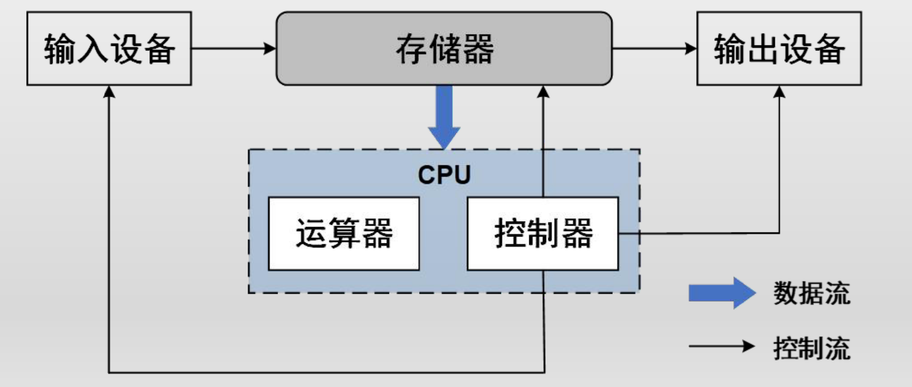{width=50%}

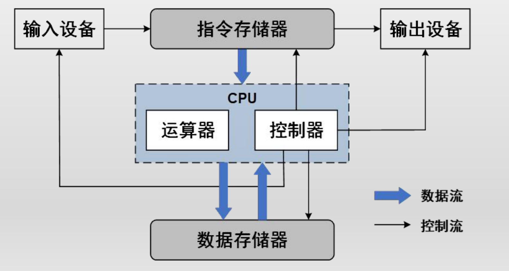{width=50%}

#### 2.2. 集成电路与摩尔定律

* **摩尔定律 (Moore's Law)**:
  * 集成电路上可容纳的晶体管数目大约每 18 个月增加一倍, 即处理器性能每隔两年翻一倍.


### 3. 后摩尔时代的挑战与创新

#### 3.1. Amdahl 定律

* **Amdahl 定律**: 系统中对某一部件采用更快执行方式所能获得的系统性能改进程度, 取决于这种执行方式被使用的频率, 或所占总执行时间的比例.
  $$S_{overall} = \frac{1}{(1 - F) + \frac{F}{S_{enhanced}}}$$
  * **$S_{overall}$**: 系统可加速比.
  * **$S_{enhanced}$**: 系统可改进部分的加速比.
  * **$F$**: 系统可改进比例.

#### 3.2. 体系结构创新

* **多核架构 (Multi-core Architecture)**:
  * **集中式共享存储**: 处理器共享单个主存, 扩展性有限.
  * **分布式存储**: 存储器分布在核内, 增大带宽并降低延时.
* **网络拓扑 (Network Topology)**: 包括 Crossbar (复杂度 $O(N^2)$), 2D Mesh, 3D Cube 等.
* **领域专用处理器 (DSA)**: 通过抽取软件行为设计定制化架构 (如 AI 加速器, 安全领域处理器).

#### 3.3. 敏捷硬件开发 (Agile Hardware Development)

* **Chisel**: 基于 Scala 的硬件构建语言, 支持高级抽象和硬件生成器 (Circuit Generator).

| **特性** | **Chisel** | **Verilog** |
| :---: | :---: | :---: |
| **类型系统** | 强大, 支持 Vec 和 Aggregate | 仅有 wire 和 reg, 类型无语义 |
| **代码重用** | 支持继承, 多态, 泛型 | 无继承多态, 功能有限 |
| **可综合性** | 设计与电路唯一对应, 全语义可综合 | 语义混杂, 许多语法不可综合 |


### 4. 计算机体系结构的层次

#### 4.1. 指令集体系结构 (ISA)

* **ISA**: 软硬件的交界面.
  * 软件编程者而言是唯一可见的计算机结构特征.
  * 定义了指令格式和语义.
  * 同一指令集可以有不同的硬件实现.
* **CISC (Complex Instruction Set Computer)**: x86 等.
  * **优点**: 实现相同操作所需的指令数少, 指令类型丰富, 操作灵活.
  * **缺点**: 指令的利用率很不均衡; 译码困难, 不利于处理器流水线的分割, 增加了高性能处理器的设计难度.
* **RISC (Reduced Instruction Set Computer)**: ARM, MIPS, RISC-V 等.
  * **优点**: 指令格式统一, 类型简单, 硬件开发周期可以更短.
  * **缺点**: 指令灵活性弱于 CISC, 实现相同操作所需的指令数可能更多.

#### 4.2. 微架构与硬件实现

* **微架构 (Microarchitecture)**:
  * 微架构是指体系结构的具体设计, 可以认为是对ISA的一个具体实现, 对软件透明.

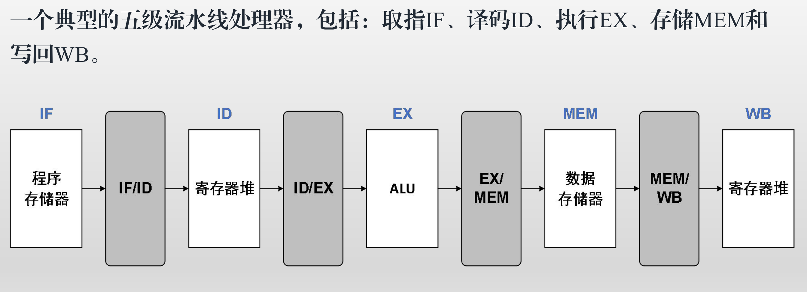{width=80%}

* **硬件实现 (Implementation)**:
  * 硬件实现指计算机具体的实现细节, 包括具体的逻辑设计, 制造工艺和封装技术等.

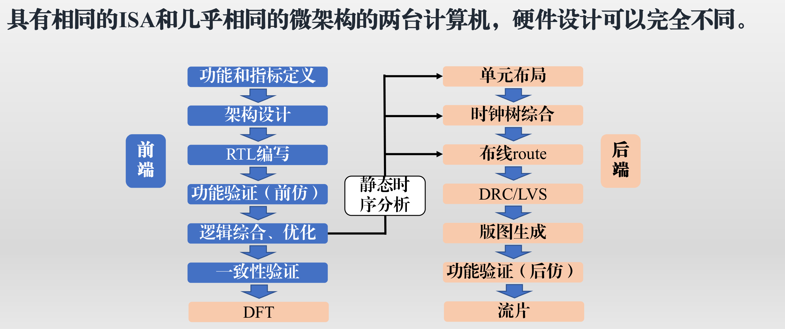{width=80%}


## 第2章 指令集基本原理

### 1. 指令集的发展历史与分类

#### 1.1. CISC 与 RISC 的对比

| **特性** | **CISC** | **RISC** |
| :---: | :---: | :---: |
| **代表架构** | x86 (Intel, AMD) | RISC-V, MIPS, ARM |
| **指令特点** | 单条指令完成的任务量大且功能复杂, 指令长度灵活可变. | 单条指令完成的任务量少且功能单一, 指令长度相对固定. |
| **优点** | 对编译器和程序存储空间的要求较低, 代码密度高. | 硬件设计较为简单, 非常适合利用流水线 (Pipeline) 提升性能, 设计周期短. |
| **缺点** | 硬件设计复杂, 微码控制导致设计与测试验证难度极高. | 对编译器设计的要求较高, 程序的代码密度较低. |

#### 1.2. 存储空间与指令集分类

* 指令集可以按照对处理器存储空间 (Memory, Working Store, Control Store) 的分配方式进行分类.

| **分类** | **架构特点** | **优点** | **缺点** |
| :---: | :---: | :---: | :---: |
| **堆栈型 (Stack)** | 无通用寄存器; ALU 指令无操作数, 仅堆栈操作 (PUSH, POP) 有一个操作数. | 指令较短, 无需显式指定操作数. | 效率较低, 指令执行顺序相对固定. |
| **累加器型 (Accumulator)** | 具有单一的累积寄存器 (Acc); 每条指令有单一的显式操作数. | 指令短, 内部实现简单, 适合连续运算. | 访存压力大. |
| **寄存器-内存型 (Register-Memory)** | 操作数既可以在寄存器也可以在存储器中; 运算指令可直接访存; 显式指定 2-3 个操作数. | 节省指令数量. | 运算指令访问存储器造成延迟比较高. |
| **寄存器-寄存器型 (Register-Register)** | 又称加载/存储型 (Load/Store); 仅 Load/Store 指令可访问内存; 运算基于通用寄存器; 显式指定 2-3 个操作数. | 访问内存少, 存取速度快; 寻址空间短, 改善目标代码大小. | 指令数量相对较多. |


### 2. 指令的寻址模式 (Instruction Addressing Modes)

#### 2.1. 寻址模式定义

* **寻址模式**: 体系结构如何指定指令操作对象的地址.
  * 指令操作对象包括常数 (Constants), 寄存器 (Registers) 以及内存空间 (Memory).
* **指令的组成**: 指令由操作码 (Opcode) 和地址码 (Address) 组成.
  * 地址包括内存地址, 立即数 (Immediate Values), 寄存器 (Registers), 变址寄存器 (Index Registers) 等.
  * 地址的附加信息包括偏移量 (Offset), 块长度 (Block Length), 跳距 (Jump Distance) 等.

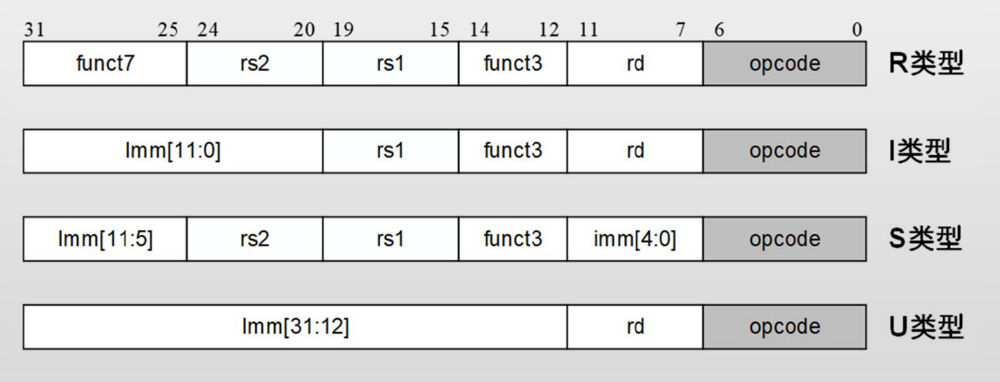{width=90%}

#### 2.2. 常见的指令寻址模式

| **寻址模式 (Addressing Mode)** | **举例** | **含义** | **使用场景** |
| :---: | :---: | :---: | :---: |
| **寄存器直接寻址 (Register Direct)** | `Add R4, R3` | $Regs[R4] \leftarrow Regs[R4] + Regs[R3]$ | 操作数已加载到寄存器中时使用. |
| **立即数寻址 (Immediate)** | `Add R4, 3` | $Regs[R4] \leftarrow Regs[R4] + 3$ | 某个操作数为常数时使用. |
| **偏移量寻址 (Offset)** | `Add R4, 100(R1)` | $Regs[R4] \leftarrow Regs[R4] + Mem[100 + Regs[R1]]$ | 访问局部变量时使用. |
| **寄存器间接寻址 (Register Indirect)** | `Add R4, (R1)` | $Regs[R4] \leftarrow Regs[R4] + Mem[Regs[R1]]$ | 访问指针内容或计算的地址时使用. |
| **索引寻址 (Indexed)** | `Add R3, (R1+R2)` | $Regs[R3] \leftarrow Regs[R3] + Mem[Regs[R1] + Regs[R2]]$ | 访问数组内容时使用. |
| **内存直接寻址 (Memory Direct)** | `Add R1, (1001)` | $Regs[R1] \leftarrow Regs[R1] + Mem[1001]$ | 访问静态数据时使用. |
| **内存间接寻址 (Memory Indirect)** | `Add R1, @(R3)` | $Regs[R1] \leftarrow Regs[R1] + Mem[Mem[Regs[R3]]]$ | 访问二级指针时使用. |
| **自动递增寻址 (Autoincrement)** | `Add R1, (R2)+` | $Regs[R1] \leftarrow Regs[R1] + Mem[Regs[R2]]$; $Regs[R2] \leftarrow Regs[R2] + d$ | 遍历数组时使用. |
| **自动递减寻址 (Autodecrement)** | `Add R1, -(R2)` | $Regs[R2] \leftarrow Regs[R2] - d$; $Regs[R1] \leftarrow Regs[R1] + Mem[Regs[R2]]$ | 遍历数组时使用. |
| **比例寻址 (Scaled)** | `Add R1, 100(R2)[R3]` | $Regs[R1] \leftarrow Regs[R1] + Mem[100 + Regs[R2] + Regs[R3] \times d]$ | 索引数组时使用. |

#### 2.3. RISC-V 支持的寻址模式

* **寄存器直接寻址**:
  ```riscvasm
  add a1, a1, a2
  ```
* **立即数寻址**:
  ```riscvasm
  addi a1, a1, 4
  ```
* **偏移量寻址**:
  ```riscvasm
  lw a1, 4(a2)
  jal x1, 0x1234          # x1=pc+4; pc=pc+0x1234 (用于控制流指令)
  ```
* **寄存器间接寻址**: 偏移量寻址中偏移量为 0.
  ```riscvasm
  lw a1, 0(a2)
  ```
* **内存直接寻址**: 偏移量寻址中基址寄存器为 `x0`.
  ```riscvasm
  lw a1, 0x100(x0)
  jalr x1, 0x100(x0)      # to 0x100
  ```


### 3. 数据类型与指令操作

#### 3.1. 常见数据类型

| **C 语言类型** | **描述** | **RV32 大小 (bytes)** | **RV64 大小 (bytes)** |
| :---: | :---: | :---: | :---: |
| `char` | Character value | 1 | 1 |
| `short` | Short integer | 2 | 2 |
| `int` | Integer | 4 | 4 |
| `long` | Long integer | 4 | 8 |
| `long long` | Long long integer | 8 | 8 |
| `void*` | Pointer type | 4 | 8 |
| `float` | Single-precision floating-point | 4 | 4 |
| `double` | Double-precision floating-point | 8 | 8 |
| `long double` | Quad-precision floating-point | 16 | 16 |

#### 3.2. 主要指令操作分类

* **算术和逻辑指令 (Arithmetic and Logical)**: 加, 减, 乘, 除, AND, OR, XOR, 移位 (Shift).
* **数据转移指令 (Data Transfer)**: 加载 (Load) 与存储 (Store).
* **控制流指令 (Control Flow)**: 条件分支 (Branch), 跳转 (Jump), 过程调用和返回.
* **其他**: 系统指令 (System), 浮点运算指令 (Floating Point), 十进制指令, 字符串指令, 图形指令等.

#### 3.3. RISC-V 指令操作

| **指令集** | **指令操作类型** |
| :---: | :---: |
| **RV32I/RV64I/RV128I** | 包括算术和逻辑指令, 数据转移指令, 控制流指令, 系统指令等 |
| **RVM** | 乘除法操作, 取余操作 |
| **RVF/RVD/RVQ** | 单精度/双精度/四精度浮点操作, 包括浮点运算/转换/比较/加载/存储 |
| **RV-Zicsr** | CSR 控制指令 |
| **RVV** | 向量扩展指令 |

* **RV64I 算术运算 (加减)**:
  ```riscvasm
  addi a1, a1, 4        # a1 = a1 + 4
  add a1, a2, a3        # a1 = a2 + a3
  sub a1, a2, a3        # a1 = a2 - a3
  ```
* **RV64I 逻辑运算 (`and`, `or`, `xor`)**:
  ```riscvasm
  andi a1, a1, 7        # a1 = a1 & 7
  and a1, a1, a2        # a1 = a1 & a2
  ```
* **RV64I 移位运算 (左移, 右移)**:
  ```riscvasm
  sll a1, a1, a2        # a1 = a1 << a2
  srli a1, a1, 2        # a1 = a1 >> 2 (逻辑右移, 高位无符号扩展)
  srai a1, a1, 2        # a1 = a1 >> 2 (算术右移, 高位符号扩展)
  ```
* **RV64I 比较运算 (`slt[i][u]`)**:
  ```riscvasm
  slt a1, a2, a3        # a1 = (a2 < a3) ? 1 : 0 (有符号比较)
  slti a1, a2, 10       # a1 = (a2 < 10) ? 1 : 0 (有符号比较)
  sltu a1, a2, a3       # a1 = (a2 < a3) ? 1 : 0 (无符号比较)
  ```
* **RV64I 加载指令 (Load)**:
  ```riscvasm
  lb a1, 4(a2)          # a1 = Mem[a2+4][0:7]  加载字节 (Byte, 8 bit), 符号扩展至 64 bit
  lbu a1, 4(a2)         # a1 = Mem[a2+4][0:7]  加载字节 (Byte, 8 bit), 无符号扩展至 64 bit
  lh a1, 4(a2)          # a1 = Mem[a2+4][0:15] 加载半字 (Half Word, 16 bit), 符号扩展至 64 bit
  lw a1, 4(a2)          # a1 = Mem[a2+4][0:31] 加载字 (Word, 32 bit), 符号扩展至 64 bit
  ld a1, 4(a2)          # a1 = Mem[a2+4][0:63] 加载双字 (Double Word, 64 bit)
  ```
* **RV64I 存储指令 (Store)**:
  ```riscvasm
  sb a1, 4(a2)          # Mem[a2+4][0:7]  = a1[7:0]  存储字节
  sh a1, 4(a2)          # Mem[a2+4][0:15] = a1[15:0] 存储半字
  sw a1, 4(a2)          # Mem[a2+4][0:31] = a1[31:0] 存储字
  sd a1, 4(a2)          # Mem[a2+4][0:63] = a1[63:0] 存储双字
  ```
* **RV64I 分支指令 (条件分支)**:
  ```riscvasm
  beq a1, a2, offset    # 如果 a1 == a2, 则跳转到 PC+offset 的地址上, 否则 PC+4 (有符号比较)
  bge a1, a2, offset    # 如果 a1 >= a2, 则跳转至 PC+offset 的地址上, 否则 PC+4 (有符号比较)
  ```
* **RV64I 跳转指令 (无条件跳转)**:
  ```riscvasm
  jal rd, imm           # 无条件跳转到 PC+imm 的地址上, 同时把 PC+4 的值记录到 rd 中
  jalr rd, rs1, imm     # 无条件跳转到 rs1+imm 的地址上, 同时把 PC+4 的值记录到 rd 中
  ```

| **机制名称** | **代表架构** | **详述** | **优点** | **缺点** |
| :---: | :---: | :---: | :---: | :---: |
| **条件码 (Condition Code, CC)** | x86, ARM, PowerPC | ALU 在计算中设置条件码 (如结果为 0, 溢出, 为负), 分支指令根据 CC 判断. | 条件码的设置比较灵活. | 需要额外状态寄存器; 由于依赖上一条指令的 CC, 减少了乱序执行 (Out-of-Order Execution) 的可能性. |
| **有限制的比较** | MIPS | 只比较指定寄存器之间是否相等, 是否为 0 等. | 实现较为简单. | 复杂分支条件需要额外的前置指令进行计算. |
| **完整的比较系统** | RISC-V | 比较即为分支指令的一部分, 指令自身支持大多数比较操作 (如 `<`, `>=`, `==`). | 分支只需要一条指令. | 造成分支指令的逻辑延时较长. |

* **RISC-V 浮点运算指令**:
  ```riscvasm
  fadd f1, f2, f3       # f1 = f2 + f3
  fmul f1, f2, f3       # f1 = f2 * f3
  fsqrt f1, f2          # f1 = sqrt(f2)
  ```
* **RISC-V 浮点转换指令**:
  ```riscvasm
  fcvt.w.s a1, f2       # a1 = (int)f2
  fcvt.s.w f1, a2       # f1 = (float)a2
  ```
* **RISC-V 浮点比较指令**:
  ```riscvasm
  flt.s a1, f2, f3       # a1 = f2 < f3
  ```


### 4. 指令集编码 (Instruction Set Encoding)

#### 4.1. 编码概念与分类

* **指令集编码 (Instruction Encoding)**: 用二进制机器码来表征指令, 包括操作码 (Opcode) 编码和地址 (Address) 编码.
  * **固定长度编码 (Fixed Length Encoding)**: 所有指令长度相同 (如 RISC-V 基础指令, ARM, MIPS), 适用于简单的操作数和寻址方式, 译码器设计简单.
  * **可变长度编码 (Variable Length Encoding)**: 不同指令长度不同 (如 x86), 适用于复杂的操作数和寻址方式, 译码器设计复杂.
  * **混合编码方式 (Hybrid Encoding)**: 提供固定与变长的折中 (如 RVC 指令压缩扩展).

#### 4.2. 前缀码与霍夫曼编码

* **前缀码 (Prefix Code)**: 任何一个字符的编码都不能是其他字符编码的前缀, 保证了指令译码的唯一性.
* **信息和熵**:
  * **信息 (Information)**: $l(x_i) = -\log_2 p(x_i)$. 其中 $\log_n q$ 表示具有总概率 $q$ 的那些最可能序列为了描述序列所需要的二进制位数.
  * **熵 (Entropy)**: $H = -\sum_{i=0}^{n} p(x_i) l(x_i) = -\sum_{i=0}^{n} p(x_i) \log_2 p(x_i)$. 熵是信息的数学期望. 熵确定了要编码集合 $S$ 中任意成员 (即以均匀的概率随机抽取一个成员) 的分类所需要的最少的二进制位数.
  * **操作码的最短平均长度**: $H = -\sum_{i=1}^{n} p_i \log_2 p_i$, 其中 $p_i$ 表示第 $i$ 种操作码在程序中出现的概率.
  * **固定长编码的信息冗余量**: $R = 1 - \frac{H}{[\log_2 n]} = 1 - \frac{-\sum_{i=1}^{n} p_i \log_2 p_i}{[\log_2 n]}$.
* **霍夫曼编码 (Huffman Coding)**: 出现频率高的字符使用较少的位编码, 频率低的字符使用较多的位编码.
  * **优点**: 霍夫曼编码得到霍夫曼树, 其平均带权重路径长度最短, 因此霍夫曼树也被称为最优二叉树.
  * **缺点**: 操作码很不规整, 硬件译码困难; 与地址码组成固定长度指令比较困难.
  * **Huffman 树构造过程**:
    1. 将所有字符作为单节点树加入优先队列, 按照频率排序.
    2. 从队列中取出频率最低的两个节点, 合并成一个新节点, 频率为两者之和, 将新节点重新加入队列.
    3. 重复步骤 2 直到队列中只剩一个节点, 该节点即为霍夫曼树的根.

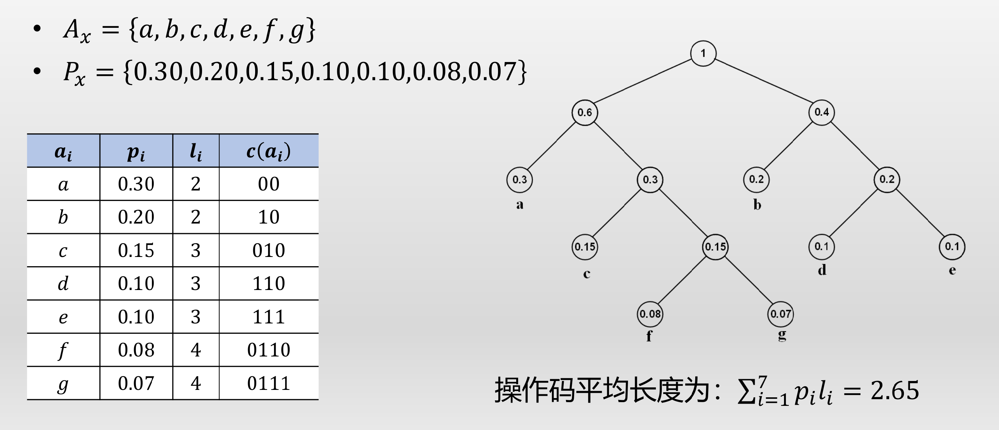{width=60%}

* **扩展编码法 (Expanded Coding)**: 在固定码长与 Huffman 编码之间进行折中.

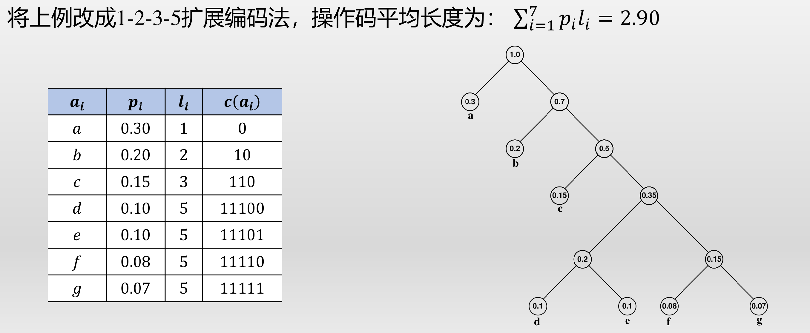{width=60%}

#### 4.3. RISC-V 的指令编码结构

| **指令格式** | **主要用途** | **`rd`** | **`rs1`** | **`rs2`** | **`imm`** |
| :---: | :---: | :---: | :---: | :---: | :---: |
| **R 类型** | 寄存器-寄存器的 ALU 操作 | 目标寄存器 | 第一个源操作数 | 第二个源操作数 | --- |
| **I 类型** | 立即数 ALU 操作或 Load 指令 | 目标寄存器 | 第一个源操作数/基址寄存器 | --- | 常数/偏移值 |
| **S 类型** | Store 指令或比较分支指令 | --- | 基址寄存器/第一个源操作数 | 待存储的数据/第二个操作数 | 偏移值 |
| **U 类型** | 跳转指令 | 返回值目标寄存器 | --- | --- | 跳转目的地址 |

{width=80%}

* **指令长度扩展**: RISC-V 指令长度是可变的.
  * 基础长度为 32 bit, 但可按 16 bit 为单位扩展.
  * 长度信息被直接定义在最低位的 opcode 区间中.


### 5. 特权指令与 ABI 规定 (Privileged Instructions and ABI)

#### 5.1. 特权等级与保护环 (Privilege Levels and Protection Rings)

* **保护环 (Protection Ring)**: 一种分级的 CPU 数据和功能保护机制.
  * 保护操作系统内核和固件不受用户程序的破坏
  * 旨在实现系统的隔离, 安全和可维护性.

| **RISC-V 的特权等级** | **编码** | **名称** | **缩写** | **描述** |
| :---: | :---: | :---: | :---: | :---: |
| **0** | `00` | 用户模式 (User) | U | 运行普通应用程序. |
| **1** | `01` | 管理员模式 (Supervisor) | S | 通常用于运行操作系统内核. |
| **2** | `10` | Reserved | N/A | 保留. |
| **3** | `11` | 机器模式 (Machine) | M | 最高权限, 可信代码, 所有处理器强制要求实现. |

#### 5.2. 特权指令与 CSR (Privileged Instructions and CSRs)

* **特权指令 (Privileged Instructions)**: RISC-V 规定了一些指令只能在指定的特权等级下执行. 同时有些指令虽然能在各种特权等级下执行, 但执行结果不同.
  * **`ecall`**: 用于向系统执行环境发出请求 (程序主动执行的 trap 指令, 使得处理器的控制权发生转移). 在 `M|S|U` 模式执行时会产生不同的异常 (exception), PC 将跳转到不同的处理函数入口, 并把当前 PC 保存到目标特权模式下的 `xepc` 寄存器中 (`x=m|s|u`, `uepc` 通常不实现).
  * **`xret`**: 从对应等级的 trap 处理函数返回, 设置 `PC=xepc`, 使得指令只能在 `x` 或比 `x` 更高的特权等级中执行 (`x=m|s|u`, `uepc` 通常不实现).
* **控制状态寄存器 (Control and Status Registers, CSR)**: 用于控制并记录处理器的运行状态.
  * 较高特权等级可以访问并修改属于较低等级的 CSR.
  * RISC-V 的 CSR 主要包括中断的开关以及入口设置, 物理内存保护 (PMP), 性能监测模块等功能.
  * **示例**: MIE (Machine Interrupt Enable) 寄存器, 仅在机器模式下访问, 用于控制外部中断, 定时器中断和软件中断.

#### 5.3. 应用程序二进制接口 (Application Binary Interface, ABI)

* **寄存器分配 (Register Allocation)**:
  * `x0` (`zero`): 硬件恒为 0.
  * `x1` (`ra`): 返回地址 (Return Address). 由 Caller 保存.
  * `x2` (`sp`): 栈指针 (Stack Pointer). 由 Callee 保存.
  * `x10-x17` (`a0-a7`): 函数参数 (Function Arguments). `a0-a1` 用于返回值. 由 Caller 保存.
  * `x5-x7`, `x28-x31` (`t0-t6`): 临时寄存器 (Temporary). 由 Caller 保存.
  * `x8-x9`, `x18-x27` (`s0-s11`): 保存寄存器 (Saved). `x8` (`s0` 或 `fp`) 用于 Frame Pointer. 由 Callee 保存.
* **在函数调用者和被调用者之间跳转**:
  * **调用 `jal/jalr` 指令**:
    * `jal/jalr` 指令将当前 PC+4 存放到目的寄存器中 (按照规定为 `ra` 寄存器), 同时将跳转地址写入当前 PC, 即完成了从调用者跳转到被调用者.
    * 当子函数返回时, 将 `ra` 寄存器记录的地址写入 PC 继续执行, 即完成了从被调用者跳转回调用者.
  * **函数调用栈 (Call Stack)**:
    * 每一次函数的调用, 都会在调用栈 (call stack) 上维护一个独立的栈帧 (stack frame).
    * 每个独立的栈帧包括函数的返回地址和参数, 函数运行过程中的局部变量.
    * 栈帧的地址由寄存器 `sp` 记录.


### 6. RISC-V 汇编程序设计

#### 6.1. 伪指令与关键字 (Pseudo-instructions and Keywords)

* **伪指令 (Pseudo-instructions)**: 汇编器将其映射为等价的基础指令.

| **伪指令** | **基础指令** | **意义** |
| :---: | :---: | :---: |
| `la rd, symbol` | `auipc rd, symbol[31:12]`<br>`addi rd, rd, symbol[11:0]` | 地址加载. |
| `l{b\|h\|w\|d} rd, symbol` | `auipc rd, symbol[31:12]`<br>`l{b\|h\|w\|d} rd, symbol [11:0](rd)` | 全局加载. |
| `s{b\|h\|w\|d} rd, symbol, rt` | `auipc rt, symbol[31:12]`<br>`s{b\|h\|w\|d} rd, symbol [11:0](rt)` | 全局保存. |
| `fl{w\|d} rd, symbol, rt` | `auipc rt, symbol[31:12]`<br>`fl{w\|d} rd, symbol [11:0](rt)` | 浮点全局加载. |
| `fs{w\|d} rd, symbol, rt` | `auipc rt, symbol[31:12]`<br>`fs{w\|d} rd, symbol [11:0](rt)` | 浮点全局保存. |

* **段控制关键字 (Section Keywords)**:
  * **`.align`**: 将接下来的指令地址对齐到 $2^n$ 字节.
  * **`.globl`**: 将该符号写入全局符号表.
  * **`.section`**: 标志接下来的内容所属段.
  * **`.text`**: 代码段.
  * **`.data`**: 初始化数据段.
  * **`.rodata`**: 只读数据段.
  * **`.bss`**: 未初始化数据段.

* **标签 (Labels)**: 汇编语言用标签标识跳转地址.
  * **文字标签**: 写入符号表中, 用于进行分支和跳转.
  * **数字标签**: 用于局部跳转, `b` 指向前面的标签, `f` 指向后面的标签.


## 第3章 处理器流水线结构

### 1. 实现 RISC 指令集的典型硬件结构

#### 1.1. 经典五级硬件结构

* **取指 (Instruction Fetch, IF)**: 处理器根据当前 PC (Program Counter) 从程序存储器中取出即将执行的指令.
* **译码 (Instruction Decode, ID)**: 提取操作码和地址码, 确定寄存器堆和数据存储器的读写控制信号. 由于 RISC 指令格式固定, 指令译码和寄存器读取可同时进行 (固定字段译码, Fixed-field Decoding).
* **执行 (Execution, EX)**: ALU 根据译码阶段得到的操作数和操作码进行运算. 对于载入/存储指令 (Load/Store), 在此阶段计算数据存储器的访问地址.
* **访存 (Memory, MEM)**: 载入和存储类指令在此阶段读写数据存储器.
* **写回 (Write Back, WB)**: 将运算结果写回到寄存器堆中的相应位置.

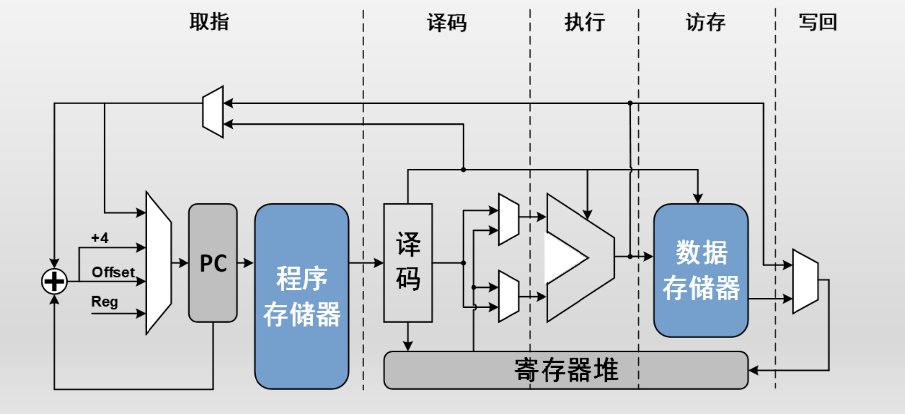{width=60%}


### 2. 基础流水线

#### 2.1. 流水线基础概念

* **流水线 (Pipeline)**: 将指令执行过程分解为多个阶段, 允许多条指令在不同阶段重叠执行.
* **硬件实现**: 通过在各个执行阶段对应的组合逻辑之间插入边缘触发的流水线寄存器来实现. 寄存器保证了相邻两级指令之间不会互相干扰.

#### 2.2. 流水线术语

* **指令发射与退休**:
  * **指令发射 (Issue)**: 指令经过译码后, 派发到对应的硬件计算单元进行执行的过程.
  * **指令退休 (Retire)**: 代表一条指令已经完整执行完毕并提交其结果.
* **前端与后端**:
  * **前端 (Front-end)**: 流水线中负责获取和解析指令的部分 (通常为 IF 和 ID 阶段).
  * **后端 (Back-end)**: 流水线中负责指令具体执行的部分 (包括 EX, MEM, WB 阶段).

#### 2.3. 处理器性能的定量分析

* **完成同一计算任务所需的总时间公式**:
  $$T = T_{cycle} \times N_{cycle} \,.$$ $$T = T_{cycle} \times \frac{N_{cycle}}{N_{instruction}} \times N_{instruction} = T_{cycle} \times CPI \times N_{instruction} \,.$$
  * **$N_{instruction}$**: 执行任务所需的总指令数.
  * **$T_{cycle}$**: 时钟周期长度 (Clock Cycle Time), 与硬件工艺和电路设计相关.
  * **$CPI$ (Cycles Per Instruction)**: 执行每条指令所需的平均时钟周期数. 其倒数为吞吐率 $IPC$ (Instructions Per Cycle).
* **流水线带来的性能加速比 (Speedup)**:
  * 假设 K 级流水线的最大级延时为 $T_{pipe}$, 无流水线单周期延时为 $T_{cycle}$, 那么相同任务有无流水线的执行时间之比为:
    $$S = \frac{T_{pipe} \times CPI_{pipe} \times N_{instruction}}{T_{cycle} \times CPI_{cycle} \times N_{instruction}} = \frac{T_{pipe} \times CPI_{pipe}}{T_{cycle} \times CPI_{cycle}} \,.$$
  * **时钟周期长度之比**: 假设流水线寄存器将原有的组合电路延时均匀分割, 流水线寄存器自身引入的延时相比原有电路可忽略不计.
    $$\frac{T_{pipe}}{T_{cycle}} \approx \frac{1}{K} \,.$$
  * **CPI 之比**: 基础流水线每个周期均发射一条指令并退休一条指令, 完成 $N$ 条指令共需要 $N+K-1$ 个周期.
     $$\frac{CPI_{pipe}}{CPI_{cycle}} = \frac{N+K-1}{N} \,.$$
  * 在理想流水线且 $N$ 足够大时, $\frac{T_{pipe}}{T_{cycle}} \approx \frac{1}{K}$, $CPI_{pipe} \approx 1$. 从而加速比 $S \approx K$. 即 K 级单发射流水线在理想情况下可获得 K 倍的性能提升.


### 3. 流水线冲突

#### 3.1. 冲突分类

| **冲突类型** | **描述** | **示例** |
| :---: | :---: | :---: |
| **结构冲突 (Structural Hazard)** | 硬件资源不足导致的暂停. | ALU 多周期占用; 冯·诺依曼架构下 IF 和 MEM 阶段同时争抢单一存储器端口. |
| **控制冲突 (Control Hazard)** | 分支转移指令未能立刻确定目标地址引起的暂停. | 执行 `jalr` 或条件分支时, 流水线需等待计算出跳转目标才能继续取指. |
| **数据冲突 (Data Hazard)** | 指令操作数之间存在依赖关系 (真实依赖) 或资源竞争 (名称依赖) 引起的暂停. | 前一条指令尚未写回结果, 后续指令就需要读取该数据. |

#### 3.2. 数据冲突的三种类型

* **写后读 (Read After Write, RAW)**: 真实数据依赖. 后续指令需要读取前序指令尚未写回的结果.
* **写后写 (Write After Write, WAW)**: 乱序执行或不同指令执行周期长度不一致时, 后续指令先于前序指令写回同一目的寄存器, 导致结果被错误覆盖.
  * 对于严格顺序执行的基础流水线, 前面指令的停顿会在流水线上向后续指令传播, WAW 冲突不会发生.
  * 流水线允许指令乱序执行, 或不同指令完成 EX 需要的时间不同时, 可能发生 WAW 冲突.
* **读后写 (Write After Read, WAR)**: 前序指令读取操作数之前, 后续指令就改写了该寄存器, 导致读到错误值.
  * 基础五级流水线模型中, 在严格顺序执行指令时不会发生 WAR 冲突.

#### 3.3. 前馈技术 (Forwarding)

* **前馈 (Forwarding)**: 将已经计算出但尚未写回到寄存器堆的结果, 直接从 ALU 输出端或流水线寄存器 (如 EX/MEM 或 MEM/WB) "短路" 传输到 ALU 输入端.
  * 前馈使得 ALU 的输入不仅来自寄存器堆, 还可以来自流水线寄存器. 前馈可以发生在不同的硬件位置.
  * 前馈可以消除部分 RAW 冲突带来的停顿.
  * 某些情形下, 不需要额外添加前馈硬件就可以避免冲突.
  * 前馈无法解决所有数据冲突.


### 4. 乱序执行与超标量流水线 (Out-of-Order Execution and Superscalar)

#### 4.1. 动态调度与乱序执行 (Dynamic Scheduling and OoO Execution)

* **严格顺序执行的缺陷**: 若发生冲突停顿, 阻塞点之后的所有后续无关指令都必须一起等待.
* **乱序执行 (Out-of-Order Execution, OoO)**: 当某条指令因冲突停顿时, 允许后续无依赖关系的指令越过阻塞指令, 提前进入执行阶段.
* **动态调度 (Dynamic Scheduling)**: 硬件在运行时动态安排指令的执行顺序和时机, 使得硬件在缓存缺失 (Cache Miss) 等意外延迟时仍能执行其他代码, 提高资源利用率.

#### 4.2. 多发射 (Multiple Issue) 与超标量 (Superscalar)

* **多发射技术**: 允许处理器在一个时钟周期内发射多条指令到待执行队列中, 使得每个周期可以产生多条准备好进入执行阶段的指令.
* **超标量技术**: 处理器拥有多个并行的流水线执行单元, 使得待执行队列中的指令可以进入不同的功能单元进行处理, 从而使得每个周期可以完成多条指令.

| **架构类型** | **调度方式** | **执行顺序** | **特点** |
| :---: | :---: | :---: | :---: |
| **超长指令字 (VLIW)** | 静态 | 顺序 | 编译器负责打包无冲突的指令集合, 硬件设计简单. |
| **静态超标量 (Static Superscalar)** | 静态 | 顺序 | 硬件具备多个执行单元, 依序发射 1 至多条指令. |
| **动态超标量 (Dynamic Superscalar)** | 动态 | 乱序 | 硬件动态检测依赖并乱序派发, 结合重排序保证结果正确. |

#### 4.3. 超标量流水线的性能分析

* **一个 K 级单发射基础流水线的 CPI 为**:
  $$CPI_{pipe} = \frac{N_{pipe}}{N_{instruction}} = \frac{N+K-1}{N} \,.$$
* **假设一个超标量流水线每个周期可以退休 $W$ 条指令, 则执行 $N$ 条指令所需要的总周期数由 $N+K-1$ 降低为**:
  $$N_{multi\_pipe} = \frac{N+K-1}{W} \,.$$
* **流水线的 CPI 降低为**:
  $$CPI = \frac{N+K-1}{NW} \,.$$


### 5. 记分牌结构 (Scoreboard)

#### 5.1. 记分牌的主要控制部件

* **记分牌结构**: 将顺序执行的指令进行动态调度, 从而实现高效无误的乱序执行. 该方法最早在 CDC 6600 计算机中引入.
  * **超标量结构**: 4 个浮点单元, 5 个存储器引用单元和 7 个整数运算单元.
  * **解决数据冲突**:
    * **WAR**: 阻塞写回操作直到所有寄存器被读取; 只在操作数读取这一流水级进行寄存器读取操作.
    * **WAW**: 检测到冲突以后, 阻塞新指令直到相关指令完成执行.
* **计分牌的四级控制结构**:
  * **发射 (ID1)**: 指令译码并检查结构冲突.
    * 按程序本来的顺序发射指令 (以便于检查冲突).
    * 如果有结构冲突就不发射当前指令.
    * 如果当前指令与前面发射但未完成的指令之间有输出依赖则不发射该指令 (保证不出现 WAW 冲突).
  * **读操作数 (ID2)**: 当没有数据依赖时读操作数.
    * 所有真实数据依赖 (即 RAW 冲突) 在这一级得到解决, 等待相应的指令写回数据.
    * 不存在数据前馈.
  * **执行 (EX)**: 对操作数进行操作.
    * 接到操作数后功能单元开始工作, 得到结果以后, 它会通知记分牌它已经完成操作.
  * **写回 (WB)**: 完成执行.
    * 阻塞直到和前面的指令之间没有 WAR 冲突.

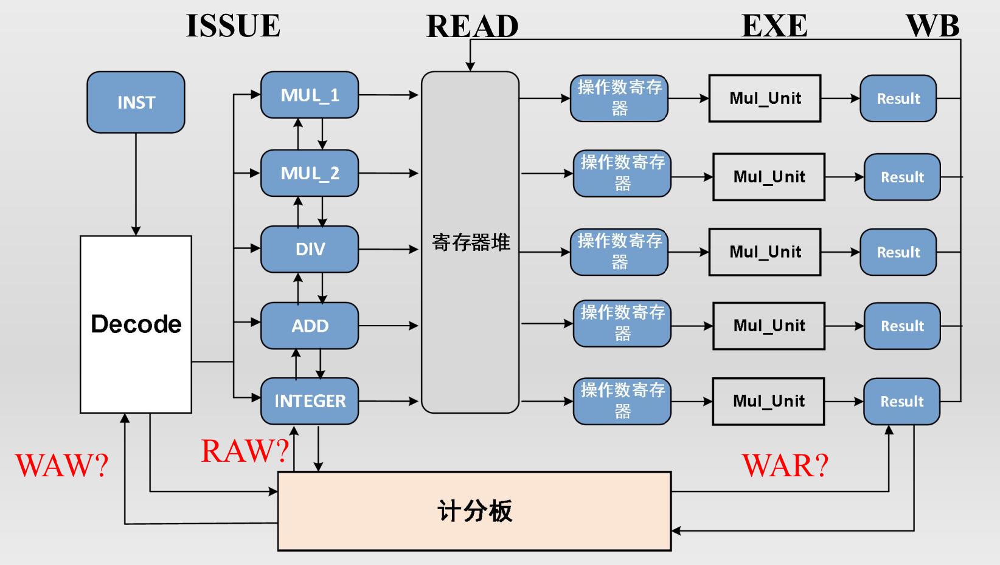{width=60%}

* **计分牌的执行过程分析**:
  * **是否可以 Issue**: 检查结构冲突和 WAW.
  * **是否可以 Read**: 检查 RAW (操作数是否准备好).
  * **是否可以 Execute**: 功能单元 (FU) 是否空闲.
  * **是否可以 Write**: 检查 WAR.
* **记分牌的主要控制部件**:
  * **指令状态寄存器 (Instruction Status)**: 记录指令处于四级中的哪一级.
  * **功能单元状态寄存器 (Functional Unit Status)**: 指明了功能单元 (FU) 的状态. 每个功能单元有 9 个状态.
    * **`Busy`**: 该单元是否繁忙.
    * **`Op`**: 该单元执行的操作.
    * **`Fi`**: 目的寄存器.
    * **`Fj`, `Fk`**: 源操作数寄存器.
    * **`Qj`, `Qk`**: 产生源操作数的功能单元 `Fj`, `Fk`.
    * **`Rj`, `Rk`**: 表明 `Fj`, `Fk` 已准备好的标志位.
  * **写回状态寄存器 (Register Result Status)**: 针对每个寄存器指明对其写回结果的相应功能单元. 空白表明没有正在执行的指令需要写回结果到该寄存器.


### 6. 寄存器重命名 (Register Renaming)

#### 6.1. 寄存器重命名的基本原理

* **寄存器重命名**: 通过控制待读写寄存器的物理位置, 消除名称依赖 (WAR 和 WAW 冲突), 实现完全的乱序执行.
* **显式重命名**: 让物理上的寄存器堆具有的真实寄存器数目比 ISA 定义的寄存器数目更多. 对每条需要写回的指令, 总是新分配一个目的寄存器.
  * **主要机制**: 应用一个从 ISA 寄存器到物理寄存器映射的转换表.
    * 当指令需要写回结果, 则令其写回到空闲的物理寄存器中.
    * 只要没有其他指令使用该物理寄存器, 那么该寄存器就是空闲的.
* **隐式重命名**: 只存在按 ISA 定义的逻辑寄存器堆, 但利用保留站作为临时存储单元, 每条写操作指令被指向独立的保留站.
  * **主要机制**: 目的寄存器的写操作隐式绑定到保留站 (Reservation Station), 后续读操作通过保留站编号引用数据, 而非直接访问逻辑寄存器. 最早由 Tomasulo 算法引入.
    * 指令结果通过公共数据总线广播, 供保留站中需要该结果的指令自动监听并获取该结果, 同时将该结果写入逻辑寄存器堆.
    * 现代 Tomasulo 算法引入 ROB (Reorder Buffer), 指令结果暂存于 ROB, 按程序顺序提交到逻辑寄存器.

#### 6.2. Tomasulo 算法 (Tomasulo Algorithm)

* **Tomasulo 算法**: 通过隐式寄存器重命名的高级动态调度算法.
  * **基本特点**:
    * 提高发射带宽, 把指令尽量发射到分布在各个功能单元 (FU) 的缓冲寄存器, 称为保留站 (RS).
    * 通过隐式寄存器重命名消除 WAR 和 WAW 冲突, 该功能通过保留站来实现.
    * 利用公共数据总线将功能单元产生的结果广播到各个保留站.
  * **主要控制部件**:
    * **保留站 (Reservation Station, RS)**: Tomasulo 算法为每一条执行通路 (功能单元) 配置的一组缓冲, 每个保留站单元有 7 个状态.
      * **`Busy`**: 该保留站是否繁忙.
      * **`Op`**: 该单元执行的操作.
      * **`Vj`, `Vk`**: 源操作数的值.
      * **`Qj`, `Qk`**: 产生源操作数的功能单元保留站.
    * **写回状态寄存器 (Register Result Status)**: 针对每个寄存器指明对其写回结果的相应功能单元. 该结构和记分牌中的写回状态寄存器类似.
    * **公共数据总线 (Common Data Bus, CDB)**: 在总线上广播数据及其数据源 (产生该数据的保留站位置即功能单元).

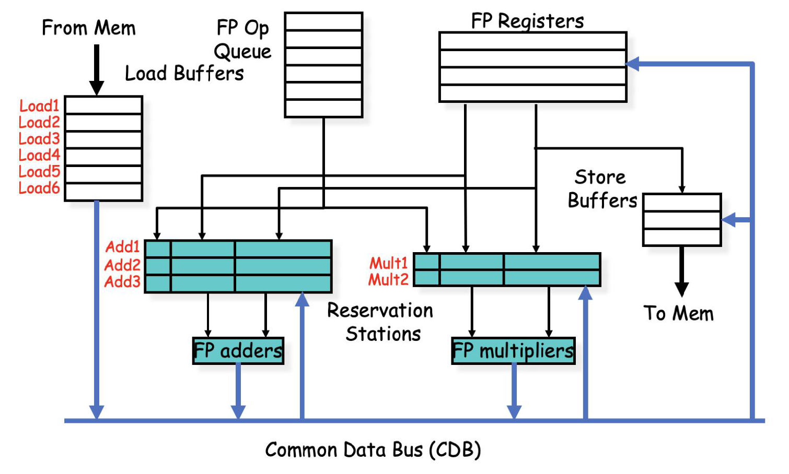{width=72%}

* **Tomasulo算法的调度流程**:
  * **顺序发射**:
    * 指令按照程序中的顺序一条接一条发射到保留站, 判断能否发射的标准是指令对应功能单元的保留站是否有空余位置.
    * 指令周期结束时会更新保留站和寄存器结果状态表, 如果指令有可以读取的数据, 就会立刻拷贝到保留站中.
    * 寄存器结果状态表中总是存有最新的值.
  * **执行**:
    * 指令通过拷贝数据和监听 CDB 获得源数据, 然后开始执行, 执行可能是多周期的.
  * **写回**:
    * 指令在写回阶段通过 CDB 总线将数据直通到寄存器堆和各个保留站.
    * 指令周期结束时, 根据寄存器结果状态表来更新寄存器堆, 并清除保留站和寄存器结果状态表的信息.
* **实现显式重命名的记分牌结构**:
  * **发射**: 指令译码检测结构冲突, 分配新的物理寄存器给需要写回的结果.
    * 按照程序的正常顺序发射指令.
    * 如果没有空闲的物理寄存器就不发射指令.
    * 如果存在结构冲突就不发射指令.
  * **读操作数**: 只要没有冲突, 就读取操作数.
    * 所有真实的数据依赖 (RAW) 都将在这一级解决, 等待相应的指令写回数据.
  * **执行**: 对操作数进行操作.
    * 功能单元在接到操作数后开始执行操作, 当操作结果产生后, 功能单元会通知记分牌.
  * **写回**: 结束执行.
    * 不再需要专门检测WAR和WAW冲突.


### 7. 分支预测 (Branch Prediction)

#### 7.1. 分支预测技术

* **分支预测**: 解决指令之间存在的控制冲突从而进一步提高流水线性能的技术.
  * **静态预测 (Static Prediction)**: 每次执行对特定分支的预测结果始终是确定的.
    * 始终成立 (Always taken), 始终不成立 (Always not taken).
    * 基于操作码 (`BLEZ`成立, `BGTZ`不成立).
    * 基于偏移量 (向前不成立, 向后成立).
    * 编译器决定, 根据对分支转移的可能性的分析 (在 opcode 中添加提示信息).
  * **动态预测 (Dynamic Prediction)**: 预测结果由每次执行时的具体信息动态决定.
    * 基于分支的历史信息, 预测结果会随着实时产生的信息产生相应的变化.

#### 7.2. 预测器类型

* **1-bit 预测器**: 记录每个分支转移最近一次是否发生跳转. 使用宽度为 1 bit 的分支历史表 (Pattern History Table, PHT) 记录预测器状态.
  * 实际的预测器不可能使用完整的 PC 值来索引分支历史表, 通常使用 PC 的低位地址作为 PHT 索引.
  * 当某个分支几乎总是被选中, 但偶尔会有一次未被选中, 那么在使用 1-bit 预测器进行预测时总会连续发生两次错误预测.
* **2-bit 预测器**: 必须连续预测失败两次才会翻转预测方向.
* **相关/全局预测器 (Correlating/Global Predictor)**: 利用 **GHR (Global History Register)** 记录全局分支历史, 并结合 PC 索引 **PHT (Pattern History Table)** (即两级预测器).
  * **gShare 预测器**: 将 PC 与 GHR 进行异或 (XOR) 哈希来索引单列 PHT, 节省存储开销.
* **Tournament 预测器/混合预测器**: 使用选择算法 (如 2-bit 计数器) 在全局预测器和局部预测器之间动态选择表现更好的一个.

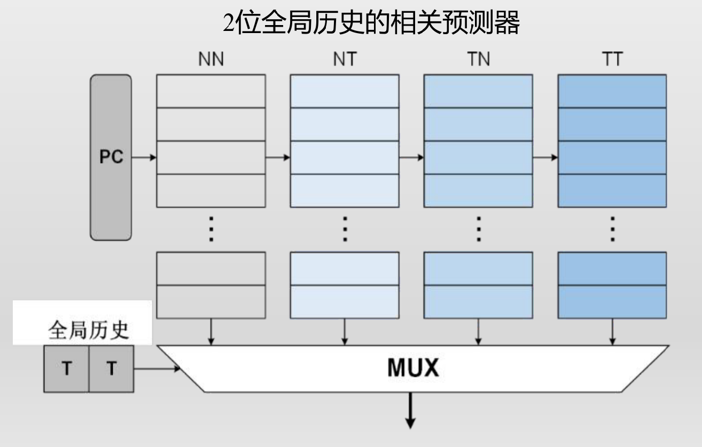{width=60%}

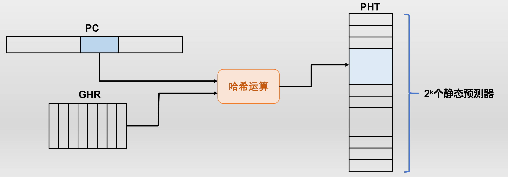{width=80%}

#### 7.3. 目标地址与返回地址预测

* **分支目标缓存 (Branch Target Buffer, BTB)**: 使用 PC 查找, 如果命中且预测跳转, 则直接输出缓存的目标指令地址进行取指.
  * **BTB 和 BHT 相互结合**: 配置一个表项很多的 BTB 成本高昂, 因此现代处理器一般不采用单一预测器, 而是在流水线的不同级上放置数个不同的分支预测器.
* **返回地址栈 (Return Address Stack, RAS)**: 专门用于预测函数调用的返回地址.
  * **工作过程**: 遇到函数调用 (`jal`/`jalr`) 时将 `PC+4` 压栈; 遇到函数返回时弹出栈顶作为目标 PC.
  * **可能问题**: 容量有限, 无法处理过深的函数调用嵌套; 并非所有过程调用都和返回一一对应.


### 8. 重排序缓存 (Reorder Buffer, ROB)

#### 8.1. 硬件推测执行

* **硬件推测执行**: 对程序的分支方向进行预测, 并按假定正确的分支方向执行程序. 当出现预测错误时, 能够通过一些机制撤销其影响.
  * 需要将处于推测状态的指令和确定状态的指令分离.
  * 在流水线的写回阶段 (完成执行) 后再加一个提交阶段, 在该阶段指令才能够更新架构寄存器堆和存储器. 推测状态的指令允许写回, 但只有当指令消除不确定性之后才允许被提交.
  * 允许指令乱序执行, 但强制指令循序提交, 以防止在指令提交之前采取任何不可挽回的动作 (比如激发异常等).

#### 8.2. 重排序缓存

* **重排序缓存**: 为了将指令完成执行的过程和指令提交过程区分开来, 可以增加一个硬件缓存, 记录着指令的顺序, 用来支持指令循序提交.
  * **功能**:
    * 指令结果可以保存在 ROB 中 (隐式重命名), 也可以保存在物理寄存器堆 (显式重命名).
    * ROB 本质上是一个队列, 记录着指令在程序中的原始顺序, 通常情况下队列的每一项都对应着一条指令.
    * ROB 队列的头存储着最早发射的指令 (最先提交的指令), 队列的尾存储着最晚发射的指令 (最后提交的指令).
  * **对推测执行的支持**:
    * 在指令提交之前, 指令的目标寄存器值或存储器值都没有更新.
    * 如果发现分支预测错误, 可以将推测执行的指令结果撤销掉, 然后从正确的指令处重新开始执行.
    * 可以准确追溯哪些指令需要撤销.
  * **对精确异常的支持**:
    * 如果指令发生异常, 在指令提交阶段会触发异常处理机制. 完成异常处理以后, 处理器会从发生异常的指令位置重新执行. ROB 是循序提交指令的, 可以保证实现精确异常.
    * 出现分支预测错误时, ROB 将预测错误分支之后的所有 ROB 表项清空, 而该分支之前的 ROB 表项还可以继续有效. 处理器将在正确分支处重新开始提取指令, 从而完成恢复操作.
    * 处理器发生异常 (如缓存缺失, TLB 缺失), 一般在相应指令准备提交时才会对异常进行识别处理. 发现异常后, 相应指令之后的 ROB 表项清空, 异常处理完成后再从正确的指令位置继续执行程序.


## 第4章 计算机存储系统

### 1. 半导体存储技术 (Semiconductor Storage)

#### 1.1. 易失性存储器 (Volatile Memory)

* **SRAM (Static Random Access Memory, 静态随机访问存储器)**:
  * 基本单元通常由 6 个晶体管构成 (6T).
  * 不需要周期性地刷新数据.
  * 具有较快的速度, 较低的静态功耗.
  * 面积较大.
  * **读出**: 位线 (Bitline) 被预充至电源电压. 当选中的字线 (Wordline) 有效时, 其中一根位线会通过存储单元内部选通管缓慢放电, 与另一根位线形成差分信号. 由于单元电流极小, 放电速度很慢, 需借助灵敏放大器 (Sense Amplifier) 将其放大后输出, 以加快读取速度.
  * **写入**: 将新数据送至对应位线. 若写入数据与原数据不同, 则位线会通过选通管对存储节点进行充放电, 从而覆盖原状态, 完成数据更新.

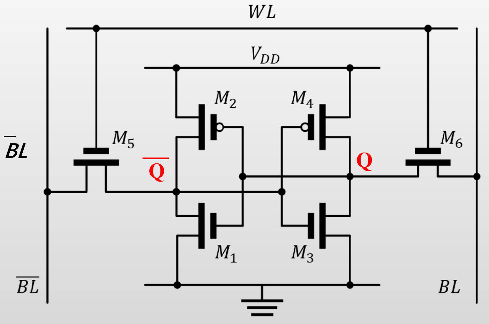{width=60%}

* **DRAM (Dynamic Random Access Memory, 动态随机访问存储器)**:
  * 基本单元通常由1个晶体管和1个电容构成 (1T1C).
  * 依靠晶体管上的电容来保存数据.
  * 容量比 SRAM 大, 集成密度更高.
  * 速度比 SRAM 慢, 读出是破坏性的, 需要周期性刷新.
  * **写入**: 驱动位线; 选择行 (字线).
  * **读出**: 位线预充电到 $\frac{V_{dd}}{2}$; 选择行; 单元与位线共享充电; 灵敏放大; 恢复存储值.

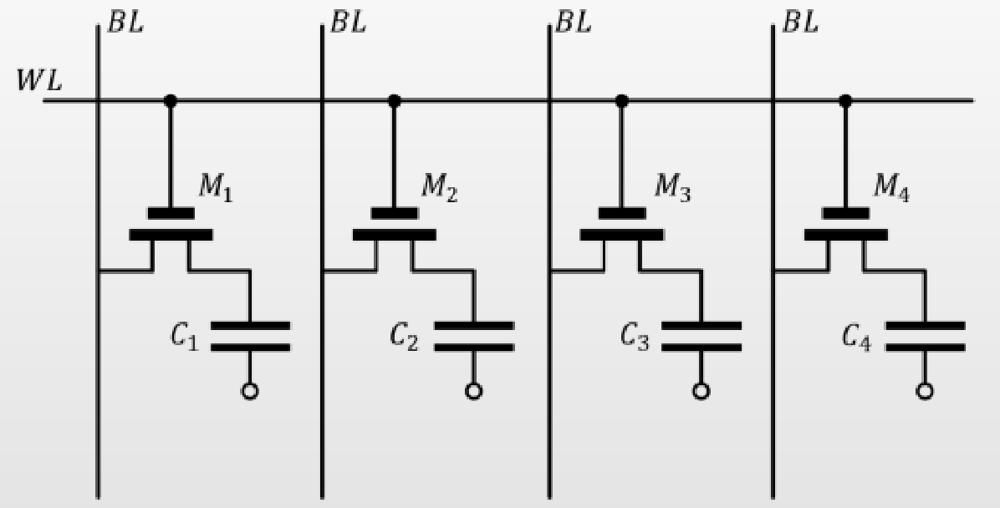{width=72%}

#### 1.2. 非易失性存储器 (Non-Volatile Memory)

* **FLASH (快闪存储器)**:
  * **SLC (Single Level Cell)**: 一个特殊晶体管保存一个比特.
  * **MLC / TLC / QLC**: 每个晶体管保存 2/3/4 个比特.
  * **编程**: 栅极电压高, 电子隧穿进入存储层, $V_{th}$ 上升.
  * **擦除**: 栅极电压低, 电子隧穿离开存储层, $V_{th}$ 下降.
  * **读取**: 栅极电压适中, 根据不同 $V_{th}$ 导通情况判断数据.
  * 速度远远慢于 DRAM, 具有微秒级的访问时间.

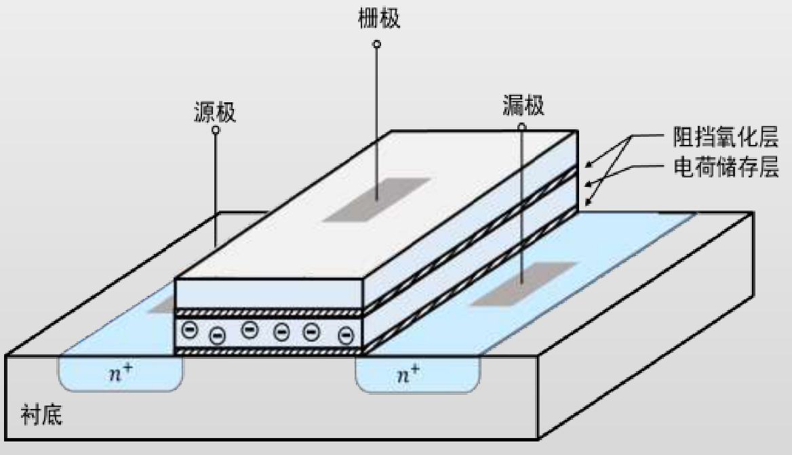{width=72%}

#### 1.3. 存储技术比较与层级

| **存储技术** | **速度** | **成本** | **容量** | **功耗** | **易失性** | **用途** |
| :---: | :---: | :---: | :---: | :---: | :---: | :---: |
| **SRAM** | 快 | 高 | 极小 | 中等 (动态功耗) | 易失 | 寄存器堆, 缓存 |
| **DRAM** | 较快 | 较高 | 较小 | 高 (周期刷新) | 易失 | 内存, 缓存 (HBM) |
| **FLASH** | 慢 | 中等 | 大 | 低 (仅编程/擦除) | 非易失 | 硬盘 |

| **层级** | **名称** | **大小** | **工艺** | **访问延时 (ns)** | **带宽 (MiB/s)** | **管理形式** |
| :---: | :---: | :---: | :---: | :---: | :---: | :---: |
| **1** | 寄存器 | < 4 KiB | CMOS 多端口储存结构 | 0.1 - 0.2 | $10^5 - 10^6$ | 编译器 |
| **2** | 缓存 | 32 KiB - 8 MiB | SRAM | 0.5 - 10 | $2 \times 10^5 - 5 \times 10^5$ | 硬件 |
| **3** | 内存 | < 1 TB | DRAM | 30 - 150 | $1 \times 10^5 - 3 \times 10^5$ | 操作系统 |
| **4** | 硬盘 | > 1 TB | 机械或固态硬盘 (HDD/SSD) | 5000000 | $2 \times 10^2 - 10^3$ | 操作系统 |

#### 1.4. 接口时序介绍 (Interface Timing)

* **BRAM (Block RAM)**:
  * FPGA 内部的嵌入式存储资源, 属于 SRAM 结构. 极低的访问延迟 (1~2 个时钟周期), 高带宽, 无需刷新.
  * **工作模式**: 真双口模式 (True Dual-Port, TDP), 简单双口模式 (Simple Dual-Port, SDP), 单口模式.
* **DDR (Double Data Rate SDRAM)**:
  * 片外独立存储器, 属于 DRAM 技术. 访问延迟较高, 需定期刷新.
  * **Burst 传输 (Burst Transmission)**: 减少地址开销, 仅需发送一次起始地址即可连续传输一组数据. 包含顺序 (Sequential) 和交织 (Interleaved) 模式.
* **HBM (High Bandwidth Memory)**:
  * 采用硅中介层与处理器或 FPGA 封装在同一基板上的三维堆叠 DRAM.
  * 缩短信号传输路径, 提供极高带宽. 包含多个伪通道 (Pseudo Channel).
  * **控制器功能**: 动态总线反转 (Dynamic Bus Inversion, DBI), 事务重排序 (Reordering), 一致性管理 (Coherency), ECC 纠错.


### 2. 虚拟存储 (Virtual Storage)

#### 2.1. 虚拟存储的概念与优点

* **虚拟存储**: 系统为进程维护统一且连贯的虚拟地址空间, 不同进程数据在内存中的实际存放位置由物理地址决定. 虚拟地址向物理地址的转换由地址翻译过程完成.
  * **进程保护 (Process Protection)**: 页表可负责页访问权限检查. 仅内核进程能够修改页表, 用户进程只能读取属于自己的页表, 实现数据隔离与安全共享.
  * **简化编程 (Simplify Programming)**: 操作系统负责调度, 利用页表映射实现就地执行 (Execute in place, XIP) 和进程之间共享内存 (Shared memory).

#### 2.2. 段式虚拟存储 (Segment-based Virtual Storage)

* **段式虚拟存储**: 程序由逻辑分段组成代码段, 数据段, 栈段, 堆段.
  * 物理地址 = 段基地址 + 偏移量.
  * **缺点**: 会产生多个不连续的小物理内存碎片 (内存碎片问题), 导致新的程序无法被装载; 不常用的部分内存也被装载, 造成浪费.

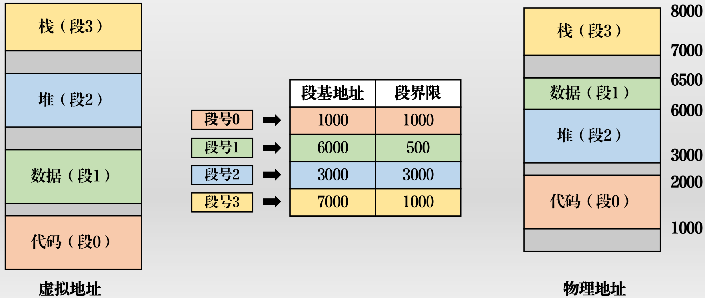{width=80%}

#### 2.3. 页式虚拟存储与页表 (Page-based Virtual Storage and Page Table)

* **页式虚拟存储**: 将内存按固定大小的页进行管理.
  * 虚拟地址 = 虚拟页号 (Virtual Page Number, VPN) + 页内偏移 (Page Offset).
  * 虚拟页号经由页表 (Page Table) 翻译为物理页号 (Physical Page Number, PPN).
  * **单级页表缺陷**: 容量太大. 32 位系统单张页表容量约为 4 MB, 64 位系统单张页表高达 512 GB. 故现代系统均采用多级页表.

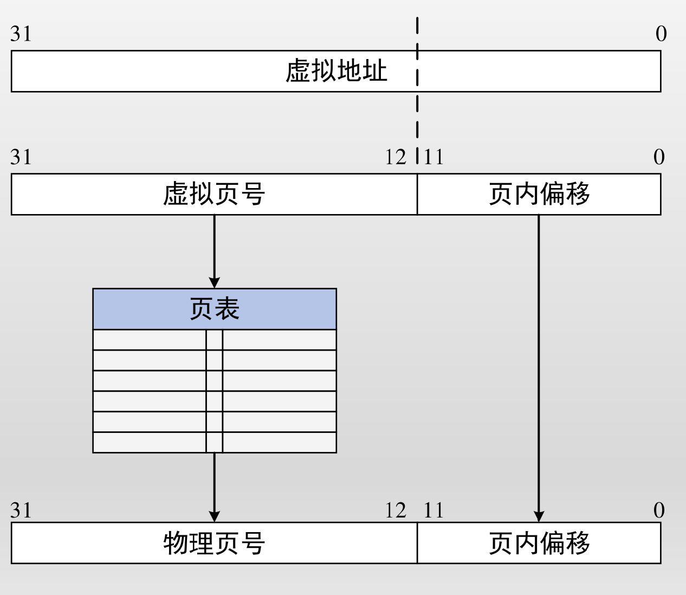{width=50%}

#### 2.4. 多级页表与 TLB (Multi-level Page Table and Translation Look-aside Buffer)

* **多级页表**: 通过多次访问的方式节省存储空间, 按需创建.
  * **页表项属性**: 物理页号, presence (是否位于内存), read/write (读写权限), user/supervisor (访问权限), dirty (是否被写脏), accessed (是否被访问过), page size, executable, cacheable, wright through (写回/写通), Address Space Identifier (ASI, 地址空间标识符).
* **TLB**: 页表的缓存, 位于 CPU 中. 加速物理地址转换.
  * 若 TLB 未命中 (TLB Miss), 需查询主存中的多级页表, 若该页不属于主存则触发 Page Fault.

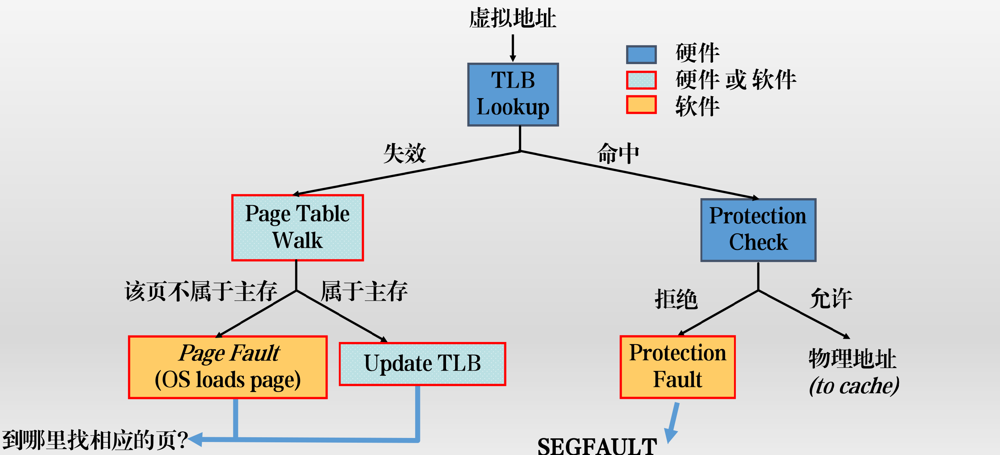{width=80%}

#### 2.5. RISC-V 的分页机制 (RISC-V Paging Mechanism)

| **特性** | **SV32** | **SV39** | **SV48** | **SV57** |
| :---: | :---: | :---: | :---: | :---: |
| **适用架构** | RV32 | RV64 | RV64 | RV64 |
| **虚拟地址位宽** | 32 位 | 39 位 | 48 位 | 57 位 |
| **物理地址位宽** | 34 位 | 56 位 | 56 位 | 56 位 |
| **页表级数** | 2 级 | 3 级 | 4 级 | 5 级 |
| **最大虚拟空间** | 4 GB | 512 GB | 128 TB | 64 PB |


### 3. 缓存 (Cache)

#### 3.1. 局部性原理 (Memory Wall and Locality Principle)

* **局部性原理 (Principle of Locality)**: 处理器倾向于在较短时间内重复访问同一组内存位置.
  * **分类**:
    * **时间局部性 (Temporal Locality)**: 访问过的内存位置, 在不久的将来很可能再次被访问.
    * **空间局部性 (Spatial Locality)**: 当前访问的位置, 近期将会访问附近的内存位置.
    * **分支局部性 (Branch Locality)**: 程序的路径只有少数几种可能的前景, 如循环/分支.
    * **等距局部性 (Equidistant Locality)**: 介于空间与分支局部性之间, 可用简单线性函数预测.
  * 局部性原理是 Cache 设计的理论基础, 而 Cache 则是利用该原理来大幅提升系统性能的关键硬件实现.
  * 导致局部性的原因主要是计算机软件处理的任务和软件具有可预测性, 如线性的数据结构等.

#### 3.2. 缓存的粒度与标签 (Cache Granularity and Tag)

* **缓存的粒度**:
  * **缓存块 (Block/Line)**: 缓存的基本组织单位.
    * 访问当前地址意味着将来很有可能访问相邻地址, 可以一次性地把内存中一整块的数据装入缓存.
    * 块大小就是缓存的粒度.
    * 缓存的粒度应当是空间连续性和缓存命中率的折中. 常见的块大小为 64 Bytes.
* **地址划分**: 物理地址划分为 标签 (Tag), 索引 (Index), 块内偏移 (Block Offset).
  * **标签 (Tag)**: 用于判断该块是否为目标块.
  * **索引 (Index)**: 用于定位缓存块属于哪个组.

{width=60%}

#### 3.3. 缓存的映射方式 (Cache Mapping)

* **直接映射 (Direct Mapped)**: 内存中的某个块仅允许被放置在缓存中的单一位置.
* **组相联 (Set-Associative)**: 内存中的某个块允许被放置在缓存中的多个位置之一 (例如 2 路, 4 路, 8 路).
  * **索引位数**: n 位可以索引 $2^n$ 个组, 每组包含 N 个块 (N 路), 则缓存总块数为 $2^n \times N$.
* **全相联 (Fully-Associative)**: 内存中的某个块允许被放置在缓存中的任意位置. 没有索引位 (Index), 仅使用标签 (Tag) 比对.
  * **索引位数**: 全相联的缓存不存在组划分, 不需要索引位.
  * 块地址全是标签 (Tag), 缓存的某个块位置可被所有不同块地址的内存块竞争.
  * 全相联缓存是只有 1 个组的 N 路组相联缓存, 其中 N 等于缓存可容纳的块数.

#### 3.4. 缓存的写策略与替换策略 (Write and Replacement Policies)

* **缓存的工作原理**:
  * CPU 请求的数据经过翻译后得到物理地址, 该地址发送到缓存.
  * 利用该地址中的索引位, 定位得到缓存块属于哪个组.
  * 将该组中各路的缓存块标签读出, 与传入的物理地址的标签进行比较.
  * 若任意一路发生标签匹配, 称为命中 (Hit), 取出该路的数据作为访存结果; 反之称为缺失 (Miss), 此时需要访问下一级缓存或者主存.
* **缓存的读请求处理**:
  * CPU 发出物理地址.
  * 缓存根据索引读出标签和数据信息.
  * 缓存将标签信息和请求地址的标签位比对.
    * 有一个标签与物理地址的标签相等, 缓存命中 (Hit).
    * 所有标签都与物理地址的标签不等, 缓存失效 (Miss).
  * 根据比对结果驱动 MUX.
    * 缓存命中, 使对应的数据信息返回 CPU.
    * 缓存失效, 将 CPU 的读请求发给下一级存储.
* **缓存的写请求处理**:
  * CPU 发出物理地址和需要写的数据.
  * **缓存命中时的写策略**:
    * **回写 (Write-back)**: 仅修改当前缓存的数据. 包含 dirty 标志, 当 cache line 被排出时才写入下一级缓存或主存.
    * **写直达 (Write-through)**: 同时修改当前缓存和下一级缓存的数据.
  * **缓存失效时的写策略**:
    * **按写分配 (Write allocate)**: 将缺失的数据块写入下一级并分配在缓存中.
    * **非按写分配 (No-write allocate)**: 缺失的数据块仅写入下一级.
  * **写策略基本组合**: 回写+按写分配; 写直达+非按写分配.
* **缓存的替换策略**:
  * **随机 (Random)**: 随机选择一个块进行替换.
  * **最近最不常用 (Least Recently Used, LRU)**: 选择最近最不常用的块进行替换.
    * LRU cache 状态需要在每次访问过程中更新.
    * 对小的组 (2-way) 较为有效. Pseudo-LRU 二进制树常用于 4-8 way 的情况.
  * **先进先出 (First In First Out, FIFO, a.k.a. Round-Robin)**: 选择最早进入缓存的块进行替换.
    * 适用于组相连程度较高的缓存.
  * **非最近常用 (Not Least Recently Used, NMRU)**: 跟踪每组里面最常用的行, 除此行以外其它行采用随机或 FIFO 策略进行替换.

#### 3.5. 缓存与虚拟地址 (PIPT, VIVT, VIPT)

* **地址转换与缓存访问**:
  * 虚实地址的低位是 Offset, 地址转换前后 Offset 的内容总是相同.
  * 虚地址的高位 VPN 分为 Tag 和 Index 两部分, TLB/MMU 的任务是将 VPN 映射到 PPN.
* **实现方式**:
  * **VIVT (Virtual Index, Virtual Tag)**: 虚地址直接访问 Cache, Cache 未命中则通过 TLB 访问物理地址内存, 更新 Cache.
    * 访问速度快.
    * 存在别名问题 (Aliasing). 同一个物理地址可以有多个虚拟地址, 导致 Cache 内出现同一块物理内存的多份拷贝. 导致 Cache 资源浪费, 数据不一致等问题.
    * 不同进程的相同虚拟地址一般指向完全不同的物理地址 (Homonyms, 同名异意), 在 VIVT 下也可能造成问题. 可以辅以 ASID, 或上下文切换时冲刷 Cache 等解决.
  * **PIPT (Physical Index, Physical Tag)**: 先通过 TLB 获得实地址, 再访问一级 Cache.
    * Cache 得到的 Index 和 Tag 都是实地址.
    * TLB 和 Cache 延迟叠加, 访问速度慢.
  * **VIPT (Virtual Index, Physical Tag)**: 利用虚拟地址的偏移量 (Offset) 和索引 (Index) 查找 Cache, 同时并行查找 TLB 获取物理标签 (Tag) 进行比对. 速度快且无别名问题.
    * VIPT 的前提是 Cache 的大小不能超过页大小乘以组相联度, 否则可能出现别名问题.
    * 常见的处理器配置:
      * $\text{Page Size} = 4 \text{KiB}$.
      * $\text{Line Size} = 64 \text{B}$.
      * $\text{Associativity} = 8\text{-way}$.
      * $\text{Cache Size} \leq 4 \text{KiB} \times 8 = 32 \text{KiB}$.

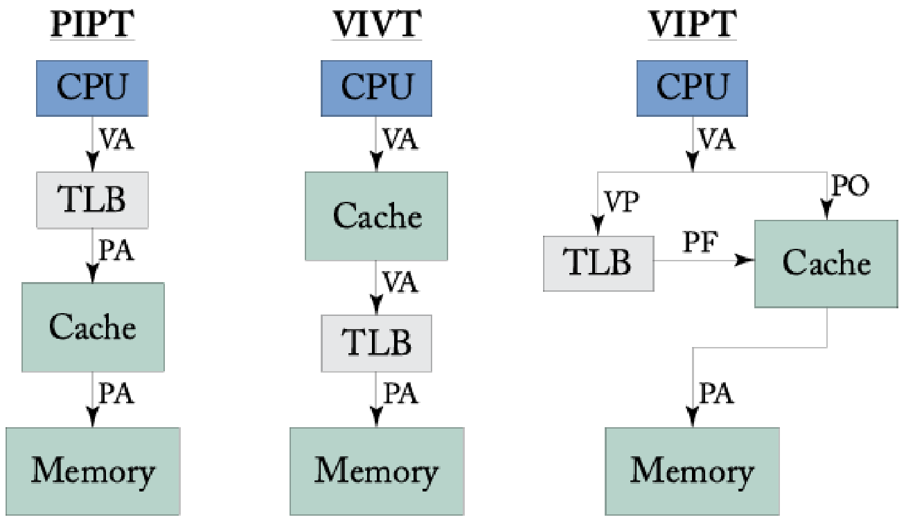{width=50%}

#### 3.6. 缓存命中和缓存失效 (Cache Hit and Miss)

* **缓存命中延时**:  CPU 读写请求从到达缓存到在缓存命中的时间.
  * **来源**: 译码电路; SRAM 时序; 比较器和数据选择器.
* **缓存失效**: CPU 请求的块不在缓存中.
  * 缓存失效是通过标签比对来判断的.
  * 缓存失效代表请求的块需要到更低一级的存储层次中寻找 (下级缓存或内存).
  * **失效率 (Miss Rate)**: 用来量化缓存失效的频率.
  * **失效惩罚 (Miss Penalty)**: 量化缓存失效需要花费的周期数.
* **缓存失效原因**:
  * **3C 失效 (3 Cs of Cache Misses)**:
    * **强制失效 (Compulsory misses)**: 冷启动或缓存清空后的失效.
    * **冲突失效 (Conflict misses)**: 相联组数不足造成的失效.
    * **容量失效 (Capacity misses)**: 缓存总容量有限造成的失效.
  * **其他失效**:
    * **一致性失效 (Coherence misses)**: 共享多核架构下的一致性协议所导致. 也称为第 4 个 C.
    * **软件系统导致的失效**: 例如系统调用, 中断, 上下文切换等.
* **缓存失效率分析**:
  * **容量越大效果越好**: 随着缓存容量增加, 所有类型的缓存未命中率都会显著下降.
  * **相联度越高冲突越少**: 在相同容量下, 相联度越高, 未命中率越低. 因为数据存放更灵活, 减少了冲突.
  * **收益存在边际递减**: 增加相联度带来的性能提升是递减的. 通常 8 路组相联已非常接近理论上的最佳性能, 再增加相联度性价比不高.
  * **最终受限于容量**: 当缓存足够大时, 不同相联度的曲线最终都会收敛, 此时未命中率主要取决于数据总量, 而不是存放位置的限制.

#### 3.7. 多级缓存 (Multi-level Cache)

* **多级缓存的取舍**:
  * **(I-D) 分离 VS. 统一**: 一般 L1 分为 L1I 和 L1D, L2 开始合为一个.
  * **包含策略**: 包含/排他/非包含非排他.
  * **常见的多级缓存写策略**:
    * L1 写穿/不按写分配, 降低 L1 的复杂度, 也利于多核一致性检查.
    * L2 写回/写分配, 减少对下级 Cache 的访问.
  * **多核情况**: Cache 分为私有和共享 (紧耦合), 分布式.
* **包含策略 (Inclusion Policy)**:
  * **Inclusive 包含**: 低层级 Cache 的内容必须被高层级 Cache 覆盖包含.
    * 如果某个 cache line 在 L1 中, 那么它一定也在 L2 中. 即 $L1 \subseteq L2 \subseteq L3$.
    * **优点**: 一致性维护简单, 一个核心想知道某个 cache line 是否可能存在于其他核心的私有 L1/L2 中, 只需要查 LLC 的 tag. 如果 LLC 中没有这个 line, 那么其他私有 cache 中也一定没有.
    * **缺点**: 有效容量浪费, 同一个 cache line 会同时占据 L1, L2, L3 的空间; 反向失效 (back invalidation), 如果 L2 或 L3 替换掉某个 cache line, 由于 inclusive 约束, 它必须把上层 L1 中对应的 line 也 invalid 掉, 即使 L1 近期还在使用它.
  * **Exclusive 排他**: 同一个 cache line 不会同时存在于相邻层级 Cache 中.
    * 某个 cache line 在 L1 中, 那么它不在 L2 中; 如果它从 L1 被替换出去, 才进入 L2.
    * **优点**: 有效容量更大.
    * **缺点**: 数据移动和一致性维护更复杂.
  * **NINE**: 既不保证排他, 也不保证包含.
    * 一致性和查找逻辑异常繁琐.
* **平均访问时间 (Average Access Time, AAT / AMAT)**:
  $$AMAT = \sum_{n=1}^{N} P_n \times L_n \,.$$
  * $N$ 为缓存层数 + 1 (即 $n=N$ 代表内存).
  * $P_n$ 代表 CPU 请求在当前层级命中的几率.
  * $L_n$ 代表当前层级的命中延时.


### 4. 多核处理器下的缓存 (Cache in Multicore Processors)

#### 4.1. 缓存一致性与内存一致性 (Cache Coherence vs. Memory Consistency)

* **内存一致性 (Memory Consistency)**: 定义共享内存的正确性, 定义了 Load/Store 作用于内存的规则.
  * 内存一致性对软件是可见的, 需要软件参与维护.
* **缓存一致性 (Cache Coherence)**: 使多核系统的缓存看起来像单核系统的缓存.
  * 缓存一致性在功能上对软件是透明的.
  * 多核共享内存系统一般会实现某种缓存一致性协议.

#### 4.2. 缓存一致性协议 (Cache Coherence Protocols)

* **缓存一致性协议**: 保证单写多读不变性和数据值不变性.
  * **Single-Writer, Multiple-Reader 不变性**:
    * 一个 cache line 在任意时刻只能处于以下两种情况之一:
      * 多个核心可以同时持有只读副本.
      * 只有一个核心可以持有可写副本.
    * Core 0 要执行 X=1, 必须先获得 X 的独占写权限, 让其他核心的只读副本失效.
  * **Data-Value 不变性**:
    * 对同一个地址, 读操作应该返回最近一次写操作产生的值.
    * 在所有核心对同一地址的访问之间建立一个合理的全局顺序, 使得每次读都能读到该顺序中最近一次写入的结果.
    * 在 Core 0 执行 X=1 后, Core 1 读取 X 应当获得新值 1 而非旧值.
* **缓存一致性协议的分类**:
  * **目录一致性协议 (Directory-based)**: 不同缓存中的数据块的状态统一存储在一个被称为目录的数据结构中 (一般存储在最后一级缓存).
    * 处理器产生一致性事务后, 将事务首先发送给目录. 目录决定所需的操作, 并向对应的缓存控制器发送一致性请求.
    * 缓存控制器响应请求, 并进行一致性维护的操作. 每次一致性事务结束后目录会进行相应的更新.
    * 目录统一对不同缓存内部共享块的状态进行维护, 并作为统一的操作节点对一致性事务进行处理.
  * **监听式一致性协议 (Snooping-based)**: 不同缓存中的块的状态分布式存储于对应的不同缓存中, 由不同的缓存维护其内部的共享块的状态.
    * 不同的缓存通过广播的方式相互通信, 一般通过一条连接所有缓存的总线进行广播.
    * 每个缓存的缓存控制器会通过该总线发送一致性事务, 并监听来自其他缓存控制器的一致性事务.
  * **MSI 协议状态机**:
    * **状态**:
      * **M (Modified)**: 当前缓存拥有该缓存行及读写权限.
      * **S (Shared)**: 当前缓存拥有该缓存行且仅有只读权限.
      * **I (Invalid)**: 当前缓存未拥有该缓存行, 无任何权限.
    * **状态转换**: 基于 GETM (获取读写权限) 和 GETS (获取只读权限) 操作.
      * GETM 从 Core 1 的一级缓存发出.
      * 二级缓存将数据和预定的 Ack_count 回应给 Core 1 的一级缓存, 同时二级缓存向其他持有该缓存行的一级缓存发出 Invalidate 信号.
      * 所有收到 Invalidate 信号的一级缓存向 Core 1 发送 Ack, 当 Core 1 接收到的 Ack 达到 Ack_count 时, 则可以安全地将缓存行的状态改为 M.

#### 4.3. 内存一致性模型 (Memory Consistency Models)

* **内存一致性模型**: 定义了共享内存系统对程序员和实现者的正确行为, 规范多核多线程程序允许的行为和内存最终的状态.
  * 缓存一致性和内存一致性并不等价.
  * **同步指令 (Synchronization Instructions)**: 软件可使用原子指令控制内存操作顺序, 维护内存一致性.
* **内存一致性模型的分类**:
  * **顺序一致性 (Sequential Consistency, SC)**: 内存完成访存的顺序完全遵循每个核的程序顺序 (Program Order = Memory Order).
    * 每个核的程序执行 Load/Store 操作的顺序就是内存完成访存操作的顺序, 不论前后两次操作是同一个地址还是不同的地址.
  * **弱内存一致性 (Weak Consistency)**: 线程不关心另一线程每次内存操作的顺序, 出于性能考量允许重排序.
    * RISC-V 遵循的 RVWMO 模型.
    * 仅在存在数据依赖, 地址依赖, 控制依赖时保序.


## 第5章 计算机 I/O 原理

### 1. I/O 及处理方式

#### 1.1. I/O 的处理方式

* **I/O 的概念**:
  * **对于计算机而言**:
    * I/O 是用来与外界信息交互的手段.
    * I/O 是实现大块数据非易失存储的手段.
    * I/O 是完整的计算机系统的一部分.
  * **对于处理器而言**:
    * I/O 是访问 (读或写) 一个总线上的地址.
    * I/O 设备通过各种 I/O 总线 (I/O Bus), 连接到系统总线 (System Bus).
    * I/O 造成额外的性能负担.
* **I/O 的特点**:
  * I/O 设备的种类繁多.
  * I/O 设备的速度不一.
  * I/O 设备的集成依赖于各类标准的接口 (Interface) 和协议 (Protocol).

| **处理方式** | **描述** | **优点** | **缺点** |
| :---: | :---: | :---: | :---: |
| **处理器查询方式 (Polling / Programmed I/O)** | 处理器不断地向 I/O 设备发起查询, 读取状态寄存器并判断是否有 I/O 需要处理. 处理 I/O 完全依赖于处理器主动发起. | 处理器控制整个 I/O 过程, 实现简单. | 严重拖慢了处理器的速度. 额外的分支跳转语句和指令带来了偏重的额外负担. |
| **中断方式 (Interrupt-driven I/O)** | 异步 (Asynchronous) 方式. I/O 设备主动向处理器发起中断请求. 处理器转入内核态完成实际操作, 然后恢复程序现场. | 处理器无需定期查询 I/O. 相比查询方式有更少的分支跳转指令. | 处理器仍需执行 I/O 中断服务程序 (ISR), 计算开销仍是处理器的负担. 频次较高时性能降低. |
| **直接内存访问方式 (DMA, Direct Memory Access)** | 处理器发起 I/O 请求或 I/O 设备主动发起, 处理器将总线的控制权交给 DMA 控制器. DMA 传输完成后才向处理器发出中断并交回总线控制权. | 进一步减轻了处理器的负担, 实际 I/O 操作由 DMA 控制器完成. | 增加了复杂度, 引入了 DMA 控制器, 可能会引起缓存一致性 (Cache Coherence) 问题. |


### 2. 直接内存访问技术 (DMA, Direct Memory Access)

#### 2.1. DMA 的概念与分类

* **DMA**: 采用专门的控制器负责 I/O 到内存的数据交换, 要求处理器暂时让出总线的控制权, DMA 过程的开始需要处理器的允许.
  * 进一步减轻了处理器的负担, 实际 I/O 操作由 DMA 控制器完成.
  * 增加了复杂度, 引入了 DMA 控制器这一额外结构, 可能会引起缓存一致性问题.
* **DMA 分类**:
  * **标准 DMA (Standard DMA / Third-Party DMA)**: 使用一个固定的 DMA 控制器来代替 CPU 处理 I/O 数据和内存之间的传输, 此时 DMA 控制器表现为第三方.
  * **设备侧 DMA (Bus-Mastering / First-Party DMA)**: I/O 设备可以用其专有的 DMA 控制器来获取总线的控制权, 直接完成与内存之间的数据交换, 减少总线消息的传递次数.

| **运作模式** | **描述** | **性能特征** | **应用场景** |
| :---: | :---: | :---: | :---: |
| **突发模式 (Burst Mode / Block Transfer Mode)** | DMA 连续传输批量数据, 在传输过程中始终拥有总线控制权. | I/O 峰值传输速率可达到最高, 但牺牲了 CPU 的访存带宽. | 块数据传输 |
| **交错模式 (Cycle-Stealing Mode)** | DMA 完成一个或几个字节的传输后, 立即交回总线控制权给 CPU, 交替进行. | 在 CPU 访存带宽和 I/O 性能之间达到平衡, 保证 I/O 数据传输具有实时性. | 实时操作系统 (RTOS) |
| **透明模式 (Transparent Mode)** | DMA 只在 CPU 不需要访问总线时进行, 将 CPU 的优先级定为最高. | 理论上可以消除 I/O 带来的性能开销, 但传输一块数据所需的时间最长 (牺牲实时性), 硬件复杂. | 桌面操作系统 (Desktop OS) |

#### 2.2. DMA 和缓存一致性

* **DMA 引起缓存一致性问题**:
  * I/O 设备读取或写入内存中的数据.
  * 缓存 (Cache) 中的对应数据并没有被更新, 即过期 (Stale).
  * 缓存的过期数据可能被访问, 或者错误地输出到 I/O 设备.
* **解决方案**:
  * **不允许这些 I/O 数据被缓存 (Uncacheable)**:
    * 硬件上由虚拟存储系统 (Virtual Memory System) 对于内存页 (Memory Page) 进行标记.
    * 软件上由操作系统来决定哪些地址的数据不允许被缓存.
  * **总线监听 (Bus-snooping 等)**:
    * 在进行 I/O 时, 对于缓存进行正确的一致性操作.
    * 在 DMA 写入时, 无效化对应缓存行 (Invalidate).
    * 在 DMA 读出时, 冲刷对应缓存行 (Flush).


### 3. 常见的 I/O 总线及接口 (I/O Buses and Interfaces)

#### 3.1. PCI / PCI-X / PCI-E

| **总线标准** | **传输类型** | **规格与带宽** | **特点** |
| :---: | :---: | :---: | :---: |
| **PCI (Peripheral Component Interconnect)** | 并行. | 32 bit / 64 bit 可选, 33 MHz 配置带宽为 $133 MiB/s$. | 所有信号用唯一的时钟进行同步, 连接设备被分配处理器地址空间. |
| **PCI-X (PCI-eXtended)** | 并行. | 64 bit, 133 MHz 配置带宽为 $1064 MiB/s$. | PCI 的改进, 信号时序优化, 应用于服务器和工作站. |
| **PCI-E (PCI Express)** | 串行. | PCI-E x16 的最大传输速率可达 $63 GiB/s$. | 取代并行总线. 针对不同速率要求提供不同插槽长度. |

#### 3.2. SCSI / SAS

| **总线标准** | **传输类型** | **规格与带宽** | **特点** |
| :---: | :---: | :---: | :---: |
| **SCSI (Small Computer System Interface)** | 并行接口标准, 独占式总线 (50 / 68 / 80 根线). | SCSI-4 接口速率可达 $320 MiB/s$. | 需要搭配额外控制器, 但占用更少 CPU 资源. |
| **SAS (Serial Attached SCSI)** | 串行标准, 速度更快. | SAS-4 最高速率可达约 $32.4 GB/s$. | 广泛用于服务器. |

#### 3.3. ATA / SATA

| **总线标准** | **传输类型** | **规格与带宽** | **特点** |
| :---: | :---: | :---: | :---: |
| **ATA (Advanced Technology Attachment, a.k.a. IDE)** | 并行总线, 40 孔插槽. | ATA-133 最高可达 $133 MB/s$. | 2000 年后逐渐被 SATA 代替. |
| **SATA (Serial ATA)** | 串行总线标准. | SATA3 接口速率可达 $600 MiB/s$. | 比 SCSI 廉价, 个人机硬盘接口绝对主流. |


### 4. 常见的串口通信协议 (Serial Communication Protocols)

#### 4.1. UART (Universal Asynchronous Receiver-Transmitter)

* **UART**: 一种用于异步串行通信的电路/协议.
  * **波特率 (Baud rate)**: 串行通信传输 1 bit 所需时间的倒数.
  * **特点**:
    * **异步 (Asynchronous)**: 发射和接收设备间没有统一的时钟.
      * 要求发射和接收设备使用几乎相同的波特率, 频偏建议控制在 $1.4\%$ 以内.
      * 一定程度上限制了最高速率.
    * **串行 (Serial)**: 每帧的所有数据以比特位为单位依次发射.
      * 减少了信号线数量, 仅 2 条信号线 (TX, RX).
      * 抗干扰能力强.
    * **全双工 (Full-duplex)**: TX/RX 分离.
      * 只用于两点间通信.
  * **协议细节**:
    * **数据包格式 (Data Frame)**:
      * 1 位起始位 (Start Bit).
      * 7 或 10 比特数据位 (Data Bits)
      * 0 或 1 位校验位 (Parity Bit)
      * 1 或 2 位停止位 (Stop Bit)
    * 数据一般是先传输低比特 LSB, 但也有先传输 MSB 或可配置的.
    * 双方通讯前必须约定波特率, 数据的宽度, 校验位形式, 停止位的宽度, 以及半双工/全双工等.
    * 长度大于整个起始位到停止位时长的 SPACE, 表示BREAK.
    * 最紧凑情况下, 传输一个字节需要 10 bit 的时间.
  * **电平 (Voltage Level)**:
    * 空闲状态称为 MARK (高电平, 5 V 或 3.3 V).
    * 另一个状态称为 SPACE (低电平, 0 V).

#### 4.2. SPI (Serial Peripheral Interface)

* **SPI**: 一种同步串行通信协议.
  * **特点**:
    * **同步 (Synchronous)**: 主设备和从设备间有统一的时钟.
      * 简化了发射和接收逻辑.
      * 同时限制了通信距离.
    * **串行 (Serial)**: 所有需要通信的数据均以比特位为单位依次发射.
      * 减少了必须的信号线数量 (共 4 条, 若省去片选则为 3 条).
      * 抗干扰能力强.
    * **全双工 (Full-duplex)**.
  * **协议细节**:
    * 波特率在 2M 以上, 高速设备可以达到 70M, 是芯片之间较高速的同步串行通信协议.
    * 传输字节/双字节时是 MSB 高比特在先.
    * 采用一主多从结构, 主设备选通不同的片选 CSN 信号来选择从设备.
    * 协议的数据宽度是 1 bit, 支持全双工.
    * SD/TF 卡是基于 SPI 协议的, 数据宽度 1 位 (慢速) 或 4 位 (快速).

#### 4.3. I2C (Inter-Integrated Circuit)

* **I2C**: 一种同步串行通信协议.
  * **特点**:
    * **同步 (Synchronous)**: 主设备和从设备间有统一的时钟.
    * **串行 (Serial)**: 所有需要通信的数据均以比特位为单位依次发射.
      * I2C 将信号线数量压缩到了极致 (仅 2 条, SCL 为时钟, SDA 为地址/数据).
      * 采用地址的方式 (7 位地址最多可以支持 128 个从设备).
      * 每帧为一个字节, 其中第一帧为 7 位数据 + 1 位 R/W.
      * 每个从设备将不断地比较 I2C 总线上出现的地址.
    * **半双工 (Half-duplex)**.
  * **协议细节**:
    * 一般是一主多从, 一块 PCB 上主处理器是主设备, 其余串在 I2C 上的都是从设备.
    * 数据包的第一个字节带 7 位地址和 1 位方向位, 去除 16 个保留地址后理论上可以有 112 个从设备.
    * SCL 永远由主设备控制, SDA 是三态的.
    * 一般先传输 MSB.
    * SDA 只在 SCL 低的时候跳变; 在 SCL 保持高时 SDA 的跳变是 Start 和 Stop.

#### 4.4. CAN (Controller Area Network)

* **CAN**: 车域网总线, 常见于车辆内部.
  * 物理层为一对差分信号, 隐性电平 2.5 V.
  * 协议层数据帧含 11 位 ID, 无发送和接收地址.
  * 设备可随意发包监听, 发生冲突时 ID 小的帧胜出, 实时性强.


### 5. 磁盘的基本原理 (Basic Principles of Disks)

#### 5.1. 磁盘的经典结构 (Classic Structure of Disks)

* **磁盘的结构**:
  * **盘片 (Platter)**: 多个盘片堆叠在同一根机械轴心 (Spindle) 上.
  * **盘面 (Surface)**: 每个盘片有上下两个盘面.
  * **磁道 (Track)**: 盘面划分为多个同心圆环称为磁道.
  * **扇区 (Sector)**: 每个磁道分成多个扇区.
  * **柱面 (Cylinder)**: 相同半径的磁道组成柱面.
  * **磁头 (Read/Write Head)**: 磁头臂控制磁头内外移动对准目标磁道.

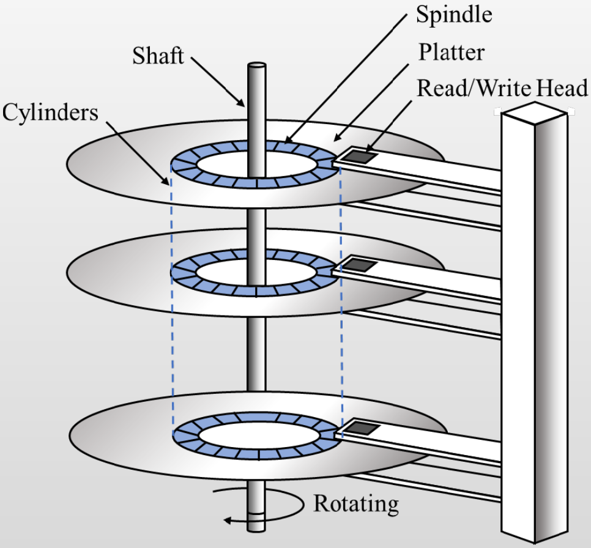{width=50%}

* **磁盘访问时间 (Disk Access Time)**:
  * **公式**: 磁盘访问时间 = 寻道时间 + 旋转时间 + 数据传输时间.
    * **寻道时间 (Seek Time)**: 磁头从当前位置移动到目标磁道并消除抖动所需的时间.
    * **旋转时间 (Rotational Latency)**: 磁头移动到目标磁道后, 目标扇区随着盘片转动经过磁头所需的时间.
    * **数据传输时间 (Transfer Time)**: 磁头完成读写所需的时间.
  * **优化**: 寻道时间和旋转时间可通过更精密的控制电路来减少.
    * 控制电路可以缓存一段时间内的磁盘请求, 决定请求的最优执行次序.
    * 通常使得寻道时间与旋转时间的和达到最小.
    * 机械硬盘的访问瓶颈主要在机械部件上.
* **磁盘功耗 (Power Consumption)**:
  * **公式**: 磁盘整体功耗 = 控制电路功耗 + 盘片旋转功耗.
  * **优化**: 降低功耗主要靠降低盘片质量和减小直径.
    * 高性能磁盘 (SAS): 更快转速, 更小盘片.
    * 大容量磁盘 (SATA): 较慢转速, 较大盘片.
* **IOPS 与吞吐率**:
  * **IOPS (Input/Output Operations Per Second)**:
    * 表示每秒能完成多少个 I/O 请求.
    * 适合衡量小块随机访问.
    * 数据库, 操作系统元数据, 小文件访问.
  * **吞吐率 (Throughput)**:
    * 单位为 MB/s 或 GB/s, 表示每秒能传输多少数据.
    * 适合衡量大块顺序访问.
    * 大文件拷贝, 视频传输.
* **随机与顺序访问**:
  * **顺序 I/O**:
    * 一次寻道后连续读取大量扇区.
    * 机械开销被摊薄.
    * 吞吐率较高.
  * **随机 I/O**:
    * 每个请求可能访问不同磁道.
    * 每个请求都可能重新寻道, 等待旋转.
    * IOPS 很低.
  * 机械硬盘擅长顺序 I/O, 但不擅长随机 I/O.
  * 为了增加顺序 I/O 比例, 磁盘控制器通常会运行调度算法, 进行 I/O 重排序 (先来先服务 VS. 电梯算法).

#### 5.2. 闪存 (Flash Memory)

* **闪存**: 一种非易失性存储器, 以电荷的形式存储数据, 不需要持续供电.
  * **优点**: 读写速度明显快于磁盘, 功耗低, 体积小.
    * 无机械转动.
    * 无磁头寻道时间.
    * 利用电子隧穿来存储数据.
  * **缺点**: 造价昂贵.
    * 最初的 SLC 闪存用一个 cell 保存一个比特位.
    * MLC/TLC/QLC 和 3D-stack 等技术有效降低了成本.


### 6. RAID (Redundant Array of Independent Disks)

#### 6.1. 系统可用性 (System Availability)

* **系统可用性 (System Availability)**: 系统正常工作时间在连续两次正常服务间隔时间中所占的比率.
  * **时间指标**:
    * **MTBF (Mean Time Between Failures)**: 平均失效间隔时间.
    * **MTTF (Mean Time To Failure)**: 平均无故障时间.
    * **MTTR (Mean Time To Repair)**: 平均修复时间.
  * **可用性计算**:
    $$\text{Availability} = \frac{\text{MTTF}}{\text{MTTF} + \text{MTTR}} \,.$$
  * **系统类型**:
    * **不可维修系统**: $\text{MTTF} \approx \text{MTBF}$, 即不存在修好之后的周期.
    * **可维修系统**: $\text{MTBF} = \text{MTTF} + \text{MTTR}$.
    * **易维修系统**: $\text{MTTF} \gg \text{MTTR}$, 系统可用性可近似为 1.
* 假设串联系统模型中部件正常工作时间服从指数分布且故障相互独立:
  * **部件失效率**: $\lambda_i = \frac{1}{\text{MTTF}_i}$.
  * **系统失效率**: $\lambda_{\text{sys}} = \sum_{i=1}^{n} \lambda_i$.
  * **系统 MTTF**: $\text{MTTF}_{\text{sys}} = \frac{1}{\lambda_{\text{sys}}}$.

#### 6.2. 标准 RAID 等级 (Standard RAID Levels)

* **RAID**: 独立磁盘冗余阵列, 简称磁盘阵列.
  * **作用**: RAID 用于提高磁盘容量, 传输速率, 及提供纠错能力.
  * **标准**: 最早由 UCB 提出, 经过多年的发展后被 SNIA 标准化.
  * **虚拟磁盘**: 磁盘阵列及其控制器和驱动程序最终呈现给计算机程序的抽象存储.
    * 每个虚拟磁盘至少包括一个物理磁盘, 同时支持一般的 I/O 操作.
  * **实现方式**: 可以通过软件或硬件实现.
    * 通常机械硬盘会使用阵列卡实现 RAID 功能.
    * 固态硬盘很难使用阵列卡, 通常通过软件实现 RAID 功能.
  * **常见组合**: RAID-0/1/5/6/10 等.

| **RAID 等级** | **机制** | **性能及可靠性** |
| :---: | :---: | :---: |
| **RAID-0** | 把数据分散在多个物理磁盘, 无冗余. | 速率高, 大容量, 可靠性低. |
| **RAID-1**/**RAID-1E** | RAID-1 在 2 个物理磁盘中存放相同的数据, RAID-1E 将数据镜像多次. | 数据可靠性高, 读取速率翻倍, 写入不变. |
| **RAID-2** | 数据以比特为单位分散, 保证纠错. | 磁盘开销极大, 现已不再是标准等级. |
| **RAID-3**/**RAID-4** | 划分单位为若干字节 (RAID-3) 或数据块 (RAID-4), 并设置一个专门的奇偶校验磁盘 (Parity Disk). | 写入优化, 大块连续数据读写快, 瓶颈在于单独的奇偶校验磁盘. |
| **RAID-5** | 将奇偶校验数据分散存储于所有物理磁盘. | 消除 RAID-4 的单盘瓶颈, 分摊校验开销, 应用最广. |
| **RAID-6** | 采用行/对角线双重奇偶校验 (Dual Parity) 等方式. | 极高的可靠性, 能纠正同时发生的 2 个磁盘失效, 开销大. |

* **RAID-4 的写入优化与小写惩罚**:
  * **小写惩罚**: 每次小块随机写入需要 4 次磁盘操作.
  * **写入过程**:
    * 读出旧数据块和旧校验块.
    * 计算新校验块并写回新数据块和新校验块.
* **RAID 磁盘容量**:
  * **基本假设**: 一共有 N 块物理磁盘, 每块的盘的容量都是 C. 若磁盘容量不同, 通常按最小磁盘容量计算.
  * $\text{可用容量} = \text{数据盘数量} \times \text{单盘容量}$.
  * 奇偶校验盘或校验数据块占用的空间不能算作用户可用容量.
* **RAID-01 与 RAID-10**:
  * **机制**:
    * **RAID-01**: 先将磁盘分成 2 组 RAID-0, 再将两组 RAID-0 镜像成 RAID-1.
    * **RAID-10**: 先将磁盘两两组成 RAID-1, 再将这些 RAID-1 组组成 RAID-0.
  * **容量**: RAID-01 和 RAID-10 的可用容量相同, 都是 $\frac{NC}{2}$.
  * **可靠性**: RAID-10 的可靠性更高.
    * RAID-01 中任一 RAID-0 组的两个磁盘失效都会导致整个系统失效.
    * RAID-10 中每个 RAID-1 组只要有一个磁盘正常就不会失效.

| **RAID 等级** | **最少盘数** | **校验开销** | **可用容量** | **容错** | **读性能** | **写性能** |
| :---: | :---: | :---: | :---: | :---: | :---: | :---: |
| **RAID-0** | 2 | 0 | $N \times C$ | 0 | 高 | 高 |
| **RAID-1** | 2 | 0 | C | 1 | 中/高 | 中 |
| **RAID-5** | 3 | 1 | $(N-1) \times C$ | 1 | 高 | 小写较差 |
| **RAID-6** | 4 | 2 | $(N-2) \times C$ | 2 | 高 | 小写更差 |
| **RAID-10** | 4 | 0 | $\frac{N \times C}{2}$ | 视组合 | 高 | 高 |


### 7. 排队论 (Queueing Theory)

#### 7.1. 基本概念与 Kendall 表示法

* **排队论**: 用于评估 I/O 系统性能 (预测队列长度, 等待时间等).
  * 对于队列系统的抽象:
    * **等待区 (Waiting Area, Queue)**: 对应队列的长度.
    * **服务者 (Service Node, Server)**: 对应元素的处理单元.
* **Kendall 表示法**: 用 $A/B/m/K/n/D$ 表示一个队列系统.
  * $A$: I/O 请求到达间隔时间的概率分布.
  * $B$: 处理一个 I/O 请求所需时间的概率分布.
  * $m$: I/O 设备 (Server) 个数.
  * $K$: 队列系统中最大 I/O 请求数目.
  * $n$: I/O 请求源的数目.
  * $D$: 服务规则 (如 FIFO).
  * $A/B$ 的取值中, $M$ 代表指数分布, $D$ 代表确定的常数间隔分布, $G$ 代表一般分布.
  * 若 $K$ 和 $n$ 为无穷大, $D$ 为 FIFO, 则 Kendall 表示法可以简化为 $A/B/m$.

#### 7.2. Little 定理 (Little's Law)

* **Little 定理**: 在任何稳态队列系统中, 平均任务数 $L$ 等于平均到达率 $\lambda$ 与平均响应时间 $W$ 的乘积.
  * **公式**: $L = \lambda W$.
  * **适用范围**: 适用于任何稳态队列系统, 不受 $A/B/m/K/n/D$ 的限制.

#### 7.3. M/M/1 队列系统评估 (M/M/1 Queue)

* **$M/M/1$ 队列系统**: I/O 请求的到达和完成的时间间隔都服从指数分布, 只有 1 个队列和 1 个 I/O 设备, 并且 I/O 请求的数目和队列的长度没有上限.
  * 系统中的 I/O 请求数目 $N(t) = k$ 随时间变化是一个马尔可夫过程.
  * 生长率为 $\lambda$, 除 $N(t) = 0$ 以外状态的消亡率为 $\mu$.
  * 设备利用率 $\rho = \frac{\lambda}{\mu}$.
  * 队列系统中不存在请求的概率: $P(0) = 1 - \rho$.
  * 系统中 I/O 请求数目的分布:
    $$P(k) = (1 - \rho) \rho^k \,.$$
  * 平均请求数:
    $$L = \sum_{k=0}^{\infty} k P(k) = \frac{\rho}{1 - \rho} \,.$$
  * 平均响应时间:
    $$W = \frac{L}{\lambda} = \frac{1}{\mu - \lambda} \,.$$
  * **结论**: 随着利用率提高, 延迟急剧增加.

