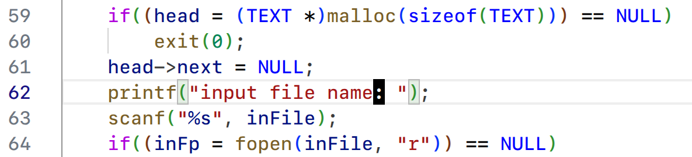
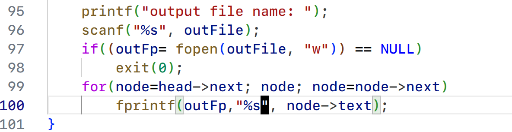
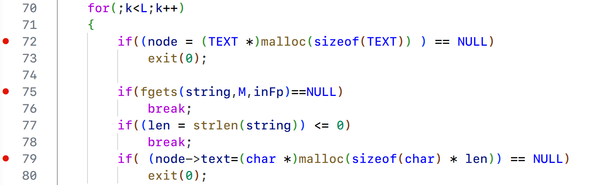
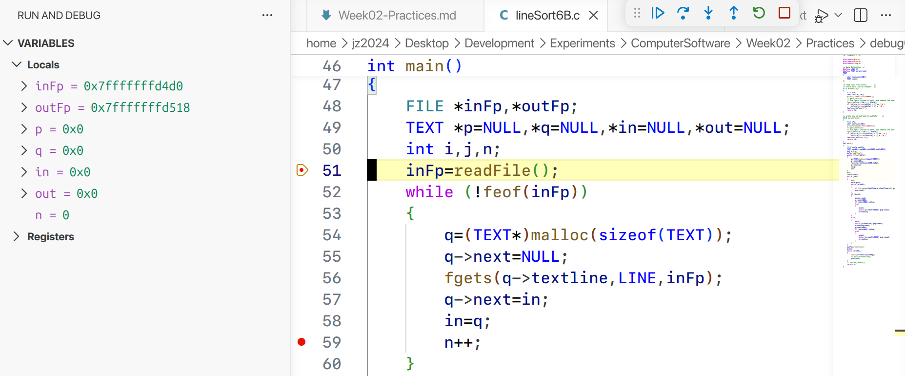

# 第二周 上机实习题

## 1. 调试 `lineSort6A.c`

在 Linux 中使用 Visual Studio Code 打开并调试 `lineSort6A.c`, 其编译过程基于 `gcc`，调试过程基于 `gdb`.

编译并执行, 发现打印至标准输出的提示 `input file name` 之后缺少冒号. 打印至指定文件中的排序结果内容正确, 但每行末都有多余的换行符. 由于 Linux 默认采用 UTF-8 编码, 部分 Non-ASCII 字符未能正常显示, 但不影响程序的正常运行.

{width=48%}

在 `lineSort6A.c` 第 62 行添加冒号.

{width=60%}

在 `lineSort6A.c` 第 98 行删除多余的换行符.

{width=60%}

修改后重新编译并运行, 在对给定文件执行排序, 能够正确输出结果.

{width=60%}

但该程序仍然存在一些问题. 程序在为每一行文字动态分配内存时, 没有为字符串结尾的空字符 `\0` 预留空间, 这可能会导致字符串处理时越界, 从而引发未定义行为.

{width=60%}

程序在为 `node` 分配内存时, 没有考虑到读到文件末尾的情况. 这会使得 `node` 在文件末尾被多分配了一次内存, 导致内存泄漏. 在以下地方设置断点, 可以观察到程序最后一次为 `node` 分配内存之后, 直接通过 `break` 跳出了循环.

{width=60%}

此外, 程序并未调用 `free` 函数释放动态分配的内存, 也没有通过 `fclose` 函数关闭打开的文件, 这可能会导致内存泄漏和文件内容丢失.

程序中发生错误时直接调用 `exit` 函数以 `0` 的状态码退出, 不利于错误的诊断和处理.程序还通过 `system` 函数调用了 `pause` 命令, 这在 UNIX-like 系统中并不适用.

## 2. 调试 `lineSort6B.c`

编译 `lineSort6B.c` 并执行. 编译过程中编译器对 `gets` 函数发出了警告, 因为 `gets` 函数存在缓冲区溢出的风险. 执行过程中程序将输入的字符串正确地写入了指定文件, 但在打印至标准输出时每行末尾多了一个换行符. 程序结尾调用了 `system("pause")`, 这在 UNIX-like 系统中并不适用, 因此报错 `command not found`. 程序中使用了中文冒号等 Non-ASCII 字符和 Non-UTF-8 编码, 导致部分提示信息无法正确显示, 但不影响程序的正常运行.

{width=48%}

将 `lineSort6B.c` 中的 `gets` 函数替换为 `fgets` 函数, 并去除多余的换行符.

{width=60%}

去除打印至标准输出的 `puts` 函数, 并将程序结尾的 `system("pause")` 替换为 `return 0`.

{width=60%}

重新编译并运行, 程序能够正确地将输入的字符串写入指定文件, 但不再打印至标准输出.

{width=60%}

但该程序仍然存在一些问题. 程序未对变量 `n` 进行初始化, 而直接进行自增操作. 此前程序能够正常运行只是因为恰好 `n` 的初始值为 `0`, 但这并不保证在所有环境下都能正常运行.

{width=60%}

此外, 程序使用 `while (!feof(inFp))` 来判断文件是否结束, 这是一种不可靠的方式. 程序还没有检查文件是否成功打开, 这可能会导致在文件打开失败时继续执行后续代码, 从而引发错误. 程序也没有调用 `free` 函数释放动态分配的内存, 也没有通过 `fclose` 函数关闭打开的文件.

## 3. 启发或体会

在调试过程中, 通过编译器的警告信息和调试器的断点设置, 可以更有效地定位和修复程序中的错误. 在处理字符串输入时, 应该避免使用不安全的函数如 `gets`, 而应该使用更安全更现代的方式. 此外, 在编写程序时应该注意内存管理, 包括为字符串预留足够的空间, 以及在不再需要动态分配的内存时及时释放. 在处理文件时, 应该检查文件是否成功打开, 并且在完成文件操作后及时关闭文件. 最后, 在编写跨平台的程序时, 应该避免使用特定平台的命令或函数, 以提高程序的可移植性.

