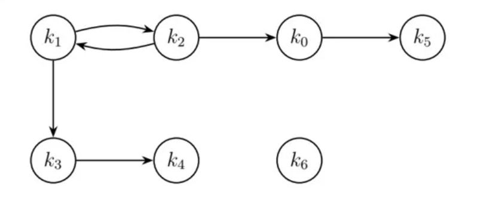
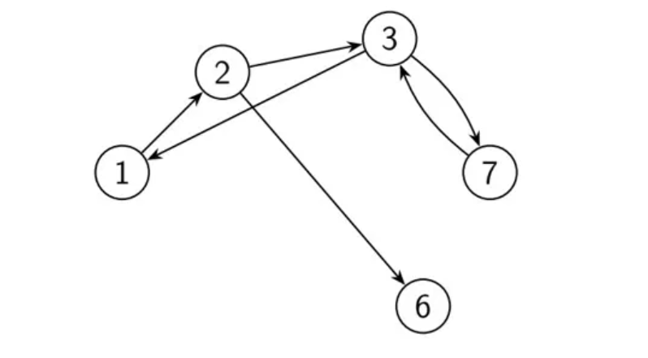

# 第十周 习题

## 4-1. 已知数据结构

$B=\{K,R\}$, $K=\{k_0, k_1, k_2, k_3, k_4, k_5, k_6\}$

$R=\{(k_1, k_2), (k_0, k_5), (k_1, k_3), (k_2, k_0), (k_2, k_1), (k_3, k_4)\}$

试用图形表示 $B$.

{width=40%}

## 4-2. 已知数据结构 $B=(K, R)$ 的图形表示. 写出 $K$ 和 $R$ 的集合.

{width=40%}

$K=\{1, 2, 3, 6, 7\}$.

$R=\{(1, 2), (2, 3), (2, 6), (3, 1), (3, 7), (7, 3)\}$.

