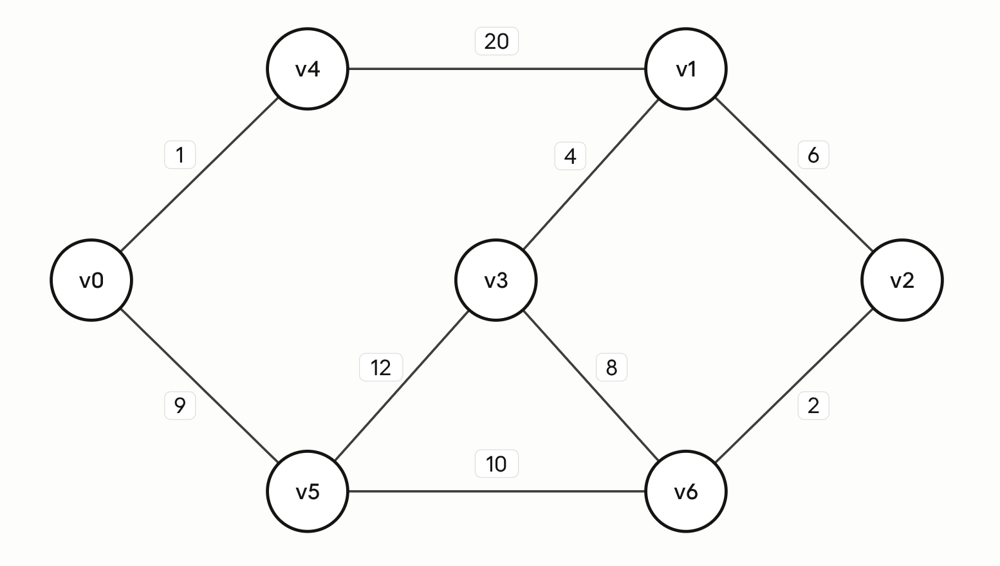

# 第十五周 习题

## 4-19. 已知图中顶点和边的输入信息如下:

v4 v1 20 v0 v4 1 v1 v2 6 v1 v3 4 v2 v6 2 v6 v3 8 v0 v5 9 v3 v5 12 v5 v6 10

{width=50%}

### 4-19-1. 采用 Prim 算法, 演算最小生成树的形成过程, 写出各边的生成顺序.

(v0, v4), (v0, v5), (v5, v6), (v6, v2), (v2, v1), (v1, v3).

### 4-19-2. 采用 Kruskal 算法, 演算最小生成树的形成过程, 写出各边的生成顺序以及发生顶点反转的情况.

(v0, v4), (v2, v6), (v1, v3), (v1, v2), (v0, v5), (v5, v6).

(v2, v6) 反转为(v6, v2), (v1, v2) 反转为 (v2, v1).

### 4-19-3. 采用 Dijkstra 算法, 演算生成从源点 v0 到所有顶点最短路径各边的生成顺序.

(v0, v4), (v0, v5), (v5, v6), (v4, v1), (v6, v2), (v5, v3).

